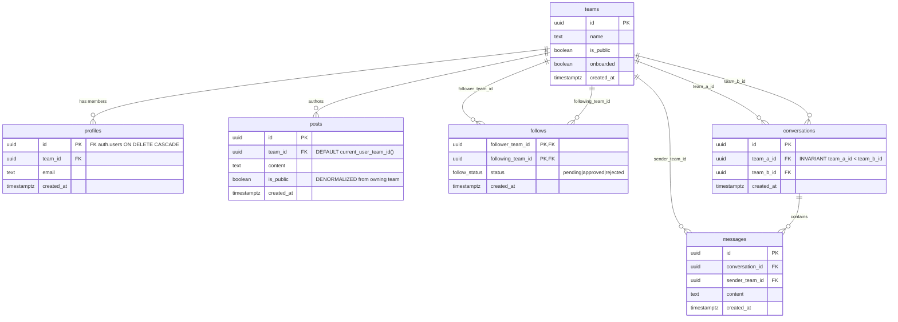
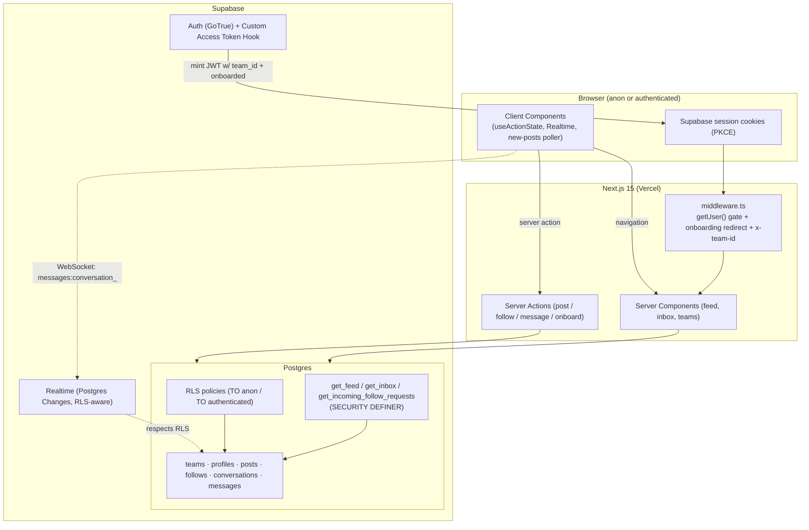

# TeamSocial — a team-based social MVP

A small social network where **the tenant is a team, not a person**. Each user
belongs to exactly one team, there are no individual profiles, and every action —
posting, following, messaging — happens under the **team identity**. Built with
**Next.js 15 (App Router) + Supabase**, with **all authorization enforced in the
database via Row-Level Security (RLS)**.

> This repository is a take-home case. The emphasis is **how & why > feature
> completeness**: the design rationale lives in [`docs/plan/`](docs/plan)
> (`00-overview.md` is authoritative), the AI build process in
> [`docs/AI_ENGINEERING_BLUEPRINT.md`](docs/AI_ENGINEERING_BLUEPRINT.md), and the
> operating ruleset in [`CLAUDE.md`](CLAUDE.md).

---

## 1. Live demo & video

- **Live app:** _(optional Vercel link — see [§5 Deploy](#10-deployment))_
- **Walkthrough video:** _(optional)_

---

## 2. Feature checklist (where each requirement lives)

| # | Requirement | Implemented in |
|---|---|---|
| 1 | Email + password auth | [`app/(auth)/actions.ts`](app/(auth)/actions.ts), [`login`](app/(auth)/login/page.tsx) |
| 1 | Google OAuth (PKCE) | [`components/google-button.tsx`](components/google-button.tsx) → [`app/auth/callback/route.ts`](app/auth/callback/route.ts) |
| 1 | Persistent session | [`utils/supabase/*`](utils/supabase) (cookie session) + [`middleware.ts`](middleware.ts) |
| 1 | Clear logged-in vs logged-out + "acting as team" | [`components/site-header.tsx`](components/site-header.tsx) |
| 2 | One user → one team; team seeded at signup; **multiple users per team via invite code** | [`handle_new_user`](supabase/migrations/0006_triggers.sql), [`team_invites`](supabase/migrations/0011_team_membership.sql) |
| 2 | Teams public/private | [`teams`](supabase/migrations/0002_tables.sql) + [`onboarding`](app/onboarding/actions.ts) |
| 2 | Content scoped to the team | all [RLS policies](supabase/migrations/0005_rls.sql) |
| 3 | Any member posts as the team (text + timestamp) | [`actions/posts.ts`](actions/posts.ts), [`components/composer.tsx`](components/composer.tsx) |
| 4 | No self-follow, one-directional | [`follows` constraints](supabase/migrations/0002_tables.sql) |
| 4 | Public ⇒ instant follow; private ⇒ request → approve/reject | [`actions/follows.ts`](actions/follows.ts), [`app/requests`](app/requests/page.tsx) |
| 5 | Team↔team messaging, any member, no self-message | [`actions/messages.ts`](actions/messages.ts) |
| 5 | Start / send / receive / newest-first / persisted | [`get_inbox`](supabase/migrations/0004_helpers.sql) + [`message-thread.tsx`](components/message-thread.tsx) (Realtime) |
| 6 | Public posts to **all incl. logged-out**; private only to approved followers; newest-first | [`app/page.tsx`](app/page.tsx) + [`get_feed`](supabase/migrations/0004_helpers.sql) |
| 7 | RLS enforces all scoping | [`supabase/migrations/0005_rls.sql`](supabase/migrations/0005_rls.sql) + [pgTAP tests](supabase/tests) |

---

## Status, gaps & what I prioritized

**Functionally complete.** All seven requirement groups above are implemented and
wired end-to-end — plus **team membership** (multiple users per team via invite
code, which is what makes "any member acts as the team" actually testable) — and
the codebase is green on `pnpm typecheck` + `pnpm build` + `pnpm lint`.

**What I deliberately deferred, and why.** On a 3-day budget, and taking the
brief's *"how & why > feature completeness"* seriously, I spent the time on the
graded core — the **RLS security model**, **100% functional scope**, and **clear
docs / architecture / AI blueprint** — over the optional and the ceremonial:

| Deferred / not done | Why | How to finish |
|---|---|---|
| **Live Vercel deploy + video walkthrough** | Both are *optional* deliverables; I prioritized correctness + explanation over deployment ceremony. | Runbook in §10; the app is Vercel-ready. |
| **Full end-to-end live run** | Needs a provisioned Supabase project (env + Auth Hook + Google provider). I verified at typecheck / build / lint / authored-pgTAP / adversarial-review level instead. | Setup in §4, then `pnpm dev`. |
| **Google OAuth enabled** | The flow is fully coded; enabling the provider + credentials is a Supabase/Google **dashboard** step, not code. | §10 / provider settings. |
| **pgTAP suite executed** | Authored ([`supabase/tests`](supabase/tests)); not run in my environment (needs the local Supabase stack). | `supabase db test`. |
| **Deeper UI polish / mobile nav / broad E2E** | Non-graded polish; kept a clean, coherent UI and spent the depth on the data model + security instead. | §17. |

**Nothing in the required functional scope is stubbed or missing** — the items
above are optional deliverables or environment/config steps, each documented here.
Product-level limitations (empty teams, kick-on-refresh, poll-not-push feed, …)
are in [§16](#16-known-limitations); the improvement backlog is in
[§17](#17-what-id-improve-with-more-time).

---

## 3. Tech stack & why

| Choice | Why (one line) |
|---|---|
| **Next.js 15 App Router** | RSC + Server Actions give one secure server boundary for reads and writes — no bespoke API tier. |
| **Supabase (Postgres + Auth + Realtime)** | One platform for auth, relational data with RLS, and websockets — minimal moving parts for a 3-day MVP. |
| **Postgres RLS as the security boundary** | Authorization lives next to the data, so every path (RSC, Server Action, direct API) is equally protected. |
| **JWT `app_metadata.team_id` via a Custom Access Token Auth Hook** | Stateless tenant resolution with zero DB round-trips; the hook guarantees the claim on the **first** token. |
| **`SECURITY DEFINER` RPCs (`get_feed`/`get_inbox`/…)** | Collapse multi-table visibility joins into one fast call and surface private counterpart names safely, while table RLS stays on as defense-in-depth. |
| **Server Actions + Zod + `useActionState`** | Colocated, type-safe mutations with one validated, untrusted-input boundary. |
| **Realtime only for messaging** | Push where it matters; the feed uses `revalidateTag` + a poll pill (smaller blast radius). |
| **pgTAP for RLS tests** | RLS bugs are silent; in-DB assertions prove cross-tenant isolation in milliseconds. |
| **Vercel** | First-class Next.js host; trivial Supabase env wiring. |

---

## 4. Local setup

**Prerequisites:** Node 20+, [pnpm](https://pnpm.io), and the
[Supabase CLI](https://supabase.com/docs/guides/cli) (for the local DB).

```bash
# 1. Install dependencies
pnpm install

# 2. Configure environment
cp .env.example .env.local
#   → fill NEXT_PUBLIC_SUPABASE_URL / NEXT_PUBLIC_SUPABASE_ANON_KEY (and the
#     service-role key) from your Supabase project (Settings → API).

# 3. Start the local Supabase stack and apply the schema + seed
supabase start
supabase db reset        # runs migrations 0001..0007 (in order) + seed.sql

# 4. Run the app
pnpm dev                 # http://localhost:3000
```

Then, **one-time Supabase config** (both done already for local via
`supabase/config.toml`, but required on a hosted project):

- **Enable the Auth Hook:** Dashboard → Authentication → Hooks → *Custom Access
  Token* → point at `public.custom_access_token_hook`, **Enable**. _Without this,
  `team_id` is never in the JWT and the whole tenant model fails closed._
- **Disable email confirmation** (for the demo): Authentication → Providers →
  Email → turn off *Confirm email* (or click the emailed confirm link —
  `/auth/confirm` handles it).
- **Google OAuth (optional):** set the provider Client ID/Secret and add
  `http://localhost:3000/auth/callback` (and your Vercel URL) to the redirect
  allowlist.

**Verify / quality gates:**

```bash
pnpm typecheck     # tsc --noEmit
pnpm lint          # next lint
pnpm build         # production build
supabase db test   # pgTAP RLS assertions (requires pgTAP in the test DB)
```

> **Demo accounts:** `seed.sql` seeds public teams + posts + a conversation, but
> **not** auth users (that is environment-sensitive). Create accounts via the
> signup UI. For the full private-follow flow, create **two** accounts (one
> private team requesting to follow the other).

---

## 5. Environment variables

| Variable | Where | Exposure | Purpose |
|---|---|---|---|
| `NEXT_PUBLIC_SUPABASE_URL` | client + server | **Public** | Supabase project URL. |
| `NEXT_PUBLIC_SUPABASE_ANON_KEY` | client + server | **Public** | Anon key — safe to expose because RLS is the real boundary. |
| `SUPABASE_SERVICE_ROLE_KEY` | **server only** | **Secret** | Admin key (bypasses RLS) — never `NEXT_PUBLIC_`, never in the browser bundle. Used by migrations/tests, not the runtime app. |

---

## 6. Database schema

Six tables, defined in dependency order across the migrations
([`supabase/migrations`](supabase/migrations)):

- **`teams`** — the tenant. `name`, `is_public`, `onboarded`. Private + un-onboarded by default.
- **`profiles`** — maps an `auth.users` row to its single team (`id` is PK **and** FK to `auth.users`; enforces one-user-one-team).
- **`posts`** — team-owned content. `team_id` defaults to `current_user_team_id()`; `is_public` is **denormalized** from the owning team (trigger-maintained) so the anon feed needs no join.
- **`follows`** — a single table with a `status` enum (`pending`/`approved`/`rejected`); composite PK `(follower_team_id, following_team_id)` + `CHECK(follower <> following)`. Directional (no sort invariant).
- **`conversations`** — symmetric, canonicalised with `team_a_id < team_b_id` + `UNIQUE(pair)` so each team pair maps to exactly one row (and self-conversations are impossible).
- **`messages`** — team↔team; `sender_team_id` is the acting team.

Schema details and the "why" behind each constraint/index/trigger are in
[`docs/plan/01-data-model.md`](docs/plan/01-data-model.md).

### 6.1 Entity-Relationship Diagram



---

## 7. RLS & security summary

The golden rule: **the app never enforces tenancy in TypeScript — the database
does.** Server Actions validate and shape input (Zod); RLS decides what is
allowed. Two layers gate every request: coarse table `GRANT`/`REVOKE`, then
fine-grained RLS policies (default-deny once RLS is enabled).

| Resource | Anonymous visitor | Logged-in member (acting as their team) | Enforced by |
|---|---|---|---|
| Public posts/teams | View | View | `*_select_anon` + denormalized `is_public` |
| Private posts | Hidden | Own team, or private teams you **approve-follow** | `posts_select_authenticated` + `check_team_follows()` |
| Create post | Denied | As own team only (`team_id` server-derived) | `posts_insert_own_team` |
| Follow public team | Denied | Inserted `approved` immediately | `follows_insert_as_follower` privacy guard |
| Follow private team | Denied | Inserted `pending`; target approves/rejects | INSERT guard + `follows_update_status_as_followee` |
| Approve/reject | Denied | Only the **target**, only the `status` column | RLS UPDATE policy **+** `GRANT UPDATE(status)` |
| Messaging | Denied | As own team, only in own conversations | participant policies on `conversations`/`messages` |
| Read messages | Denied | Participants only (also gates Realtime) | `messages_select_participant` |

Key mechanisms (full detail in
[`docs/plan/02-rls-and-security.md`](docs/plan/02-rls-and-security.md)):

- **`anon` vs `authenticated` split policies** keep the private predicate out of
  the anonymous query plan entirely — a logged-out visitor can *never* be served
  private content.
- **`current_user_team_id()`** reads the verified JWT `app_metadata.team_id`
  claim — no table read, no recursion.
- **`check_team_follows()`** is `SECURITY DEFINER` to break the posts↔follows RLS
  recursion; every definer function pins `search_path = ''`.
- **`get_feed()`** verifies `_viewer_team_id = current_user_team_id()` inside the
  function so the elevated RPC can't be used to read another team's feed.
- **Column-level `GRANT UPDATE(status)` on `follows`** makes approve/reject
  unable to rewrite the FK columns — RLS gates rows, this gates columns.

These properties are asserted by [pgTAP tests](supabase/tests) (see §9).

---

## 8. Architecture

A single Next.js app on Vercel talks to a single Supabase project. The browser
never holds privileged credentials: reads are RLS-gated, writes go through Server
Actions, and Realtime is the one live edge (messaging).



| Concern | Mechanism | Auth context |
|---|---|---|
| Public feed (logged-out) | RSC + `unstable_cache` tagged `public_feed` (anon client) | `anon` role |
| Private feed (logged-in) | RSC → `get_feed()` RPC | user JWT (`team_id` claim) |
| All writes | Server Actions | user JWT |
| Auth gate / onboarding | `middleware.ts` `getUser()` | network-validated user |
| Live messages | Supabase Realtime (Postgres Changes) | user JWT, RLS-filtered |

Sequence diagrams for the four hot flows (post, follow→approve, messaging,
feed load) are in [`docs/plan/08-architecture.md`](docs/plan/08-architecture.md) §4.

---

## 9. Testing

Security is the product here, so the testing budget goes to **database RLS**,
where a bug is catastrophic and invisible.

- **pgTAP** ([`supabase/tests`](supabase/tests)) — runnable with `supabase db test`:
  - `01_rls_posts.sql` — anon sees public posts, never private ones.
  - `02_rls_follows.sql` — a follower can't self-approve; the followee can; FK
    columns can't be rewritten (column-GRANT lockdown).
  - `03_rls_messaging.sql` — an outside team can't read a conversation's messages.

  The tests set `request.jwt.claims` directly to simulate the Auth Hook's
  `app_metadata.team_id` claim, so they exercise the real tenant-resolution path.

Testing strategy rationale (and the Playwright smoke sketch) is in
[`docs/plan/09-ai-blueprint-and-quality.md`](docs/plan/09-ai-blueprint-and-quality.md) Part B.

---

## 10. Deployment

1. Create a Supabase project; `supabase link --project-ref <ref>` then
   `supabase db push` to apply the migrations.
2. Enable the **Custom Access Token Auth Hook** (Dashboard → Auth → Hooks) and
   disable *Confirm email* (or use the link). Configure Google OAuth + redirect
   URLs if using it.
3. Import the repo into **Vercel**; set the env vars from §5 (service-role key
   server-only). Deploy.
4. Smoke-check: logged-out `/` shows public posts only; sign-up lands on
   `/onboarding` once then `/` (no loop); post appears after revalidation;
   private follow → approve → follower sees posts; message round-trips live.

Full runbook: [`docs/plan/09-ai-blueprint-and-quality.md`](docs/plan/09-ai-blueprint-and-quality.md) Part C.

---

## 11. Project structure

```
app/
  page.tsx                      # "/" home feed — anon + authed, one dynamic route
  layout.tsx                    # root layout + adaptive <SiteHeader/>
  (auth)/{login,signup}/        # logged-out auth screens + actions.ts
  auth/{callback,confirm,...}/  # PKCE exchange + email OTP routes
  onboarding/                   # name team + public/private + actions.ts
  teams/                        # discover teams → follow / message
  messages/{,[conversationId]}/ # inbox (newest-first) + live thread
  requests/                     # incoming follow requests → approve/reject
actions/                        # Server Actions, one file per domain
  posts.ts · feed.ts · follows.ts · messages.ts
components/                     # ui kit + composer, post-card, follow-button,
                                #   request-actions, message-thread, new-posts-pill
lib/                            # auth/claims.ts, constants.ts (TAGS), types.ts, utils.ts
utils/supabase/                 # server.ts · client.ts · middleware.ts · anon.ts
supabase/
  migrations/0001..0007         # extensions → tables → indexes → helpers → RLS
                                #   → triggers → auth hook
  seed.sql · tests/             # demo data + pgTAP RLS assertions
docs/                           # plan/ (design + rationale), AI_ENGINEERING_BLUEPRINT.md
```

---

## 12. Conventions

- **Mutations** are Server Actions in `actions/*`, returning
  `ActionState = { success, message, errors? }`, consumed via React 19
  `useActionState`. Input is Zod-validated at the action boundary.
- **Tenant identity** is read only via `getCurrentTeamId()` (the verified JWT
  claim) — never from client input or `getUser().app_metadata`.
- **Cache invalidation** uses tags from `lib/constants.ts` `TAGS` (no raw
  strings); `revalidateTag` over `revalidatePath` where granular.
- **The server Supabase client is always awaited** (`cookies()` is async in
  Next 15).

---

## 13. Key assumptions

- One user ↔ one team, but **multiple users can share one team**: join at signup
  with a team's invite code, or leave to move to a fresh team of your own
  (`team_invites` + `handle_new_user` create-or-join, migration 0011). No
  multi-team-per-user.
- Roles are out of scope (every member shares the team identity — any member can
  post, message, manage settings, invite, and remove teammates).
- A team is seeded at signup (private + un-onboarded), then named/published in
  onboarding.
- Email confirmation is disabled for the demo.

---

## 14. Trade-offs & alternatives considered

| Decision | Chosen | Rejected | Why |
|---|---|---|---|
| Starter | Own minimal Next.js | MakerKit | MakerKit's account/billing/**roles** model fights one-user-one-team / no-over-abstraction. |
| Feed liveness | Revalidation + poll pill | Realtime feed on `posts` | Every public post fanning out to every client is a large blast radius for marginal MVP value. |
| Feed query | Hybrid: RLS on `posts` + `get_feed` RPC | Pure RLS joins / pure RPC | Hybrid keeps an unbypassable RLS backstop **and** a fast resolved read path. |
| Anon feed | Dedicated `TO anon` policy on denormalized `is_public` | One blended policy | Guarantees the private predicate is never compiled into the anon plan. |
| Custom claims | Auth Hook | Trigger writing `raw_app_meta_data` | Hook puts `team_id` in the **first** token, race-free. |
| Inbox ordering | `LEFT JOIN LATERAL max(created_at)` | Denormalized `last_message_at` | Always-correct, zero write-amplification at MVP volume. |
| Follow storage | One table + `status` enum | Separate `follows`/`requests` | Single source of truth; approve = one `UPDATE`. |

---

## 15. Risks & mitigations

| Risk | Mitigation |
|---|---|
| Private posts leak to a shared cache | Feed is one dynamic route; private slice fetched only after `cookies()`; public slice cached under a non-private tag. |
| `get_feed` privilege escalation | In-function `_viewer_team_id == current_user_team_id()` check + `search_path=''`; RLS backstop on `posts`. |
| Anon reaches private data | Dedicated `TO anon USING(is_public=true)`; explicit `REVOKE` on sensitive tables. |
| Approver rewrites follow FK columns | `REVOKE UPDATE; GRANT UPDATE(status)` + RLS UPDATE predicate. |
| Conversation get-or-create race (23505) | `upsert(onConflict, ignoreDuplicates)` + `team_a_id < team_b_id`. |
| Infinite onboarding redirect | `onboarded` injected into the JWT and read from that same claim; `refreshSession()` after onboarding. |
| Server client not awaited (Next 15) | Async factory; every call site `await`s; encoded in `CLAUDE.md`. |

---

## 16. Known limitations

- Home feed liveness is **poll-not-push** (~15s) for public posts.
- No roles (every member is equal) and no media uploads.
- **Removing a member takes effect on their next token refresh (≤1h), not
  instantly** — a JWT-claim revocation limit; instant kick would need the admin
  API. Leaving is instant (the leaver refreshes their own session).
- **Empty teams persist.** When the last member leaves, the team and its posts are
  retained, not auto-deleted — team lifecycle/deletion is out of case scope and a
  deliberate non-goal (tombstone-vs-delete-vs-transfer-ownership is a data-retention
  product decision). An emptied public team's content stays visible like a dormant
  account, and its old invite code keeps working (anyone with it "revives" the team
  by joining). Auto-cleanup on last-leave is a documented "with more time" path.
- **Google OAuth signup is create-only** — an invite code can't ride the OAuth
  redirect, so an OAuth user joins a team afterwards via leave/rejoin or `/no-team`.
- No password reset / magic-link (the `/auth/confirm` route is ready to reuse).
- Inbox uses a read-time lateral join (fine at MVP scale).

## 17. What I'd improve with more time

- Realtime feed (Broadcast-from-DB scoped to followed teams).
- Denormalized `conversations.last_message_at` once chat throughput grows.
- Keyset infinite scroll on the feed (the cursor is already in `get_feed`).
- Broader Playwright E2E + `rlsautotest` matrix wired into CI.
- Role management (a `role` claim rides the same hook with zero middleware rework).

---

## 18. AI Engineering Blueprint

Built with a **plan-first, research-grounded, multi-agent** workflow, with every AI
artifact treated as an untrusted draft and verified before it counted. The tools:
**Gemini 3.5 Flash** for the first-pass architecture plan (later audited) and small
tasks; **NotebookLM** for citation-bound research on the decisions an LLM gets
subtly wrong (RLS recursion, JWT claim freshness, anon NULL-comparison, keyset vs
OFFSET); **Claude Opus 4.8** via Claude Code in "ultracode" multi-agent mode as the
primary driver — deep planning, the parallel domain-agent implementation fan-out
against a pinned contract, and the adversarial review passes (a review of the plan
and a review of the built code); and **Claude Sonnet 5** for smaller, quicker edits.
The plan review's findings are reconciled canonically in
[`docs/plan/00-overview.md`](docs/plan/00-overview.md) §6.

**Full write-up — tools, rulesets, prompting strategy, the reviewed-bugs table, and
the candidate-vs-AI split — is in
[`docs/AI_ENGINEERING_BLUEPRINT.md`](docs/AI_ENGINEERING_BLUEPRINT.md)**, backed by
the real artifacts: [`CLAUDE.md`](CLAUDE.md), [`docs/plan/`](docs/plan), and
[`docs/research/`](docs/research).
