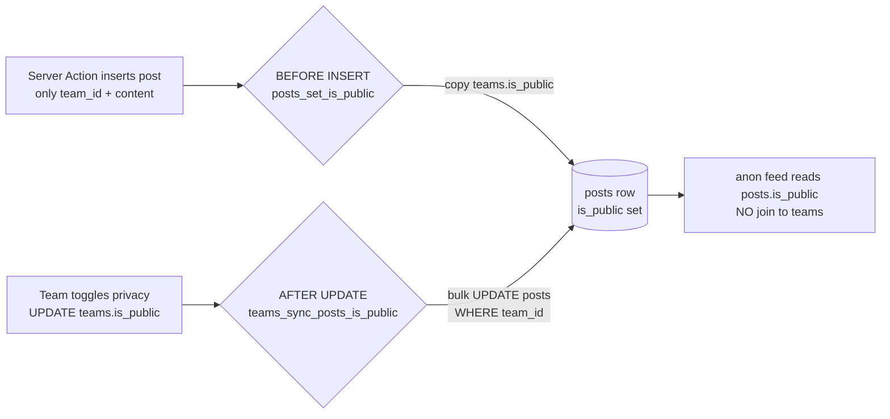

# 01 — Database Schema & Data Model

> **Owner of:** Postgres DDL for all tables, the `follow_status` enum, every constraint, all B-tree indexes, the `is_public` denormalization sync mechanism, the ERD, and on-delete strategy.
>
> **Cross-references (do not duplicate here):**
> - RLS policies, `SECURITY DEFINER` helper bodies, column-level `GRANT/REVOKE` → `02-rls-and-security.md`
> - The `auth.users` INSERT trigger that seeds team+profile, and the Custom Access Token Auth Hook → `03-auth-and-session.md`
> - `get_feed()` RPC body and feed read path → `07-home-feed.md`
> - Conversation `upsert` / inbox lateral join query → `06-messaging.md`
> - Follow approve/reject mutation flow → `05-follow-system.md`
>
> This file defines **shape and invariants**. It declares the *signatures* of the shared helper functions and triggers so other files can rely on them, but the security-sensitive bodies live in the files above.

---

## 1. Design Principles

The data model is the security and consistency foundation for every other feature, so it is designed around five non-negotiable invariants:

1. **Tenant = Team.** Every row that represents user-generated content carries a `team_id` (or a pair of team ids). There is no user-owned content. `profiles` exists only to map an `auth.users` row to its single team.
2. **One user → exactly one team.** Enforced by `profiles.id` being the PK *and* an FK to `auth.users`, with a single `team_id`. A user cannot be in two teams because they have exactly one profile row.
3. **Directional, deduplicated relationships.** Follows are one-directional with a uniqueness guarantee; conversations are symmetric and canonicalised so the same pair never produces two rows.
4. **Denormalize only where it removes a hot-path join.** The single justified denormalization is `posts.is_public` (mirrors the owning team), because the anonymous feed must read posts without joining `teams`. Every other read can afford its join.
5. **The DB is the last line of defense.** Constraints encode rules that RLS and application code *also* enforce. Defense-in-depth: a bug in a Server Action must still be caught by a CHECK or a unique index.

**Why these principles up front:** the evaluator weights "how & why > feature completeness." Stating the invariants makes each later DDL choice a consequence of a rule rather than an arbitrary preference.

---

## 2. Entity-Relationship Diagram

```mermaid
erDiagram
    TEAMS ||--o{ PROFILES : "has members"
    TEAMS ||--o{ POSTS : "authors (as team)"
    TEAMS ||--o{ FOLLOWS : "follower"
    TEAMS ||--o{ FOLLOWS : "following"
    TEAMS ||--o{ CONVERSATIONS : "team_a"
    TEAMS ||--o{ CONVERSATIONS : "team_b"
    TEAMS ||--o{ MESSAGES : "sender"
    CONVERSATIONS ||--o{ MESSAGES : "contains"
    AUTH_USERS ||--|| PROFILES : "is"

    AUTH_USERS {
        uuid id PK "managed by Supabase auth"
    }

    TEAMS {
        uuid id PK
        text name
        boolean is_public
        boolean onboarded
        timestamptz created_at
    }

    PROFILES {
        uuid id PK_FK "-> auth.users.id (CASCADE)"
        uuid team_id FK "-> teams.id (RESTRICT)"
        text email
        timestamptz created_at
    }

    POSTS {
        uuid id PK
        uuid team_id FK "-> teams.id (CASCADE)"
        text content
        boolean is_public "DENORMALIZED from team"
        timestamptz created_at
    }

    FOLLOWS {
        uuid follower_team_id PK_FK "-> teams.id (CASCADE)"
        uuid following_team_id PK_FK "-> teams.id (CASCADE)"
        follow_status status
        timestamptz created_at
    }

    CONVERSATIONS {
        uuid id PK
        uuid team_a_id FK "-> teams.id (CASCADE) [team_a < team_b]"
        uuid team_b_id FK "-> teams.id (CASCADE)"
        timestamptz created_at
    }

    MESSAGES {
        uuid id PK
        uuid conversation_id FK "-> conversations.id (CASCADE)"
        uuid sender_team_id FK "-> teams.id (CASCADE)"
        text content
        timestamptz created_at
    }
```

**Reading the diagram:** `TEAMS` is the hub. The two `TEAMS ||--o{ FOLLOWS` edges are the follower/following pair; the two `TEAMS ||--o{ CONVERSATIONS` edges are `team_a`/`team_b`. `AUTH_USERS` is Supabase-managed (shown for context only — we do not create it).

---

## 3. Extensions & Enum

```sql
-- pgcrypto provides gen_random_uuid(). On modern Supabase/PG13+ this is usually
-- already present, but declaring it makes the migration self-contained & idempotent.
create extension if not exists "pgcrypto";

-- Follow lifecycle as a first-class type.
create type public.follow_status as enum ('pending', 'approved', 'rejected');
```

**Why an enum instead of `text` + `CHECK`:** an enum stores the value as a 4-byte OID (compact, fast equality), gives the three states a *named domain* that appears in `\dT` and in generated TypeScript types, and makes "what are the legal states?" answerable from the schema itself. A `text` column with `CHECK (status in (...))` works but scatters the allowed-values list into a constraint expression, costs more storage, and is invisible to type generators. The classic enum drawback — you cannot easily *remove* a value — does not bite us because these three states are stable domain facts, not config.

> **Note on `gen_random_uuid` vs `uuid_generate_v4`:** we use `gen_random_uuid()` (from `pgcrypto`, or built-in on PG18+) rather than the legacy `uuid-ossp` `uuid_generate_v4()`. Same v4 UUID, one fewer extension dependency.

---

## 4. Table DDL

The tables are created in FK-dependency order: `teams` → `profiles` → `posts` → `follows` → `conversations` → `messages`.

### 4.1 `teams`

```sql
create table public.teams (
    id         uuid        primary key default gen_random_uuid(),
    name       text        not null check (char_length(trim(name)) between 1 and 60),
    is_public  boolean     not null default false,
    onboarded  boolean     not null default false,
    created_at timestamptz not null default now()
);
```

- `is_public default false` — Why: a new team is private until the user opts into Public during onboarding (matches `handle_new_user` in `03`, which seeds `is_public = false`). Private-until-onboarding is the secure default — content is never discoverable before the user has explicitly chosen to be public.
- `onboarded default false` — the team is seeded by the signup trigger (`03-auth-and-session.md`) but is not "onboarded" until the user names their team. This flag is mirrored into the JWT by the Auth Hook **and** read from `teams` by middleware — both must read the *same logical source* (see the correction note in §10) to avoid the infinite onboarding-redirect bug.
- `name` CHECK trims whitespace and bounds length — Why: cheap server-side guard so a blank or absurd team name can never reach the DB even if a Server Action's Zod check is bypassed.

### 4.2 `profiles`

```sql
create table public.profiles (
    id         uuid        primary key references auth.users (id) on delete cascade,
    team_id    uuid        not null references public.teams (id) on delete restrict,
    email      text        not null,
    created_at timestamptz not null default now()
);

create index profiles_team_id_idx on public.profiles (team_id);
```

- **`id` is simultaneously PK and FK to `auth.users`.** Why: this is what physically enforces "one user → one profile → one team." There is no separate surrogate key, so a user cannot accidentally own two profile rows. `on delete cascade`: if Supabase deletes the auth user, the profile evaporates with it.
- **`team_id` FK uses `on delete restrict`.** Why: a team must not be deletable while it still has members — deleting the team out from under a logged-in user would orphan their session's `team_id` claim. Team deletion is out of MVP scope anyway; `restrict` makes that explicit and safe.
- `email` is denormalized from `auth.users.email` purely for cheap display ("posted by a member of Team X" never needs the email, but admin/debug views do). It is *not* a source of truth for auth.
- `profiles_team_id_idx` — Why: every "who is on my team / does this user belong to viewer_team_id" lookup (used inside the `get_feed` privilege check and in `current_user_team_id()`) filters by `team_id`.

### 4.3 `posts`

```sql
create table public.posts (
    id         uuid        primary key default gen_random_uuid(),
    team_id    uuid        not null references public.teams (id) on delete cascade
                           default public.current_user_team_id(),
    content    text        not null check (char_length(content) between 1 and 2000),
    is_public  boolean     not null,            -- DENORMALIZED from teams.is_public
    created_at timestamptz not null default now()
);
```

- **`team_id` defaults to `public.current_user_team_id()`** — this default is the *single source* for the owning team: the client never sends `team_id`, so `insert({ content })` is valid and the value is resolved server-side from the verified JWT claim. The `WITH CHECK (team_id = current_user_team_id())` policy (`02`) re-validates it, so the client can never spoof another team's id. (Depends on the Auth Hook in `03` so the function resolves on the first token.)
- **`is_public` is denormalized from the owning team.** It has *no default* on purpose — every insert path must supply it (the posting trigger in §6 fills it from the team, so application code never sets it directly). Why denormalize: the **anonymous home feed** must answer "show all public posts" via `... TO anon USING (is_public = true)` *without joining `teams`*. An `anon` role join into `teams` would either need a second permissive `teams` policy (leaking team rows to the public) or fail RLS. Storing the flag on the row keeps the public feed a single-table scan. The cost — keeping it in sync — is paid by one trigger (§6), which is cheap because team-privacy toggles are rare.
- `content` CHECK bounds length 1–2000 — Why: prevents empty posts and unbounded payloads at the storage layer.
- `on delete cascade` — deleting a team removes its posts (consistent with "content belongs to the team").

Indexes for `posts` are defined in §5.

### 4.4 `follows`

```sql
create table public.follows (
    follower_team_id  uuid               not null references public.teams (id) on delete cascade,
    following_team_id uuid               not null references public.teams (id) on delete cascade,
    status            public.follow_status not null default 'pending',
    created_at        timestamptz        not null default now(),

    primary key (follower_team_id, following_team_id),
    constraint follows_no_self_follow check (follower_team_id <> following_team_id)
);
```

- **Single table with a `status` enum — not separate `follows` + `follow_requests` tables.** Why: a follow *request* and an *approved follow* are the same relationship at different lifecycle stages. One table = one source of truth, no risk of a row existing in both tables or neither, and approve = a single `UPDATE status` rather than a delete-from-one/insert-into-other dance. A public-team follow is inserted directly as `'approved'`; a private-team follow is inserted as `'pending'` (default) and the target flips it to `'approved'`/`'rejected'`.
- **Composite PK `(follower_team_id, following_team_id)`** doubles as the `UNIQUE` guarantee — a pair can have at most one follow row, so re-follow attempts hit `ON CONFLICT` (idempotent) instead of duplicating.
- **`follows_no_self_follow` CHECK** — a team cannot follow itself, enforced in the DB regardless of app logic.
- **No sorting invariant on the pair.** Why: unlike conversations, a follow is *directional* — "A follows B" is a different fact from "B follows A," and both may exist independently. Canonicalising the pair would destroy direction. (Contrast with `conversations` in §4.5, which *is* symmetric and therefore *is* canonicalised.)
- **Retroactive public→private toggle:** when a team flips to private, existing `'approved'` follows are kept as-is; only *new* follow attempts are created `'pending'`. No data migration needed — the status column already records each follow's negotiated state. (Approve/reject mutation + the column-level `GRANT(status)` live in `05-follow-system.md` / `02-rls-and-security.md`.)
- `on delete cascade` on both FKs — deleting a team removes all follow edges touching it.

Indexes for `follows` are defined in §5.

### 4.5 `conversations`

```sql
create table public.conversations (
    id         uuid        primary key default gen_random_uuid(),
    team_a_id  uuid        not null references public.teams (id) on delete cascade,
    team_b_id  uuid        not null references public.teams (id) on delete cascade,
    created_at timestamptz not null default now(),

    constraint conversations_canonical_order check (team_a_id < team_b_id),
    constraint conversations_unique_pair     unique (team_a_id, team_b_id)
);
```

- **Symmetric relationship enforced by `team_a_id < team_b_id` + `UNIQUE(team_a_id, team_b_id)`.** Why: a conversation between X and Y is the *same* conversation as between Y and X. Without canonicalisation you could get two rows — `(X,Y)` and `(Y,X)` — splitting the message history. By forcing the smaller UUID into `team_a_id` (the CHECK) and uniquing the ordered pair, the pair `{X,Y}` maps to **exactly one** row no matter who starts the chat. The caller must order the two ids before insert; the get-or-create `upsert` in `06-messaging.md` uses `onConflict: 'team_a_id,team_b_id', ignoreDuplicates: true` so a race between two members starting the same conversation resolves to one row instead of throwing `23505`.
- Note there is no explicit `CHECK (team_a_id <> team_b_id)` — the strict `<` already forbids equality, so "a team cannot message itself" is implied by `conversations_canonical_order`. (Application code still rejects self-conversation earlier with a friendly error.)
- `on delete cascade` — deleting a team removes its conversations (and their messages, via the messages cascade in §4.6).

Index for `conversations` (besides the implicit unique index) is defined in §5.

### 4.6 `messages`

```sql
create table public.messages (
    id              uuid        primary key default gen_random_uuid(),
    conversation_id uuid        not null references public.conversations (id) on delete cascade,
    sender_team_id  uuid        not null references public.teams (id) on delete cascade,
    content         text        not null check (char_length(content) between 1 and 4000),
    created_at      timestamptz not null default now()
);
```

- `conversation_id` `on delete cascade` — deleting a conversation deletes its messages.
- `sender_team_id` `on delete cascade` — Why: the sender is a *team* (messaging is team↔team; any member acts on behalf of their team). RLS (`02`) additionally enforces that `sender_team_id` must equal the actor's `current_user_team_id()` *and* be one of the conversation's two teams — so a member can only send as their own team, into a conversation their team belongs to.
- `content` CHECK bounds length 1–4000.

Indexes for `messages` (the inbox-ordering composite) are defined in §5.

---

## 5. Indexes

All indexes are plain B-tree. Each is justified by a concrete query in another plan file. **This section is the sole authoritative index set** — `05-follow-system.md` and `07-home-feed.md` must *reference* these index names (`posts_public_feed_idx`, `follows_approved_idx`, etc.), never redefine them.

```sql
-- ── posts ────────────────────────────────────────────────────────────────
-- Mutation scoping & "my team's posts" lookups (RLS, profile page).
create index posts_team_id_idx     on public.posts (team_id);

-- Global newest-first ordering for the feed merge/sort and keyset pagination.
create index posts_created_at_idx  on public.posts (created_at desc);

-- Anonymous public-feed hot path: filter is_public = true, ordered newest-first,
-- WITHOUT touching teams. Partial index keeps it tiny (only public rows) and lets
-- keyset pagination on (created_at, id) be a pure index scan. The `id desc`
-- tiebreaker matches the keyset ordering (07-home-feed.md) so pagination is stable.
create index posts_public_feed_idx on public.posts (created_at desc, id desc)
    where is_public = true;

-- ── follows ──────────────────────────────────────────────────────────────
-- "Who does my team follow (and is it approved)?" — drives the private-feed
-- subquery and check_team_follows(). follower-leading order matches the filter.
create index follows_follower_idx  on public.follows (follower_team_id, following_team_id, status);

-- Approved-only partial index for check_team_follows() — the private-feed hot path
-- asks "does A follow B with status='approved'?" on every get_feed call. A partial
-- index on the approved rows keeps the membership probe tiny and index-only.
create index follows_approved_idx  on public.follows (follower_team_id, following_team_id)
    where status = 'approved';

-- "Who is requesting to follow me?" — the pending-requests inbox for a private team.
create index follows_following_idx on public.follows (following_team_id, status);

-- ── conversations ────────────────────────────────────────────────────────
-- "List conversations my team is part of." team_a is already covered by the
-- UNIQUE(team_a_id, team_b_id) index's leading column; add the team_b side.
create index conversations_team_b_idx on public.conversations (team_b_id);

-- ── messages ─────────────────────────────────────────────────────────────
-- THE inbox-ordering index. Supports both (a) loading a conversation's history
-- newest-first and (b) the LEFT JOIN LATERAL that fetches each conversation's
-- max(created_at) for "inbox ordered by latest message" (see 06-messaging.md).
create index messages_conversation_created_idx
    on public.messages (conversation_id, created_at desc);
```

**Why the partial index `posts_public_feed_idx`:** the public/anonymous feed is the highest-traffic read and the one that must work for logged-out visitors. A partial index on `where is_public = true`, ordered `created_at desc, id desc`, lets the anon path satisfy "newest N public posts" and keyset pagination (`(created_at, id) < cursor`) as an index-only-ish scan; the `id desc` tiebreaker matches the keyset ordering so pages never duplicate or skip on ties, and the index only stores public rows so it stays small.

**Why `(conversation_id, created_at desc)` composite on messages:** ordering message history newest-first and the per-conversation `max(created_at)` lateral join both filter by `conversation_id` then sort by `created_at desc` — a composite index in exactly that order serves both with no sort step.

**Why `follows(follower_team_id, following_team_id, status)`:** the private home feed asks "give me posts from teams my team follows with status='approved'." Leading with `follower_team_id` matches that filter; including `status` makes it covering for the approval check. The partial `follows_approved_idx` narrows this further to just the approved rows that `check_team_follows()` probes on every `get_feed` call. The reverse index `follows(following_team_id, status)` serves the symmetric "incoming pending requests" query.

> FK columns do **not** auto-create indexes in Postgres. The indexes above deliberately cover every FK that participates in a JOIN or a cascade-heavy delete (`posts.team_id`, `profiles.team_id`, both `follows` directions, `conversations.team_b_id`, `messages.conversation_id`). `conversations.team_a_id` and the `follows`/`messages` sender FKs that lead a composite/unique index are already covered by that index's leading column.

---

## 6. The `is_public` Denormalization Sync Mechanism

`posts.is_public` mirrors `teams.is_public` of the owning team. Two write paths keep it correct:

### 6.1 Set on INSERT (BEFORE INSERT trigger on `posts`)

```sql
-- Fill posts.is_public from the owning team at insert time, so application code
-- (Server Actions) never has to know or set the flag. SECURITY DEFINER + pinned
-- search_path so it reads teams regardless of the caller's RLS view.
create or replace function public.posts_set_is_public()
returns trigger
language plpgsql
security definer
set search_path = ''
as $$
begin
    select t.is_public
      into new.is_public
      from public.teams t
     where t.id = new.team_id;

    if new.is_public is null then
        raise exception 'posts_set_is_public: team % not found', new.team_id;
    end if;

    return new;
end;
$$;

create trigger posts_set_is_public_before_insert
    before insert on public.posts
    for each row
    execute function public.posts_set_is_public();
```

**Why BEFORE INSERT trigger rather than a column DEFAULT or app-supplied value:** a DEFAULT cannot reference another table, and trusting every Server Action to set `is_public` correctly is exactly the kind of duplicated, drift-prone logic the brief warns against. A single trigger makes the flag *impossible to set wrong* — even an `INSERT` issued from psql gets the right value. `SECURITY DEFINER` + `set search_path = ''` is required so the lookup into `teams` is not blocked by the inserting role's RLS and cannot be hijacked by a malicious `search_path`.

### 6.2 Keep in sync on team toggle (AFTER UPDATE trigger on `teams`)

```sql
-- When a team flips its privacy, propagate to all of its existing posts.
create or replace function public.teams_sync_posts_is_public()
returns trigger
language plpgsql
security definer
set search_path = ''
as $$
begin
    if new.is_public is distinct from old.is_public then
        update public.posts
           set is_public = new.is_public
         where team_id = new.id
           and is_public is distinct from new.is_public;
    end if;
    return new;
end;
$$;

create trigger teams_sync_posts_is_public_after_update
    after update of is_public on public.teams
    for each row
    when (old.is_public is distinct from new.is_public)
    execute function public.teams_sync_posts_is_public();
```

**Why an AFTER UPDATE trigger (and `when` clause):** privacy toggles are rare, so the bulk `UPDATE posts` they trigger is an acceptable, infrequent cost — far cheaper than joining `teams` on *every* feed read forever. The `when (old.is_public is distinct from new.is_public)` clause and the inner `is distinct from` guard make the trigger a no-op for any team update that doesn't change privacy (e.g. a rename), so renames don't rewrite every post. `is distinct from` (not `<>`) is used throughout so NULLs are handled correctly.



---

## 7. Shared Helper Function Signatures

These functions are *referenced* across files. Their **signatures and contracts** are fixed here so everyone codes against the same shapes; the **security-sensitive bodies** are specified in the cross-referenced files.

```sql
-- Returns the team_id of the currently authenticated user.
-- Reads the JWT claim populated by the Auth Hook; falls back to profiles.
-- Body & STABLE/SECURITY DEFINER decision: see 02-rls-and-security.md.
create function public.current_user_team_id() returns uuid;

-- True iff _follower_team_id follows _following_team_id with status='approved'.
-- Used by the private-feed visibility logic. Body: see 05-follow-system.md.
create function public.check_team_follows(
    _follower_team_id  uuid,
    _following_team_id uuid
) returns boolean;

-- Hot-path feed read. Returns merged public + (approved-)private posts for
-- _viewer_team_id, keyset-paginated by _cursor (created_at) limited to _limit.
-- SECURITY DEFINER, verifies auth.uid() belongs to _viewer_team_id, SET search_path=''.
-- Full body & return shape: see 07-home-feed.md.
create function public.get_feed(
    _viewer_team_id uuid,
    _cursor         timestamptz,
    _limit          int
) returns table (
    id         uuid,
    team_id    uuid,
    team_name  text,
    content    text,
    is_public  boolean,
    created_at timestamptz
);

-- Inbox listing for _viewer_team_id: one row per conversation the team is in,
-- carrying the COUNTERPART team's name (surfaced even for private teams, since
-- this is SECURITY DEFINER and bypasses teams RLS in a controlled way), plus the
-- last message preview and its timestamp for newest-first ordering.
-- SECURITY DEFINER, SET search_path='', guards _viewer_team_id = current_user_team_id().
-- Full body: see 06-messaging.md.
create function public.get_inbox(
    _viewer_team_id uuid
) returns table (
    conversation_id  uuid,
    other_team_id    uuid,
    other_team_name  text,
    last_message     text,
    last_message_at  timestamptz
);

-- Incoming pending follow requests for _viewer_team_id: one row per requester,
-- carrying the requester team's name (surfaced even for private requesters via
-- SECURITY DEFINER) and when the request was made.
-- SECURITY DEFINER, SET search_path='', guards _viewer_team_id = current_user_team_id().
-- Full body: see 05-follow-system.md.
create function public.get_incoming_follow_requests(
    _viewer_team_id uuid
) returns table (
    follower_team_id   uuid,
    follower_team_name text,
    created_at         timestamptz
);
```

**Why declare signatures here:** the data-model file is the single place every other agent already reads for naming. Pinning the parameter names/order and return columns now prevents three files from inventing three incompatible `get_feed` signatures.

---

## 8. On-Delete Strategy Summary

| Child table        | FK column           | Parent        | On delete  | Rationale |
|--------------------|---------------------|---------------|------------|-----------|
| `profiles`         | `id`                | `auth.users`  | `CASCADE`  | Auth user gone ⇒ profile gone. |
| `profiles`         | `team_id`           | `teams`       | `RESTRICT` | A team with members must not be deletable; prevents orphaning a live session's claim. |
| `posts`            | `team_id`           | `teams`       | `CASCADE`  | Content belongs to the team. |
| `follows`          | `follower_team_id`  | `teams`       | `CASCADE`  | Remove edges touching a deleted team. |
| `follows`          | `following_team_id` | `teams`       | `CASCADE`  | Same. |
| `conversations`    | `team_a_id`         | `teams`       | `CASCADE`  | Conversation is meaningless without both teams. |
| `conversations`    | `team_b_id`         | `teams`       | `CASCADE`  | Same. |
| `messages`         | `conversation_id`   | `conversations` | `CASCADE` | History dies with its conversation. |
| `messages`         | `sender_team_id`    | `teams`       | `CASCADE`  | Remove a deleted team's messages. |

**Why `RESTRICT` on `profiles.team_id` while everything else `CASCADE`s:** team deletion is out of scope for the MVP, but if it ever happens it must fail loudly while members still exist rather than silently cascading and logging people out from under their JWT. Every *content* relationship cascades because in the team-tenant model content has no meaning without its team.

---

## 9. Full Migration Ordering (single file)

Recommended single migration (`supabase/migrations/0001_init.sql`) order:

1. `create extension pgcrypto`
2. `create type follow_status`
3. tables: `teams`, `profiles`, `posts`, `follows`, `conversations`, `messages`
4. indexes (§5)
5. `is_public` trigger functions + triggers (§6)
6. helper functions (`current_user_team_id`, `check_team_follows`, `get_feed`, `get_inbox`, `get_incoming_follow_requests`) — bodies from `02`/`05`/`06`/`07`
7. `enable row level security` + policies — **all in `02-rls-and-security.md`**
8. column-level `REVOKE/GRANT` on `follows.status` — **`02`/`05`**
9. `auth.users` signup trigger (seeds team+profile) — **`03-auth-and-session.md`**

**Why one ordered migration:** the take-home is reviewed by reading `supabase/migrations`. A single, dependency-ordered file is the clearest possible artifact of "I understand the dependency graph," and `supabase db reset` replays it deterministically for the pgTAP RLS tests (`09`).

---

## 10. Corrections Applied (from the prior plan)

- **`onboarded` single-source fix.** `teams.onboarded` is the durable source; the Auth Hook (`03`) copies it into the JWT at token mint time, and middleware reads `app_metadata.onboarded`. Because the hook reads the *same* `teams.onboarded` it writes, the "wrote to teams but middleware read app_metadata ⇒ infinite redirect" bug cannot recur. The data model's job is just to guarantee the column exists, is `not null`, and defaults `false`. (Mechanism detailed in `03`.)
- **Trigger responsibilities split correctly.** The `auth.users` signup trigger (`03`) ONLY creates `teams` + `profiles` transactionally; it does **not** write `raw_app_meta_data`. Claim injection is the Auth Hook's job. This file's triggers (`posts_set_is_public`, `teams_sync_posts_is_public`) touch only `posts`/`teams`.
- **`conversations` canonical order** (`team_a_id < team_b_id` + unique pair) is what makes the `upsert ... onConflict ignoreDuplicates` get-or-create in `06` race-safe.
- **No sorting invariant on `follows`** — directional by design (see §4.4).

---

## 11. Generated TypeScript Types (for app code)

The app consumes these via `supabase gen types typescript`. Indicative shapes the rest of the codebase relies on:

```ts
export type FollowStatus = 'pending' | 'approved' | 'rejected';

export interface Team    { id: string; name: string; is_public: boolean; onboarded: boolean; created_at: string; }
export interface Profile { id: string; team_id: string; email: string; created_at: string; }
export interface Post    { id: string; team_id: string; content: string; is_public: boolean; created_at: string; }
export interface Follow  { follower_team_id: string; following_team_id: string; status: FollowStatus; created_at: string; }
export interface Conversation { id: string; team_a_id: string; team_b_id: string; created_at: string; }
export interface Message { id: string; conversation_id: string; sender_team_id: string; content: string; created_at: string; }
```

**Why generated, not hand-written:** running `supabase gen types` against the live schema means the DDL above is the single source of truth and the TS types can never silently drift from it.

---

## 12. Cross-Cutting "Why" Recap (quick reference)

| Choice | Why (1-line) |
|--------|--------------|
| `uuid` PKs (`gen_random_uuid`) | Non-enumerable (no `/team/1` scraping), client-generatable, merge-safe across environments; the modest size cost is irrelevant at MVP scale. |
| `timestamptz` everywhere | Stores an absolute instant in UTC; avoids the `timestamp`-without-zone ambiguity that breaks "newest-first" ordering across server/client timezones. |
| `follow_status` enum | Named, compact (4-byte OID), type-generator-visible domain vs. a scattered `text` + CHECK. |
| Denormalized `posts.is_public` | Lets the anonymous feed scan posts without joining `teams`; kept correct by two cheap triggers. |
| Single `follows` table + status | One source of truth; approve = one `UPDATE`, no cross-table anomalies. |
| Symmetric `conversations` (`a < b` + unique) | One row per pair regardless of who starts; enables race-safe get-or-create upsert. |
| `RESTRICT` on `profiles.team_id` | A team with live members must not be deletable out from under a session. |
| Composite `messages(conversation_id, created_at desc)` | Serves both history ordering and the inbox latest-message lateral join with no sort. |

---

### Manifest

This file delivers: extensions + `follow_status` enum; full DDL for all 6 tables with PK/FK/UNIQUE/CHECK constraints (self-follow, symmetric-conversation `a<b`, length checks); all B-tree indexes including the partial public-feed index and the composite inbox index; the `is_public` denormalization sync mechanism (BEFORE INSERT trigger on posts + AFTER UPDATE trigger on teams, with flowchart); complete Mermaid ERD; on-delete strategy table; shared helper-function signatures; migration ordering; the four corrections from the prior plan; generated-type shapes; and a per-choice rationale recap. Security policies, helper bodies, the signup trigger, and feature mutation flows are cross-referenced to files `02`–`07` and `09`, not duplicated.
