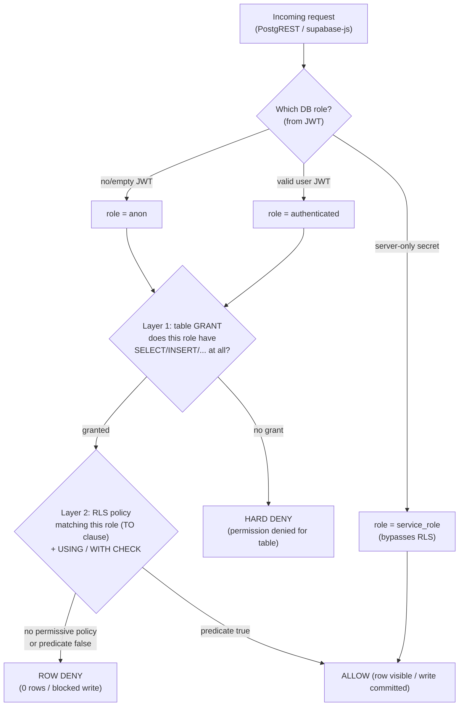
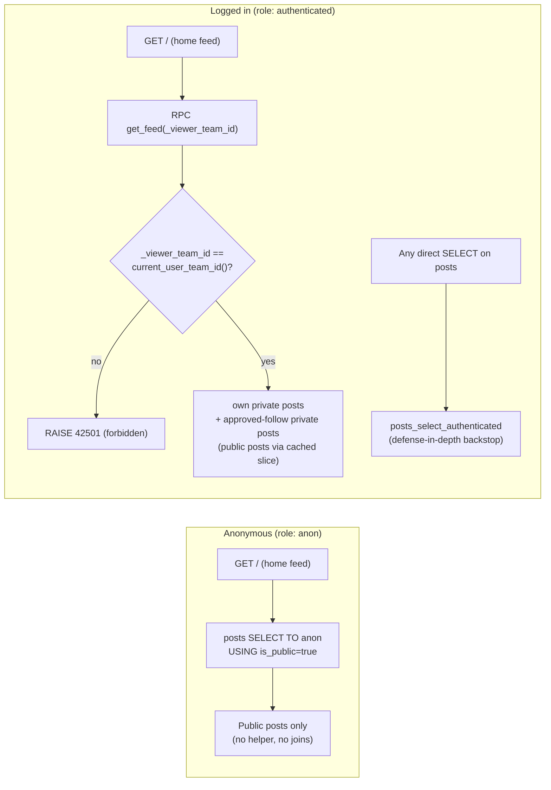

# 02 — RLS Policies & Security Model

> **Owner of:** every Row-Level Security policy, every `GRANT`/`REVOKE`, the
> `SECURITY DEFINER` helper functions, and the security envelope of the
> `get_feed()` RPC.
>
> **Cross-references (do not duplicate these here):**
> - Table DDL, constraints, enums, indexes, and the `is_public`-sync trigger → **[01-data-model.md](./01-data-model.md)**
> - Custom Access Token Auth Hook, the `app_metadata.{team_id,onboarded}` claim contract, `handle_new_user()` provisioning trigger, middleware session gating → **[03-auth-and-session.md](./03-auth-and-session.md)**
> - Posting Server Action + the `is_public` denormalization at insert → **[04-posting.md](./04-posting.md)**
> - Follow Server Action and the status-forcing `BEFORE INSERT` trigger → **[05-follow-system.md](./05-follow-system.md)**
> - Messaging realtime (Postgres Changes respects the policies defined here) and the get-or-create conversation upsert → **[06-messaging.md](./06-messaging.md)**
> - Full `get_feed()` keyset pagination body, feed caching, anon-vs-auth route → **[07-home-feed.md](./07-home-feed.md)**
> - pgTAP RLS test strategy → **[09-ai-blueprint-and-quality.md](./09-ai-blueprint-and-quality.md)**

This document is the **single source of truth for the authorization layer**. The
golden rule for the whole codebase: **the application never trusts the client and
never enforces tenancy in TypeScript alone — the database is the enforcement
boundary.** Server Actions validate and shape input (Zod); RLS decides what is
allowed.

---

## 1. The two-layer access model

Authorization in Postgres/Supabase is evaluated in **two distinct layers**, in
this order. A request must pass **both**.



- **Layer 1 — Table privileges (`GRANT`/`REVOKE`).** Coarse, *role-level*: "may
  `anon` touch `posts` at all?" If the role has **no** privilege on the table,
  Postgres rejects the statement **before RLS is ever evaluated**.
  **Why this matters:** Supabase grants the `anon` role `SELECT` on `public.posts`
  is *required* for the public feed to return anything — without the grant the
  request errors out instead of being row-filtered. Conversely, revoking a grant
  is the bluntest, most reliable lock.
- **Layer 2 — Row-Level Security (policies).** Fine, *row-level* and
  *role-segmented* via the `TO` clause: "*which* posts may this role see?"

**Default-deny is the bedrock.** Once `ENABLE ROW LEVEL SECURITY` is set, a table
with **no** permissive policy for a role denies *all* rows for that role — even if
the role holds a table `GRANT`. So our security posture is: enable RLS everywhere,
then *additively* open only the exact rows each role needs.

### Role map

| DB role | Who | RLS applies? | Used by |
|---|---|---|---|
| `anon` | Unauthenticated visitors | **Yes** | Public home feed, public team pages |
| `authenticated` | Logged-in users (carry a Supabase JWT) | **Yes** | All in-app reads/writes, acting under `app_metadata.team_id` |
| `service_role` | Server-side secret key only | **No — bypasses RLS** | Auth Hook, provisioning trigger context, admin maintenance. **Never shipped to the browser** (see [03](./03-auth-and-session.md)) |
| table owner (`postgres`) | Migrations/CI | **No — bypasses RLS** | Schema migrations, pgTAP setup |

> **Why segment `anon` vs `authenticated` at the role level (not with one blended
> policy)?** A blended policy like `is_public = true OR team_id = current_user_team_id()`
> *works* for anon only because `current_user_team_id()` returns `NULL` and
> `team_id = NULL` collapses to `false`. That is silent, brittle correctness: one
> refactor that makes the helper return a non-null sentinel, or one `OR` that
> short-circuits differently, leaks private rows to the public internet. Splitting
> by `TO anon` / `TO authenticated` means the private predicate is **never even
> compiled** into the anonymous query plan. See §5.

---

## 2. Enable RLS on every table

```sql
alter table public.teams         enable row level security;
alter table public.profiles      enable row level security;
alter table public.posts         enable row level security;
alter table public.follows       enable row level security;
alter table public.conversations enable row level security;
alter table public.messages      enable row level security;
```

> **Why enable on *every* table, including link tables like `profiles`?** RLS is
> opt-in per table; a single forgotten `enable` on a junction table is the most
> common multi-tenant leak. Enabling everywhere and then granting access
> additively makes "did we forget a table?" a non-question — the default is
> locked.

> **Note on `FORCE ROW LEVEL SECURITY`:** the table *owner* bypasses RLS by
> default. Our app connects as `anon`/`authenticated` (never the owner), so this
> is not a runtime risk. We deliberately **do not** `FORCE` RLS, because our
> provisioning trigger and Auth Hook run as `SECURITY DEFINER`/owner and *rely* on
> bypassing RLS to seed the team+profile. Documented here so it is a decision, not
> an accident.

---

## 3. `SECURITY DEFINER` helper functions

Two helpers are the backbone of every policy. `check_team_follows()` is
`STABLE SECURITY DEFINER SET search_path = ''` (it reads `follows` and must
bypass that table's RLS). `current_user_team_id()` is `STABLE SET search_path =
''` — it touches no table (it only reads the verified JWT claim), so `SECURITY
DEFINER` is unnecessary.

### 3.1 `current_user_team_id()` — the active tenant resolver

```sql
-- (C) The RLS resolver reads the SAME path. (No table access → SECURITY DEFINER not required.)
create or replace function public.current_user_team_id()
returns uuid language sql stable set search_path = '' as $$
  select nullif(auth.jwt() -> 'app_metadata' ->> 'team_id', '')::uuid
$$;
```

- **Source of truth = the JWT claim**, populated by the Auth Hook. Because the
  hook runs *inside* token minting, the first token a freshly signed-up user
  receives already contains `app_metadata.team_id` — **no client-side
  `refreshSession()` dance** and no read-after-write race. (Contract owned by
  [03](./03-auth-and-session.md); this function only *consumes* the claim.)
- We deliberately **do not** fall back to `SELECT team_id FROM profiles WHERE id =
  auth.uid()`. The Auth Hook guarantees the claim, so a DB fallback would (a) add a
  table read to *every* RLS check (per-row cost), and (b) reintroduce the very
  recursion `SECURITY DEFINER` exists to break (the `profiles` RLS policy itself
  calls `current_user_team_id()`). If the hook is ever misconfigured we want a hard
  failure (NULL → everything denied), not a silent slow path.

> **Why `STABLE`?** It lets Postgres evaluate the function **once per statement**
> (initPlan caching) instead of once per row — critical when the function appears
> in a policy scanned over thousands of `posts`. See §8.

### 3.2 `check_team_follows()` — the recursion breaker

```sql
create or replace function public.check_team_follows(
  _follower_team_id  uuid,
  _following_team_id uuid
)
returns boolean
language sql
stable
security definer
set search_path = ''
as $$
  select exists (
    select 1
    from public.follows
    where follower_team_id  = _follower_team_id
      and following_team_id = _following_team_id
      and status = 'approved'
  );
$$;
```

> **Why `SECURITY DEFINER` here is non-negotiable (the recursion break).** The
> `posts` SELECT policy must answer "does my team follow this private team?", which
> means reading `follows` *from inside* a policy. If `check_team_follows()` ran as
> the invoker, that read would re-trigger `follows`' own RLS — and any cross-table
> reference risks an infinite policy-evaluation loop (Postgres aborts with
> `infinite recursion detected in policy`). Running as `DEFINER` executes the
> lookup with the function-owner's privileges, which **bypass RLS entirely**,
> cleanly cutting the loop. It is also faster: no nested policy evaluation on the
> hot path.

> **Why `SET search_path = ''` on both?** A `SECURITY DEFINER` function runs with
> elevated privileges; an attacker who can create objects in a schema on the
> caller's `search_path` could shadow `follows` or `jwt()` and hijack execution.
> Forcing an empty `search_path` means every object **must** be schema-qualified
> (`public.follows`, `auth.jwt()`), eliminating the hijack vector. The leading-`_`
> parameter names avoid collisions with column names inside the body.

> **Naming discipline:** these are the exact shared signatures
> `public.current_user_team_id()` and
> `public.check_team_follows(_follower_team_id, _following_team_id)`. Any other
> plan file referencing them MUST use these names.

---

## 4. Table privileges — the coarse grant layer

Supabase, by default, runs `ALTER DEFAULT PRIVILEGES ... GRANT ALL ON TABLES TO
anon, authenticated` for the `public` schema. That means **new tables are
automatically reachable by both roles**, and RLS is what actually protects them.
We make our intent explicit (defense-in-depth) rather than rely on those defaults.

### 4.1 Schema usage (precondition for everything)

```sql
-- authenticated already has this via Supabase defaults; stated for clarity.
grant usage on schema public to anon, authenticated;
```

### 4.2 `anon` — minimal public surface only

The only data an unauthenticated visitor may touch is **public posts** and the
**public teams** that author them (to render a team name/handle on each post).

```sql
-- Tighten anon down to read-only on exactly two tables.
grant select on public.posts to anon;
grant select on public.teams to anon;

-- Defense-in-depth: explicitly strip anon from everything sensitive,
-- in case Supabase default privileges granted it. RLS already default-denies
-- (no anon policy), but a revoked GRANT means the request is rejected at Layer 1
-- and never even reaches RLS.
revoke all on public.profiles      from anon;
revoke all on public.follows       from anon;
revoke all on public.conversations from anon;
revoke all on public.messages      from anon;
-- And anon is read-only on the two public tables:
revoke insert, update, delete on public.posts from anon;
revoke insert, update, delete on public.teams from anon;
```

> **Why both `GRANT SELECT` *and* a `TO anon` RLS policy?** They are the two
> layers. The grant says "anon may issue `SELECT` against `posts`"; the policy says
> "...but only rows where `is_public = true`". Omit the grant → the public feed
> 500s. Omit the policy → default-deny returns zero rows. You need both.

### 4.3 `authenticated` — full CRUD surface, then narrowed by RLS + column grants

`authenticated` keeps the Supabase-default table privileges (`SELECT/INSERT/
UPDATE/DELETE`) — RLS scopes the *rows*. The **one** place table grants alone are
insufficient is `follows`' approve/reject, which must be restricted to a single
**column**:

```sql
-- Approve / reject must touch ONLY the status column. RLS gates rows, not
-- columns, so we drop blanket UPDATE and re-grant the single column.
revoke update on public.follows from authenticated;
grant  update (status) on public.follows to authenticated;
```

> **Why column-level privilege for follow approval?** The target team must be able
> to flip a pending request to `approved`/`rejected`, but must **not** be able to
> rewrite `follower_team_id`/`following_team_id` (which would let it forge an
> approved follow *from* an arbitrary team, or hijack someone else's edge). RLS
> `WITH CHECK` operates on whole rows and cannot say "only this column may change".
> A column-level `GRANT UPDATE(status)` enforces that at the privilege layer:
> Postgres rejects any `UPDATE` that writes a non-`status` column for
> `authenticated`, regardless of policy. Belt (column grant) **and** suspenders
> (the RLS UPDATE policy in §6.4 that requires *you are the followee*).

### 4.4 RPC execute grant (see §7)

```sql
revoke all on function public.get_feed(uuid, timestamptz, integer) from public;
grant execute on function public.get_feed(uuid, timestamptz, integer) to authenticated;
-- anon does NOT get get_feed: anon reads posts directly via the TO anon policy.
```

### 4.5 `supabase_auth_admin` — Auth Hook read access *under* RLS

The Custom Access Token Auth Hook (see [03](./03-auth-and-session.md)) runs as the
fixed `supabase_auth_admin` role. That role is **not** RLS-exempt, so with RLS
enabled on every table (§2) a plain `GRANT` is **not enough** — the hook also needs
a permissive `SELECT` policy on the two tables it reads to resolve
`team_id`/`onboarded`. Without this, token minting fails closed and **nobody can
log in**.

```sql
-- (A) Let the hook's role read the tables under RLS. GRANT alone is NOT enough while RLS is on.
grant usage on schema public to supabase_auth_admin;
grant select on public.profiles, public.teams to supabase_auth_admin;
create policy auth_admin_read_profiles on public.profiles
  for select to supabase_auth_admin using (true);
create policy auth_admin_read_teams on public.teams
  for select to supabase_auth_admin using (true);
```

> **Why a dedicated read policy and not `service_role`?** The hook executes as
> `supabase_auth_admin` (Supabase's identity for Auth Hooks), which obeys RLS.
> These two `using (true)` policies are scoped `TO supabase_auth_admin` only, so
> they widen **nothing** for `anon`/`authenticated`; they exist solely so the hook
> can read the `profiles → teams` link it injects into the JWT
> `app_metadata.{team_id,onboarded}` claim. (Claim contract owned by
> [03](./03-auth-and-session.md); hook body in 00 §6.1.)

---

## 5. The `posts` anon-vs-authenticated split (worked example of §1's TO rule)

`posts` is the table where the role split matters most, because it is the **only**
table read by both `anon` and `authenticated`, and where `is_public` is
**denormalized** (set at insert, kept in sync by the privacy-toggle trigger in
[01](./01-data-model.md)).

```sql
-- ANON: only public posts. No helper calls, no joins, no team logic.
create policy "posts_select_anon"
on public.posts
for select
to anon
using ( is_public = true );

-- AUTHENTICATED: own team's posts + all public posts + posts of private teams I follow (approved).
create policy "posts_select_authenticated"
on public.posts
for select
to authenticated
using (
  team_id = (select public.current_user_team_id())
  or is_public = true
  or (select public.check_team_follows((select public.current_user_team_id()), team_id))
);
```

> **Why the anon policy reads denormalized `is_public` on `posts` (not a join to
> `teams`)?** The anonymous path is the most cacheable, highest-traffic surface. A
> `JOIN teams` per row would be slower and would force `anon` to also be granted on
> a join target. Denormalizing the owning team's privacy flag onto the post turns
> the public-visibility check into a single indexed column predicate
> (`idx_posts_is_public`). The trigger in [01](./01-data-model.md) guarantees the
> flag stays consistent when a team toggles privacy.

> **Why two policies instead of one?** This is the §1 isolation principle made
> concrete. `anon` queries are planned with **only** `is_public = true` — the
> `current_user_team_id()` / `check_team_follows()` machinery is provably absent
> from the anonymous query plan, so there is no code path by which a private post
> could reach a logged-out visitor. (Multiple permissive `SELECT` policies are
> `OR`-combined *within a role*; the `TO` clause keeps the two roles' policy sets
> disjoint.)

---

## 6. Per-table RLS policies (full DDL)

Conventions: every policy is `TO authenticated` unless it explicitly serves
`anon`. Helper calls are wrapped in `(select …)` for initPlan caching (§8).
Operations with **no policy** are **denied for clients** by default — that is the
intended behavior, called out per table.

### 6.1 `teams`

```sql
-- Public teams are visible to everyone; logged-in users also see their own team
-- (even while private).
create policy "teams_select_anon"
on public.teams for select to anon
using ( is_public = true );

create policy "teams_select_authenticated"
on public.teams for select to authenticated
using (
  is_public = true
  or id = (select public.current_user_team_id())
);

-- A member may rename their team and toggle public/private. The is_public-sync
-- trigger (01) propagates the toggle to posts.is_public.
create policy "teams_update_own"
on public.teams for update to authenticated
using      ( id = (select public.current_user_team_id()) )
with check ( id = (select public.current_user_team_id()) );

-- INSERT / DELETE: no client policy. Teams are created ONLY by the
-- handle_new_user() provisioning trigger (SECURITY DEFINER, see 03). Deletion is
-- out of scope. Both are therefore denied for anon/authenticated.
```

### 6.2 `profiles`

```sql
-- A user may read the membership rows of their own team (to list teammates).
create policy "profiles_select_own_team"
on public.profiles for select to authenticated
using ( team_id = (select public.current_user_team_id()) );

-- INSERT / UPDATE / DELETE: no client policy. The profile link row is created
-- transactionally by handle_new_user() (03). There are no individual profiles to
-- edit (role management is out of scope), so clients get zero write access.
```

> **Why is `profiles` read-only and team-scoped (not self-only)?** The tenant model
> has no individual identity — a profile is purely an `auth.users → team` link.
> Members legitimately need to see who else is on their team, so SELECT is scoped
> to the team, not the single row. No client write policy exists because the only
> writer is the provisioning trigger.

### 6.3 `posts`

SELECT policies are defined in **§5** (the anon/authenticated split). Writes:

```sql
-- Any member may post AS their team. The denormalized is_public must match the
-- owning team at insert time (enforced by the posting action/trigger in 04).
create policy "posts_insert_own_team"
on public.posts for insert to authenticated
with check ( team_id = (select public.current_user_team_id()) );

-- A team may edit/delete only its own posts (MVP exposes neither edit nor delete
-- in the UI, but the policy scopes them correctly if added).
create policy "posts_update_own_team"
on public.posts for update to authenticated
using      ( team_id = (select public.current_user_team_id()) )
with check ( team_id = (select public.current_user_team_id()) );

create policy "posts_delete_own_team"
on public.posts for delete to authenticated
using ( team_id = (select public.current_user_team_id()) );
```

> **Why scope writes by `team_id = current_user_team_id()` even though the read
> path uses the `get_feed` RPC?** This is the **defense-in-depth half of the
> hybrid** (§7). The fast RPC handles reads; these simple single-table policies
> guarantee no member can ever write a post attributed to another team, no matter
> what the application layer does. Mutation scoping stays on the table where it is
> cheap and unbypassable.

### 6.4 `follows`

```sql
-- A team sees edges it is on either side of: its outgoing follows/requests and
-- its incoming followers/requests.
create policy "follows_select_participant"
on public.follows for select to authenticated
using (
  follower_team_id  = (select public.current_user_team_id())
  or following_team_id = (select public.current_user_team_id())
);

-- A team may create only follows where IT is the follower. The WITH CHECK is the
-- security backstop preventing a client from self-approving a follow to a PRIVATE
-- team: an approved edge to a private team may only be created by a public target.
create policy "follows_insert_as_follower"
on public.follows for insert to authenticated
with check (
  follower_team_id = (select public.current_user_team_id())
  and follower_team_id <> following_team_id          -- redundant w/ CHECK constraint (01); explicit here
  and (
    status = 'pending'
    or (
      status = 'approved'
      and (select is_public from public.teams t where t.id = following_team_id) = true
    )
  )
);

-- Approve / reject: only the TARGET team (the followee) may act, and the
-- column-level GRANT (§4.3) already restricts the write to the status column.
create policy "follows_update_status_as_followee"
on public.follows for update to authenticated
using      ( following_team_id = (select public.current_user_team_id()) )
with check ( following_team_id = (select public.current_user_team_id()) );

-- Unfollow / cancel-request: the follower removes its own edge. (A followee
-- "rejecting" sets status='rejected' via UPDATE rather than DELETE, preserving an
-- auditable terminal state.)
create policy "follows_delete_as_follower"
on public.follows for delete to authenticated
using ( follower_team_id = (select public.current_user_team_id()) );
```

> **Why duplicate the public/private rule in both the INSERT `WITH CHECK` *and* the
> Server Action (05)?** The action sets `status` based on the target's `is_public`
> for good UX; the `WITH CHECK` makes it *impossible* to bypass. Without the check,
> a hand-crafted request could `INSERT (follower=me, following=private_team,
> status='approved')` and silently gain access to private posts. [05](./05-follow-system.md)
> additionally documents a `BEFORE INSERT` trigger that *forces* the correct status
> so the client need not send it at all; this policy remains the hard guarantee.

> **Why model follows as one table with a `status` enum + these four policies
> (vs. separate `follows`/`follow_requests` tables)?** Single source of truth: a
> pair of teams has exactly one edge in exactly one state, so "pending request AND
> active follow simultaneously" is structurally impossible. The
> `UNIQUE(follower_team_id, following_team_id)` + `CHECK(follower <> following)`
> constraints (defined in [01](./01-data-model.md)) back the policies. Approve and
> reject are the *same* operation (an UPDATE of `status`) gated by the same single
> policy — fewer policies, fewer gaps.

### 6.5 `conversations`

```sql
-- Both participants can see the conversation row.
create policy "conversations_select_participant"
on public.conversations for select to authenticated
using (
  team_a_id = (select public.current_user_team_id())
  or team_b_id = (select public.current_user_team_id())
);

-- A team may open a conversation only if it is one of the two participants,
-- it is not talking to itself, and the team_a < team_b ordering invariant holds
-- (the constraint in 01 enforces ordering; this prevents creating a row you are
-- not part of). Creation uses upsert(onConflict, ignoreDuplicates) — see 06.
create policy "conversations_insert_participant"
on public.conversations for insert to authenticated
with check (
  team_a_id <> team_b_id
  and (
    team_a_id = (select public.current_user_team_id())
    or team_b_id = (select public.current_user_team_id())
  )
);

-- UPDATE / DELETE: no policy. Conversations are immutable headers; denied.
```

### 6.6 `messages`

```sql
-- Read messages only in conversations you participate in. This SELECT policy is
-- ALSO what gates Supabase Realtime (Postgres Changes) delivery — clients receive
-- INSERT events only for rows they may SELECT. See 06-messaging.md.
create policy "messages_select_participant"
on public.messages for select to authenticated
using (
  exists (
    select 1 from public.conversations c
    where c.id = conversation_id
      and (
        c.team_a_id = (select public.current_user_team_id())
        or c.team_b_id = (select public.current_user_team_id())
      )
  )
);

-- Send a message only AS your own team, and only into a conversation you are in.
create policy "messages_insert_as_sender_participant"
on public.messages for insert to authenticated
with check (
  sender_team_id = (select public.current_user_team_id())
  and exists (
    select 1 from public.conversations c
    where c.id = conversation_id
      and (
        c.team_a_id = (select public.current_user_team_id())
        or c.team_b_id = (select public.current_user_team_id())
      )
  )
);

-- UPDATE / DELETE: no policy. Messages are immutable in the MVP; denied.
```

> **Why does the `messages` SELECT policy double as the realtime ACL?** Supabase
> Realtime's *Postgres Changes* transport replays each change through the
> subscriber's RLS before delivery. Because our SELECT policy already restricts
> messages to conversation participants, a client subscribed to
> `messages:conversation_<id>` physically cannot receive another conversation's
> inserts — **zero extra realtime configuration**. (Details in [06](./06-messaging.md).)

---

## 7. `get_feed()` — the `SECURITY DEFINER` RPC (security envelope)

The home feed for **authenticated** users joins `posts` against `follows`/team
privacy. Doing that through inline multi-table RLS on every row is slow
(hundreds of ms / timeout risk). We use a **hybrid**: keep the simple per-table
`posts` policies (§5/§6.3) for defense-in-depth and mutation scoping, **and**
expose one `SECURITY DEFINER` RPC for the hot read path.

This file owns the **security envelope** of that RPC (ownership check, search_path,
grants). The full keyset-pagination body and cursor semantics live in
[07-home-feed.md](./07-home-feed.md).

```sql
create or replace function public.get_feed(
  _viewer_team_id uuid,
  _cursor timestamptz default null,
  _limit  int default 20
)
returns table (id uuid, team_id uuid, team_name text, content text, is_public boolean, created_at timestamptz)
language plpgsql stable security definer set search_path = '' as $$
begin
  if _viewer_team_id is null or _viewer_team_id <> public.current_user_team_id() then
    raise exception 'forbidden' using errcode = '42501';   -- privilege guard
  end if;
  return query
    select p.id, p.team_id, t.name, p.content, p.is_public, p.created_at
    from public.posts p
    join public.teams t on t.id = p.team_id
    where p.is_public = false
      and (p.team_id = _viewer_team_id
           or public.check_team_follows(_viewer_team_id, p.team_id))
      and (_cursor is null or p.created_at < _cursor)
    order by p.created_at desc, p.id desc
    limit least(_limit, 50);
end;
$$;
```

```sql
revoke all on function public.get_feed(uuid, timestamptz, integer) from public;
grant execute on function public.get_feed(uuid, timestamptz, integer) to authenticated;
```

> **Scope of `get_feed` (canonical, 00 §6.3):** the RPC returns the **private
> slice only** — own-team private posts + private posts of teams you
> approve-follow — each carrying its `team_name` via the `teams` join (so private
> counterparts' names are visible, §6.1/00 §6.4). Public posts are served
> separately from the **cached public slice** (the `posts_select_anon` path / 07),
> so the two slices are **disjoint by `is_public`** and merge with no
> de-duplication. The keyset body and cursor semantics are owned by
> [07-home-feed.md](./07-home-feed.md).

> **Why hybrid (RLS on the table **and** a DEFINER RPC) rather than one or the
> other?** Pure inline RLS is correct but pays the multi-table-join cost on every
> row of every feed load. Pure RPC is fast but, alone, removes the safety net that
> stops a stray query or future endpoint from leaking. Keeping both gives us a
> `<5ms` read path **and** an unbypassable backstop: even if the RPC had a bug, the
> table policies still constrain any direct `SELECT`.

> **Why the in-function `auth.uid()→viewer_team_id` ownership check?** `SECURITY
> DEFINER` runs as the owner and *bypasses RLS* — so the function itself is the
> only thing standing between a caller and arbitrary data. If we trusted the
> `_viewer_team_id` argument, any logged-in user could call
> `get_feed('<some-other-team>')` and read that team's private feed. Comparing the
> argument to the **verified JWT-derived** `current_user_team_id()` closes the
> escalation. `SET search_path = ''` (plus schema-qualified names) blocks the
> object-shadowing attack that DEFINER functions are uniquely exposed to.

> **Why does `anon` NOT call `get_feed`?** Anonymous visitors need only
> `is_public = true`, which the `posts_select_anon` policy expresses with a single
> indexed predicate — direct table RLS is simpler, fully cacheable, and needs no
> escalation envelope. Exposing a DEFINER RPC to `anon` would be needless attack
> surface. (This matches the "direct RLS is preferred for the simple public check"
> guidance.)

### 7.1 `get_inbox()` & `get_incoming_follow_requests()` — the same DEFINER envelope

Two further read RPCs exist solely to surface a **private counterpart team's
name** that the strict `teams` SELECT policy (§6.1) would otherwise hide — the
private team you are messaging, and a private team that has *requested* to follow
you (team-name visibility fix, 00 §6.4). Because they must reveal a name RLS keeps
hidden, they run `SECURITY DEFINER` like `get_feed`, and therefore carry the
**identical** security envelope: `SET search_path = ''` with schema-qualified
names, the `_viewer_team_id = current_user_team_id()` ownership guard, and
`EXECUTE` granted to `authenticated` **only** (never `anon`). Signatures are owned
by [01-data-model.md](./01-data-model.md) §7; the row-shaping bodies by
[06-messaging.md](./06-messaging.md) (`get_inbox`, lateral-join inbox ordering) and
[05-follow-system.md](./05-follow-system.md) (`get_incoming_follow_requests`).

```sql
-- Inbox: counterpart team name + last message, newest-first. Body/order owned by 06.
create or replace function public.get_inbox(_viewer_team_id uuid)
returns table (conversation_id uuid, other_team_id uuid, other_team_name text,
               last_message text, last_message_at timestamptz)
language plpgsql stable security definer set search_path = '' as $$
begin
  if _viewer_team_id is null or _viewer_team_id <> public.current_user_team_id() then
    raise exception 'forbidden' using errcode = '42501';   -- privilege guard
  end if;
  return query
    select c.id,
           case when c.team_a_id = _viewer_team_id then c.team_b_id else c.team_a_id end,
           t.name,
           m.content,
           m.created_at
    from public.conversations c
    join public.teams t
      on t.id = case when c.team_a_id = _viewer_team_id then c.team_b_id else c.team_a_id end
    left join lateral (
      select content, created_at from public.messages
      where conversation_id = c.id
      order by created_at desc limit 1
    ) m on true
    where c.team_a_id = _viewer_team_id or c.team_b_id = _viewer_team_id
    order by m.created_at desc nulls last;
end;
$$;
revoke all on function public.get_inbox(uuid) from public;
grant execute on function public.get_inbox(uuid) to authenticated;   -- NOT anon

-- Incoming follow requests: requester team name + created_at. Body owned by 05.
create or replace function public.get_incoming_follow_requests(_viewer_team_id uuid)
returns table (follower_team_id uuid, follower_team_name text, created_at timestamptz)
language plpgsql stable security definer set search_path = '' as $$
begin
  if _viewer_team_id is null or _viewer_team_id <> public.current_user_team_id() then
    raise exception 'forbidden' using errcode = '42501';   -- privilege guard
  end if;
  return query
    select f.follower_team_id, t.name, f.created_at
    from public.follows f
    join public.teams t on t.id = f.follower_team_id
    where f.following_team_id = _viewer_team_id
      and f.status = 'pending'
    order by f.created_at desc;
end;
$$;
revoke all on function public.get_incoming_follow_requests(uuid) from public;
grant execute on function public.get_incoming_follow_requests(uuid) to authenticated;   -- NOT anon
```

> **Why these need `SECURITY DEFINER` (same logic as `get_feed`):** `teams` SELECT
> RLS deliberately hides private teams you are not a member of. But a private team
> you *message*, or one that *requests* to follow you, is a legitimate counterpart
> whose **name** you must render. Rather than widen the `teams` policy (which would
> leak every private team), these audited RPCs reveal exactly that one name, behind
> the same caller-ownership guard and `authenticated`-only grant.

---

## 8. Performance: initPlan caching + required indexes

**initPlan wrapping.** Every helper call in a policy is written as `(select
public.current_user_team_id())` rather than a bare call.

> **Why wrap in a scalar subquery?** Postgres treats a `STABLE` function wrapped in
> `(select …)` as an **initPlan** — it is evaluated **once per statement** and the
> result reused for every scanned row. A bare `public.current_user_team_id()` in
> the predicate may be re-invoked **per row**, multiplying JWT parsing across an
> entire `posts` scan. On a feed of thousands of rows this is the difference
> between one evaluation and thousands.

**Indexes** that the policies/RPC above depend on (DDL defined in
[01-data-model.md](./01-data-model.md), listed here so the dependency is explicit):

| Index | Serves |
|---|---|
| `posts(team_id)` | `team_id = current_user_team_id()` predicate; mutation scoping |
| `posts(is_public)` | `posts_select_anon` / public branch |
| `posts(created_at desc)` | keyset cursor + `ORDER BY` in `get_feed` |
| `follows(follower_team_id, following_team_id)` *(also the PK)* | `check_team_follows()` existence probe |
| `teams(is_public)` | `teams_select_anon`, follow INSERT privacy check |
| `messages(conversation_id, created_at desc)` | `messages` SELECT policy + inbox ordering (06) |

---

## 9. Per-table policy matrix

Legend: ✅ allowed (scoped by the predicate shown) · ❌ no policy → **denied** ·
`me` = `current_user_team_id()`.

| Table | Role | SELECT | INSERT | UPDATE | DELETE |
|---|---|---|---|---|---|
| **teams** | anon | `is_public` | ❌ | ❌ | ❌ |
| | authenticated | `is_public OR id=me` | ❌ *(trigger only)* | `id=me` | ❌ |
| **profiles** | anon | ❌ | ❌ | ❌ | ❌ |
| | authenticated | `team_id=me` | ❌ *(trigger only)* | ❌ | ❌ |
| **posts** | anon | `is_public` | ❌ | ❌ | ❌ |
| | authenticated | `team_id=me OR is_public OR follows(me→author)` | `team_id=me` | `team_id=me` | `team_id=me` |
| **follows** | anon | ❌ | ❌ | ❌ | ❌ |
| | authenticated | `me ∈ {follower,following}` | `follower=me` + privacy-guard | `following=me` **(status col only)** | `follower=me` |
| **conversations** | anon | ❌ | ❌ | ❌ | ❌ |
| | authenticated | `me ∈ {a,b}` | `me ∈ {a,b}, a≠b` | ❌ | ❌ |
| **messages** | anon | ❌ | ❌ | ❌ | ❌ |
| | authenticated | participant of conversation | `sender=me` + participant | ❌ | ❌ |

Hot authenticated **feed reads** go through `get_feed()` (§7); the `posts`
SELECT policies remain the defense-in-depth backstop.

---

## 10. README-ready RLS summary

> Drop this table straight into the README's "Security / RLS" section.

| Resource | Anonymous visitor | Logged-in member (acting as their team) | Enforced by |
|---|---|---|---|
| **Public team profiles** | View | View any public team + own team | `teams` SELECT policies (role-split) |
| **Private team profiles** | Hidden | Own team only | `teams_select_authenticated` |
| **Public posts** | View (no login) | View | `posts_select_anon` + denormalized `is_public` |
| **Private posts** | Hidden | Own team, or private teams you **approve-follow** | `posts_select_authenticated` + `check_team_follows()` |
| **Create post** | Denied | As own team only | `posts_insert_own_team` (`team_id=me`) |
| **Follow public team** | Denied | Inserted `approved` immediately | `follows_insert_as_follower` privacy-guard |
| **Follow private team** | Denied | Inserted `pending`; target approves/rejects | INSERT guard + `follows_update_status_as_followee` |
| **Approve/reject a request** | Denied | Only the **target** team, only the `status` column | RLS UPDATE policy **+** `GRANT UPDATE(status)` |
| **Unfollow / cancel** | Denied | The follower deletes its own edge | `follows_delete_as_follower` |
| **Start / send messages** | Denied | As own team, only in own conversations | `conversations`/`messages` participant policies |
| **Read message history** | Denied | Participants only (also gates realtime) | `messages_select_participant` |
| **Edit/delete teams, profiles, conversations, messages** | Denied | Denied (no policy) | default-deny |

**One-line mental model:** *anon sees only `is_public = true`; a member can act on
behalf of exactly one team (`current_user_team_id()` from the JWT) and nothing
else; the database — not the app — enforces it.*

---

## 11. Read-path visibility (anon vs authenticated)



---

## 12. Threat → mitigation map

| Threat | Mitigation in this doc |
|---|---|
| Private posts leak to logged-out users | `TO anon` policy compiles **only** `is_public=true`; private predicate never in the anon plan (§5) |
| User reads another team's private feed via the RPC | In-function `_viewer_team_id == current_user_team_id()` ownership check (§7) |
| `SECURITY DEFINER` object-shadowing hijack | `SET search_path = ''` + schema-qualified names on all three functions (§3, §7) |
| Member forges an approved follow to a private team | INSERT `WITH CHECK` privacy-guard (§6.4) + status-forcing trigger (05) |
| Target rewrites `follower/following` while "approving" | `GRANT UPDATE(status)` column privilege (§4.3) blocks non-`status` writes |
| Posting as another team | `posts_insert_own_team` `WITH CHECK team_id=me` (§6.3) |
| Messaging into a conversation you are not in | `messages_insert` participant `EXISTS` check (§6.6) |
| Infinite recursion in `posts↔follows` policy evaluation | `check_team_follows()` runs `SECURITY DEFINER`, bypassing `follows` RLS (§3.2) |
| Forgotten table left world-readable | RLS enabled on **every** table; default-deny; explicit `REVOKE` for anon on sensitive tables (§2, §4.2) |
| `service_role` key leaks to browser | Key kept server-only; documented in [03](./03-auth-and-session.md) |

---

## 13. Validation (cross-reference)

These policies are proven with **pgTAP** (`supabase db test`) + the
`basejump-supabase_test_helpers` extension, asserting e.g. *Team A cannot SELECT
Team B's private posts or pending requests*, and that an approve `UPDATE` by a
non-target affects **0 rows**. Full test plan and harness live in
[09-ai-blueprint-and-quality.md](./09-ai-blueprint-and-quality.md).

Representative assertion shape (illustrative; full suite in 09):

```sql
begin;
select plan(3);
select tests.authenticate_as('user_in_team_a');

-- Team A must NOT see Team B's private post
select is_empty(
  $$ select 1 from public.posts where id = '<team_b_private_post>' $$,
  'team A cannot read team B private post'
);

-- Approving a request you are not the target of changes nothing
select tests.authenticate_as('user_in_team_a');
update public.follows set status = 'approved'
  where follower_team_id = '<team_c>' and following_team_id = '<team_b>';
select is( (select count(*)::int from public.follows
            where follower_team_id='<team_c>' and following_team_id='<team_b>'
              and status='approved'), 0,
          'non-target cannot approve a follow request');

select * from finish();
rollback;
```

---

## 14. Cross-reference summary

| Need | See |
|---|---|
| Table DDL, enum `follow_status`, constraints, indexes, `is_public`-sync trigger | [01-data-model.md](./01-data-model.md) |
| Auth Hook claim contract (`app_metadata.team_id/onboarded`), provisioning trigger, middleware | [03-auth-and-session.md](./03-auth-and-session.md) |
| `is_public` set at insert (posting action) | [04-posting.md](./04-posting.md) |
| Follow Server Action + status-forcing `BEFORE INSERT` trigger | [05-follow-system.md](./05-follow-system.md) |
| Realtime (Postgres Changes uses the `messages` policy), get-or-create upsert | [06-messaging.md](./06-messaging.md) |
| `get_feed()` keyset body, feed caching, single dynamic route | [07-home-feed.md](./07-home-feed.md) |
| pgTAP RLS test suite | [09-ai-blueprint-and-quality.md](./09-ai-blueprint-and-quality.md) |
