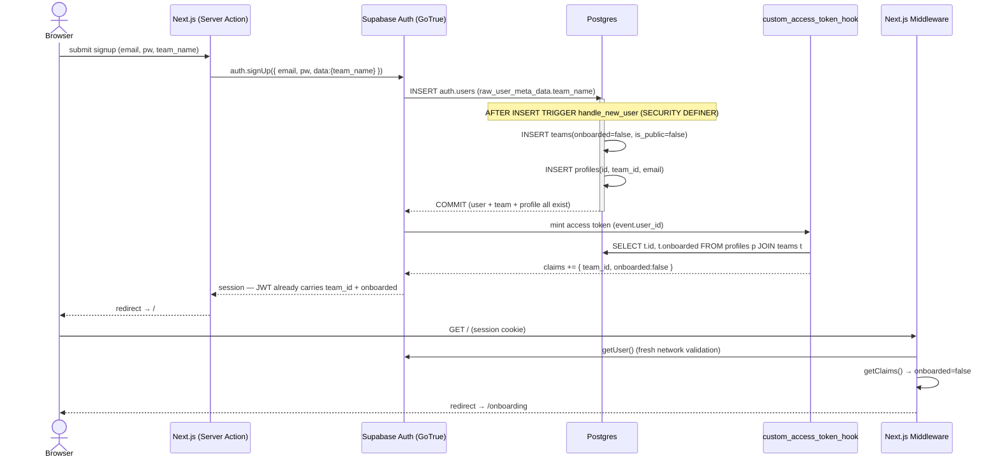
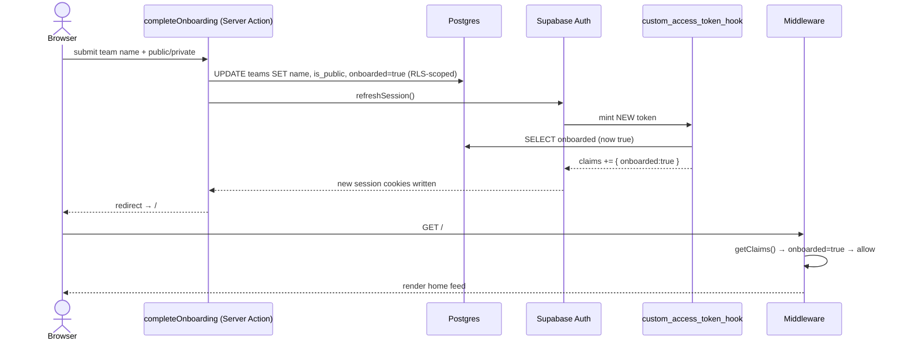

# 03 — Authentication, Session & Provisioning

> **Owns:** Supabase client factories, email/password + Google OAuth (PKCE) flows, the
> `/auth/callback` exchange, the `handle_new_user` provisioning trigger, the
> `custom_access_token_hook` claim-injection hook, `middleware.ts` (auth gating +
> onboarding redirect + `x-team-id`), and the `/onboarding` page + server action.
>
> **Boundary / cross-references (do not duplicate):**
> - Canonical DDL for `teams`, `profiles`, and the `current_user_team_id()` helper lives in
>   **`01-data-model.md`**. This file shows only the columns the trigger/hook touch and treats
>   01 as the source of truth.
> - RLS policies (the `teams` UPDATE policy scoping writes to `current_user_team_id()`, the
>   `profiles` SELECT policy, grants to `anon`) live in **`02-rls-and-security.md`**.
> - The denormalized `posts.is_public` mechanism lives in **`01-data-model.md`** / **`04-posting.md`**.
> - Public/anonymous feed reads live in **`07-home-feed.md`**; messaging realtime in **`06-messaging.md`**.

---

## 1. Responsibilities & design summary

| Concern | Decision | Where enforced |
| --- | --- | --- |
| Who am I? (identity) | Supabase Auth (GoTrue), email/pw + Google OAuth | `getUser()` (network-fresh) |
| Which team am I acting as? | `team_id` JWT claim injected by **Custom Access Token Auth Hook** | RLS via `current_user_team_id()` |
| Have I finished onboarding? | `onboarded` JWT claim (same hook, read from `teams.onboarded` at mint time) | middleware routing |
| When does my team exist? | Created **synchronously** by `handle_new_user` trigger inside the signup txn | DB trigger |
| Session persistence | `@supabase/ssr` cookie-based session, refreshed in middleware | cookies + middleware |
| Security boundary | **RLS at the DB**, never the middleware header | Postgres |

**Core invariant:** the JWT is the single carrier of *acting team identity*. The middleware uses
it only for routing + a convenience `x-team-id` request header; the real authorization boundary is
RLS. A stale/spoofed header can never grant access because every query is still filtered by
`current_user_team_id()` derived from the verified token.

### File & route map

```
app/
  (auth)/
    login/page.tsx              # email/pw form + "Continue with Google"
    signup/page.tsx             # email/pw + team_name
    actions.ts                  # signIn / signUp / signOut server actions
  auth/
    callback/route.ts           # OAuth PKCE: exchangeCodeForSession
    confirm/route.ts            # email-link OTP: verifyOtp
    auth-code-error/page.tsx    # fallback for failed exchange
  onboarding/
    page.tsx                    # name team + public/private toggle
    actions.ts                  # completeOnboarding (idempotent) + refreshSession
utils/supabase/
  client.ts                     # browser client
  server.ts                     # server client (await cookies())
  middleware.ts                 # updateSession() helper
middleware.ts                   # routing: getUser gate + onboarding redirect + x-team-id
supabase/
  config.toml                   # enables the auth hook locally
  migrations/*_auth.sql         # handle_new_user + custom_access_token_hook + grants
```

---

## 2. Environment & configuration

```dotenv
# .env.local
NEXT_PUBLIC_SUPABASE_URL=https://<project-ref>.supabase.co
NEXT_PUBLIC_SUPABASE_ANON_KEY=<anon-key>
# Server-only (never NEXT_PUBLIC_): used by migrations/tests, not by the app at runtime.
SUPABASE_SERVICE_ROLE_KEY=<service-role-key>
```

**Enable the access-token hook.** For local dev (Supabase CLI) in `supabase/config.toml`:

```toml
[auth.hook.custom_access_token]
enabled = true
uri = "pg-functions://postgres/public/custom_access_token_hook"
```

For the hosted project: Dashboard → **Authentication → Hooks → Custom Access Token** → point at
`public.custom_access_token_hook`.

**OAuth redirect allowlist.** Dashboard → Authentication → URL Configuration → add
`http://localhost:3000/auth/callback` and `https://<vercel-domain>/auth/callback`.

> **Why asymmetric JWT signing keys (ES256/RS256):** with asymmetric keys, `getClaims()` verifies
> the token **locally** against a cached JWKS — no network call for claim reads. With the legacy
> HS256 shared secret, `getClaims()` falls back to a network round-trip. Enabling asymmetric keys
> (Dashboard → Auth → JWT Keys) keeps the middleware to **one** network call (`getUser`) instead of two.

---

## 3. Supabase client factories

Three factories because the runtime cookie contract differs per context. **Why three (not one):**
the browser uses `document.cookie`, a Server Component/Action uses the async Next 15 `cookies()`
store, and middleware mutates cookies on a `NextResponse` — sharing one factory would leak the
wrong cookie adapter and silently break session refresh.

### `utils/supabase/client.ts` (browser)

```ts
import { createBrowserClient } from '@supabase/ssr'

export function createClient() {
  return createBrowserClient(
    process.env.NEXT_PUBLIC_SUPABASE_URL!,
    process.env.NEXT_PUBLIC_SUPABASE_ANON_KEY!,
  )
}
```

> **Why `@supabase/ssr`:** it defaults to the **PKCE** flow and stores the session in cookies (not
> `localStorage`), which is what makes the session readable by Server Components, Server Actions,
> and middleware on the same request. This is the foundation of "persistent session + clear
> logged-in vs logged-out" from the brief.

### `utils/supabase/server.ts` (Server Components & Server Actions)

```ts
import { createServerClient } from '@supabase/ssr'
import { cookies } from 'next/headers'

// Next.js 15: cookies() is ASYNC, so this factory is async and MUST be awaited.
export async function createClient() {
  const cookieStore = await cookies()

  return createServerClient(
    process.env.NEXT_PUBLIC_SUPABASE_URL!,
    process.env.NEXT_PUBLIC_SUPABASE_ANON_KEY!,
    {
      cookies: {
        getAll() {
          return cookieStore.getAll()
        },
        setAll(cookiesToSet) {
          try {
            cookiesToSet.forEach(({ name, value, options }) =>
              cookieStore.set(name, value, options),
            )
          } catch {
            // Thrown when called from a Server Component (read-only cookie store).
            // Safe to ignore: the middleware is the writer that refreshes the session.
          }
        },
      },
    },
  )
}
```

> **Why `await createClient()` everywhere on the server:** in Next 15 `cookies()` returns a Promise.
> Forgetting the `await` yields a client bound to a Promise instead of the cookie store, so
> `getUser()` silently sees no session and every RLS-scoped query returns empty. Every server-side
> call site does `const supabase = await createClient()`. (Correction #5.)

> **Why the `try/catch` around `setAll`:** Server Components cannot mutate cookies. Token refresh is
> delegated to the middleware; swallowing the write here keeps Server Components pure while the
> middleware remains the single cookie writer.

### `utils/supabase/middleware.ts` (`updateSession` helper)

```ts
import { createServerClient } from '@supabase/ssr'
import { NextResponse, type NextRequest } from 'next/server'

export async function updateSession(request: NextRequest) {
  // Strip any client-supplied x-team-id so a caller cannot spoof team identity.
  const requestHeaders = new Headers(request.headers)
  requestHeaders.delete('x-team-id')

  let response = NextResponse.next({ request: { headers: requestHeaders } })

  const supabase = createServerClient(
    process.env.NEXT_PUBLIC_SUPABASE_URL!,
    process.env.NEXT_PUBLIC_SUPABASE_ANON_KEY!,
    {
      cookies: {
        getAll() {
          return request.cookies.getAll()
        },
        setAll(cookiesToSet) {
          cookiesToSet.forEach(({ name, value }) => request.cookies.set(name, value))
          response = NextResponse.next({ request: { headers: requestHeaders } })
          cookiesToSet.forEach(({ name, value, options }) =>
            response.cookies.set(name, value, options),
          )
        },
      },
    },
  )

  // (1) FRESH, network-validated identity. Do not run code between createServerClient
  //     and getUser(). getUser() also transparently refreshes an expiring token and the
  //     setAll() handler above persists the new cookies onto `response`.
  const { data: { user } } = await supabase.auth.getUser()

  // (2) Locally-decoded custom claims (team_id, onboarded) that the Auth Hook injected
  //     UNDER app_metadata (matches the hook write path + current_user_team_id()).
  const { data: claimsData } = await supabase.auth.getClaims()
  const claims = (claimsData?.claims ?? null) as
    | { app_metadata?: { team_id?: string; onboarded?: boolean }; sub?: string }
    | null

  // (3) Inject the VERIFIED team_id as a request header for Server Components.
  //     Rebuild the response so the new request header is carried downstream while
  //     preserving any refresh cookies queued onto `response`.
  if (user && claims?.app_metadata?.team_id) {
    requestHeaders.set('x-team-id', String(claims.app_metadata.team_id))
    const refreshed = NextResponse.next({ request: { headers: requestHeaders } })
    response.cookies.getAll().forEach((c) => refreshed.cookies.set(c))
    response = refreshed
  }

  return { response, user, claims }
}
```

---

## 4. Provisioning — `handle_new_user` trigger

Runs **synchronously** inside the `INSERT INTO auth.users` transaction so the team + profile are
guaranteed to exist before any token is minted or any callback returns.

```sql
-- migrations: provisioning. (Canonical teams/profiles DDL lives in 01-data-model.md.)
create or replace function public.handle_new_user()
returns trigger
language plpgsql
security definer            -- runs as owner: can insert into public.* despite RLS
set search_path = ''        -- hardening: never resolve unqualified names from a caller path
as $$
declare
  v_team_id uuid;
begin
  -- One user → one team. Default PRIVATE + un-onboarded until the user confirms in /onboarding.
  insert into public.teams (name, is_public, onboarded)
  values (
    coalesce(nullif(trim(new.raw_user_meta_data ->> 'team_name'), ''), 'My Team'),
    false,
    false
  )
  returning id into v_team_id;

  insert into public.profiles (id, team_id, email)
  values (new.id, v_team_id, new.email);

  return new;
end;
$$;

create trigger on_auth_user_created
  after insert on auth.users
  for each row execute function public.handle_new_user();
```

> **Why the trigger ONLY creates team + profile and NEVER writes `raw_app_meta_data`:** writing
> metadata from this trigger races the token mint and was the source of the original "claims missing
> on first token" bug. The hook (Section 5) is the *only* writer of identity claims, and it reads
> live DB state at mint time — race-free by construction. (Corrections #1 & #3.)

> **Why `security definer` + `set search_path = ''`:** the trigger must bypass RLS to seed the new
> team/profile, so it runs as owner. Pinning `search_path = ''` and fully qualifying every object
> (`public.teams`, `public.profiles`) blocks search-path hijacking — the standard hardening for any
> `SECURITY DEFINER` function.

> **Why default `is_public = false`:** a team is invisible/un-followable until the user explicitly
> opts into Public during onboarding. Safe default; the onboarding action flips it per user choice.

---

## 5. Claim injection — `custom_access_token_hook`

GoTrue calls this function on **every** access-token mint (initial sign-in **and** every refresh),
letting us inject `team_id` + `onboarded` straight into the JWT.

```sql
-- (B) Hook writes claims UNDER app_metadata (matches current_user_team_id() + middleware).
create or replace function public.custom_access_token_hook(event jsonb)
returns jsonb language plpgsql stable set search_path = '' as $$
declare
  claims    jsonb := coalesce(event -> 'claims', '{}'::jsonb);
  v_team_id uuid;
  v_onboarded boolean;
begin
  select p.team_id, t.onboarded into v_team_id, v_onboarded
  from public.profiles p
  join public.teams t on t.id = p.team_id
  where p.id = (event ->> 'user_id')::uuid;

  if not (claims ? 'app_metadata') then            -- ensure parent object exists for jsonb_set
    claims := jsonb_set(claims, '{app_metadata}', '{}'::jsonb);
  end if;
  if v_team_id is not null then
    claims := jsonb_set(claims, '{app_metadata,team_id}', to_jsonb(v_team_id));
  end if;
  claims := jsonb_set(claims, '{app_metadata,onboarded}', to_jsonb(coalesce(v_onboarded, false)));

  return jsonb_set(event, '{claims}', claims);
end;
$$;
grant execute on function public.custom_access_token_hook to supabase_auth_admin;
revoke execute on function public.custom_access_token_hook from authenticated, anon, public;
```

> **Why the Auth Hook over "trigger writes metadata":** the hook is the **canonical, race-free** way
> to put data in a JWT. It reads `teams.onboarded` and `teams.id` at the exact moment the token is
> minted, so the *very first* access token already carries correct claims — no awkward initial
> `refreshSession()` dance, no window where the token lacks `team_id`. A trigger that pokes
> `raw_app_meta_data` instead must win a race against mint and pollutes the user record. (Correction #3.)

> **Why `onboarded` is read here AND read by middleware from the JWT (Correction #1):** the hook is
> the single source. Because `onboarded` lives **in the token claims** (not in
> `auth.users.app_metadata`), the middleware reads it from the **decoded token** — the same place
> the hook wrote it. The original infinite-redirect bug was middleware reading
> `getUser().app_metadata.onboarded` (which the hook never writes) → always `undefined` → forever
> redirected to `/onboarding`. Read from the claim, not from `app_metadata`.

---

## 6. Middleware — auth gating, onboarding redirect, `x-team-id`

```ts
// middleware.ts
import { type NextRequest, NextResponse } from 'next/server'
import { updateSession } from '@/utils/supabase/middleware'

// Routes viewable while logged OUT (public feed + auth screens). See 07-home-feed.md for "/".
const PUBLIC_PREFIXES = ['/login', '/signup', '/auth']

function isPublic(pathname: string) {
  return pathname === '/' || PUBLIC_PREFIXES.some((p) => pathname.startsWith(p))
}

function redirectWithCookies(url: URL, from: NextResponse) {
  const redirect = NextResponse.redirect(url)
  from.cookies.getAll().forEach((c) => redirect.cookies.set(c)) // keep refreshed session cookies
  return redirect
}

export async function middleware(request: NextRequest) {
  const { response, user, claims } = await updateSession(request)
  const { pathname } = request.nextUrl
  const url = request.nextUrl.clone()

  const isAuthRoute = pathname.startsWith('/login') || pathname.startsWith('/signup')
  const isOnboarding = pathname.startsWith('/onboarding')

  // (1) Logged OUT: allow public content, gate everything else to /login.
  if (!user) {
    if (isPublic(pathname)) return response
    url.pathname = '/login'
    return redirectWithCookies(url, response)
  }

  // (2) Logged IN but sitting on an auth screen → go home.
  if (isAuthRoute) {
    url.pathname = '/'
    return redirectWithCookies(url, response)
  }

  // (3) Onboarding gate — read the SAME claim the hook injected into the token
  //     (claims.app_metadata.onboarded, NOT the empty getUser().app_metadata).
  const onboarded = claims?.app_metadata?.onboarded === true
  if (!onboarded && !isOnboarding) {
    url.pathname = '/onboarding'
    return redirectWithCookies(url, response)
  }
  if (onboarded && isOnboarding) {
    url.pathname = '/'
    return redirectWithCookies(url, response)
  }

  // (4) Pass through; updateSession already set the verified x-team-id request header.
  return response
}

export const config = {
  // Run on everything except static assets / images.
  matcher: ['/((?!_next/static|_next/image|favicon.ico|.*\\.(?:svg|png|jpg|jpeg|gif|webp)$).*)'],
}
```

Reading the header in a protected Server Component (no DB round-trip needed for the common case):

```ts
import { headers } from 'next/headers'
const teamId = (await headers()).get('x-team-id') // Next 15: headers() is async
```

> **Why `getUser()` over `getClaims()`/`getSession()` for the AUTH GATE:** `getUser()` makes a
> network round-trip to GoTrue, so it validates the token is genuine and un-revoked and returns
> always-fresh state — exactly what a security gate needs. `getClaims()`/`getSession()` only decode
> the local cookie, which can be **stale** (and `getSession()` is explicitly untrusted server-side).
> We still use `getClaims()` for the **routing** values (`team_id`, `onboarded`) because those are
> cheap and non-authoritative: a stale `onboarded` only mis-routes for one request and self-corrects
> on the next refresh, while the real authorization boundary (RLS) always derives the team from the
> verified token. Security = `getUser`; UX routing = `getClaims`.

> **Why a request header (`x-team-id`) and not a cookie/global:** it lets Server Components read the
> acting team in O(1) without re-decoding the JWT, while `updateSession` strips any inbound
> `x-team-id` first so it can never be spoofed. It is a **convenience**, never a trust boundary —
> defense-in-depth on top of RLS.

### 6.1 `lib/auth/claims.ts` — the one shared team accessor for feature code

The middleware sets `x-team-id` for the common Server-Component path, but **all** feature code
(`05`/`06`/`07`) reads the acting team through **one** shared helper that decodes the verified claim
at the canonical `app_metadata.team_id` path. This is the single source of truth — copied verbatim
from `00` §6.1 (C):

```ts
// lib/auth/claims.ts — the ONE way feature code gets the acting team. (owner: 03)
import { createClient } from '@/utils/supabase/server';

export async function getCurrentTeamId(): Promise<string | null> {
  const supabase = await createClient();
  const { data } = await supabase.auth.getClaims();
  return (data?.claims as any)?.app_metadata?.team_id ?? null;
}
```

> **Never read `getUser().app_metadata.team_id` in feature code:** the provisioning trigger (§4)
> deliberately does **not** write `raw_app_meta_data`, so that field is empty — the value lives only
> in the token. `05`, `06`, and `07` all call `getCurrentTeamId()` as the single shared way to read
> the acting team; this supersedes any `user.app_metadata.team_id` reads.

---

## 7. Auth flows

### 7.1 Email + password (server actions)

```ts
// app/(auth)/actions.ts
'use server'
import { z } from 'zod'
import { redirect } from 'next/navigation'
import { revalidatePath } from 'next/cache'
import { createClient } from '@/utils/supabase/server'

type ActionState = { success: boolean; message: string; errors?: Record<string, string[]> }

const Credentials = z.object({
  email: z.string().email(),
  password: z.string().min(8),
})
const SignUp = Credentials.extend({ teamName: z.string().min(2).max(50) })

export async function signUp(_prev: ActionState, formData: FormData): Promise<ActionState> {
  const parsed = SignUp.safeParse(Object.fromEntries(formData))
  if (!parsed.success) {
    return { success: false, message: 'Invalid input', errors: parsed.error.flatten().fieldErrors }
  }
  const supabase = await createClient()
  const { error } = await supabase.auth.signUp({
    email: parsed.data.email,
    password: parsed.data.password,
    // Forwarded to auth.users.raw_user_meta_data → consumed by handle_new_user().
    options: { data: { team_name: parsed.data.teamName } },
  })
  if (error) return { success: false, message: error.message }
  // If email confirmation is ON, the session starts after /auth/confirm; otherwise it is live now.
  redirect('/onboarding')
}

export async function signIn(_prev: ActionState, formData: FormData): Promise<ActionState> {
  const parsed = Credentials.safeParse(Object.fromEntries(formData))
  if (!parsed.success) {
    return { success: false, message: 'Invalid input', errors: parsed.error.flatten().fieldErrors }
  }
  const supabase = await createClient()
  const { error } = await supabase.auth.signInWithPassword(parsed.data)
  if (error) return { success: false, message: 'Invalid email or password' }
  revalidatePath('/', 'layout')
  redirect('/') // middleware routes to /onboarding if onboarded=false
}

export async function signOut(): Promise<void> {
  const supabase = await createClient()
  await supabase.auth.signOut()
  revalidatePath('/', 'layout')
  redirect('/login')
}
```

> **Why Server Actions (not Route Handlers) for mutations:** in Next 15 actions colocate validation,
> mutation, and cache revalidation, integrate with `useActionState`'s pending/error state, and avoid
> hand-rolled `fetch` plumbing. Input is validated with **Zod inside the action**; the standardized
> `{ success, message, errors? }` return feeds React 19 `useActionState` (which supplies its own
> implicit `startTransition`).

Client form wiring (logged-in vs logged-out is visually obvious because the whole `(auth)` group is
only reachable when `!user`):

```tsx
'use client'
import { useActionState } from 'react'
import { signIn } from '../actions'

export function LoginForm() {
  const [state, action, pending] = useActionState(signIn, { success: false, message: '' })
  return (
    <form action={action}>
      <input name="email" type="email" required />
      <input name="password" type="password" required />
      {state.message && <p role="alert">{state.message}</p>}
      <button disabled={pending}>{pending ? 'Signing in…' : 'Sign in'}</button>
    </form>
  )
}
```

### 7.2 Google OAuth (PKCE)

```tsx
'use client'
import { createClient } from '@/utils/supabase/client'

export function GoogleButton() {
  async function signInWithGoogle() {
    const supabase = createClient()
    await supabase.auth.signInWithOAuth({
      provider: 'google',
      options: {
        // PKCE returns ?code=... to this route (query string, not URL hash).
        redirectTo: `${location.origin}/auth/callback?next=/`,
        queryParams: { access_type: 'offline', prompt: 'consent' },
      },
    })
  }
  return <button onClick={signInWithGoogle}>Continue with Google</button>
}
```

> **Why PKCE (Proof Key for Code Exchange):** `@supabase/ssr` uses PKCE by default, returning a
> short-lived `code` in the **query string** that the server exchanges for a session over a back
> channel. Nothing sensitive lands in the URL **fragment** (which the server cannot read and which
> leaks via history/referrer), so the flow is safe for a server-rendered app and works uniformly for
> both OAuth and email-link confirmation. It also defeats authorization-code interception without a
> client secret in the browser.

### 7.3 `/auth/callback/route.ts` — exchange the PKCE code

```ts
import { NextResponse } from 'next/server'
import { createClient } from '@/utils/supabase/server'

export async function GET(request: Request) {
  const { searchParams, origin } = new URL(request.url)
  const code = searchParams.get('code')
  const next = searchParams.get('next') ?? '/'

  if (code) {
    const supabase = await createClient() // Next 15: await — cookies() is async
    const { error } = await supabase.auth.exchangeCodeForSession(code)
    if (!error) {
      // Honor the proxy host on Vercel/load balancers; fall back to origin locally.
      const forwardedHost = request.headers.get('x-forwarded-host')
      const isLocal = process.env.NODE_ENV === 'development'
      const base = isLocal ? origin : forwardedHost ? `https://${forwardedHost}` : origin
      return NextResponse.redirect(`${base}${next}`) // middleware then applies onboarding gate
    }
  }
  return NextResponse.redirect(`${origin}/auth/auth-code-error`)
}
```

Because the `handle_new_user` trigger committed the team **inside** the signup transaction, the team
already exists by the time `exchangeCodeForSession` runs, so the hook reads a real `team_id` on this
first token. No manual refresh is needed at callback time.

### 7.4 `/auth/confirm/route.ts` — email-link OTP (when confirmation is enabled)

```ts
import { type EmailOtpType } from '@supabase/supabase-js'
import { NextResponse } from 'next/server'
import { createClient } from '@/utils/supabase/server'

export async function GET(request: Request) {
  const { searchParams, origin } = new URL(request.url)
  const token_hash = searchParams.get('token_hash')
  const type = searchParams.get('type') as EmailOtpType | null
  const next = searchParams.get('next') ?? '/'

  if (token_hash && type) {
    const supabase = await createClient()
    const { error } = await supabase.auth.verifyOtp({ type, token_hash })
    if (!error) return NextResponse.redirect(`${origin}${next}`)
  }
  return NextResponse.redirect(`${origin}/auth/auth-code-error`)
}
```

> **MVP trade-off:** email confirmation can be disabled in Auth settings to streamline the demo
> (documented as a known limitation in the README). Keeping `/auth/confirm` in place means flipping
> it back on requires zero code change.

---

## 8. Onboarding page + idempotent action (Correction #1 fix)

The team row already exists (created by the trigger); onboarding lets the user **name** it and
choose **Public/Private**, then flips `onboarded = true`.

```tsx
// app/onboarding/page.tsx (Server Component)
import { OnboardingForm } from './onboarding-form'
export default function OnboardingPage() {
  return (
    <main>
      <h1>Set up your team</h1>
      <OnboardingForm />
    </main>
  )
}
```

```ts
// app/onboarding/actions.ts
'use server'
import { z } from 'zod'
import { redirect } from 'next/navigation'
import { revalidatePath } from 'next/cache'
import { createClient } from '@/utils/supabase/server'

const Onboarding = z.object({
  teamName: z.string().min(2).max(50),
  // Why presence-check, not z.coerce.boolean(): z.coerce.boolean('false') === true (any
  // non-empty string is truthy), so an unchecked toggle posting 'false' would go Public.
  isPublic: z.preprocess(v => v === 'on' || v === 'true', z.boolean()),
})

export async function completeOnboarding(_prev: unknown, formData: FormData) {
  const parsed = Onboarding.safeParse(Object.fromEntries(formData))
  if (!parsed.success) {
    return { success: false, message: 'Invalid input', errors: parsed.error.flatten().fieldErrors }
  }

  const supabase = await createClient()
  const { data: { user } } = await supabase.auth.getUser()
  if (!user) return { success: false, message: 'Not authenticated' }

  const { data: claimsData } = await supabase.auth.getClaims()
  const teamId = (claimsData?.claims as any)?.app_metadata?.team_id as string | undefined
  if (!teamId) return { success: false, message: 'No team on session' }

  // Idempotent: re-running with the same input is a no-op-equivalent UPDATE.
  // The teams UPDATE RLS policy (02-rls-and-security.md) double-scopes to current_user_team_id().
  const { error } = await supabase
    .from('teams')
    .update({ name: parsed.data.teamName, is_public: parsed.data.isPublic, onboarded: true })
    .eq('id', teamId)
  if (error) return { success: false, message: error.message }

  // CRITICAL: mint a NEW token so the hook re-reads teams.onboarded = true.
  // Without this the cached token still says onboarded=false → /onboarding redirect loop.
  await supabase.auth.refreshSession()

  revalidatePath('/', 'layout')
  redirect('/')
}
```

> **Why the explicit `refreshSession()` (the actual fix for Correction #1):** the hook only runs at
> token-mint time, so flipping `teams.onboarded` in the DB does **not** retroactively change the
> token already in the cookie. `refreshSession()` forces a fresh mint; the hook re-reads
> `onboarded = true`; the next middleware pass sees the updated claim and stops redirecting. In a
> Server Action the cookie store is writable, so the refreshed cookies persist. This closes the loop:
> the hook writes `onboarded`, the action refreshes it, the middleware reads the same claim.

> **Why this is "idempotent" without `ON CONFLICT`:** the row already exists, so onboarding is an
> `UPDATE`, which is naturally repeat-safe (double-submit yields the same final state). The
> `INSERT … ON CONFLICT DO NOTHING` idempotency guard belongs to the *creation* path
> (the `handle_new_user` trigger / any seed insert), not here.

---

## 9. Sequence diagrams

### 9.1 Signup → provisioning → first token with claims → redirect



### 9.2 Completing onboarding (flips the claim)



---

## 10. Session persistence & logged-in/out UX

- **Persistence:** `@supabase/ssr` stores the session in HTTP cookies; `updateSession` refreshes it
  on every navigated request, so a logged-in user stays logged in across reloads and tab restarts.
- **Logged-out is first-class:** middleware lets `!user` through to `/` (public feed) and the auth
  screens; everything else redirects to `/login`. The public feed serving anonymous users is owned
  by **`07-home-feed.md`** (single dynamic route, `anon` RLS via `TO anon`).
- **Clear team association after login:** the root layout reads `x-team-id` (or `getClaims()`),
  resolves the team name once, and shows "Acting as **{team}**" + Sign out in the header, making the
  acting identity unambiguous per the brief.

---

## 11. Pitfalls checklist (corrections recap)

| # | Pitfall | Mitigation in this file |
| --- | --- | --- |
| 1 | `onboarded` written to table but middleware reads `app_metadata` → redirect loop | Hook injects `onboarded` into the **JWT**; middleware reads the **same claim**; action `refreshSession()` re-mints. §5/§6/§8 |
| 3 | Trigger writing `raw_app_meta_data` races the token mint | Trigger creates team+profile **only**; the hook is the sole claim writer. §4/§5 |
| 5 | Server `createClient()` not awaited (Next 15 async `cookies()`) | Async factory; all call sites `await createClient()`. §3 |
| — | `x-team-id` spoofing | `updateSession` strips inbound header; RLS is the real boundary. §3/§6 |
| — | Reading session for auth via local decode | `getUser()` (network) gates auth; `getClaims()` only for routing. §6 |
| — | PKCE `code` mishandled / read from hash | Server `exchangeCodeForSession` on `?code` in `/auth/callback`. §7.3 |

---

## 12. Known limitations / what to improve with more time

- **Email confirmation disabled for the demo** — re-enable in Auth settings; `/auth/confirm` already
  handles the OTP link.
- **No password reset / magic-link** — straightforward `resetPasswordForEmail` + a `/auth/confirm`
  reuse; deferred to keep the 3-day scope tight.
- **`refreshSession()` after onboarding is one extra round-trip** — acceptable for a once-per-account
  event; a more advanced approach would force-refresh on the client via `onAuthStateChange`.
- **Role management is out of scope** (per brief) — every team member shares one team identity; if
  roles were added later, an additional `role` claim would ride the same hook with zero middleware
  rework.
