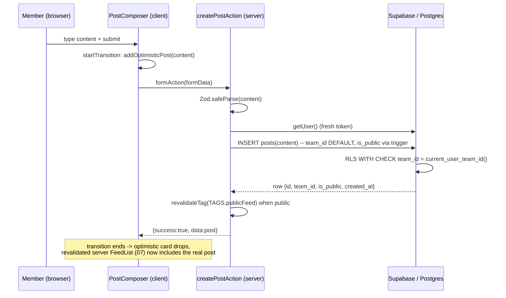
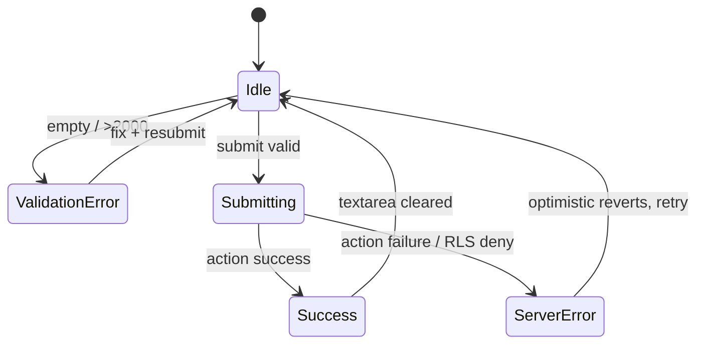

# 04 — Posting System

> **Owns:** the post **write path** (the `createPostAction` Server Action), the **post composer** Client Component, the atomic **`<PostCard>`** presentational component, the **optimistic-update** mechanics (`useActionState` + `useOptimistic` + `startTransition`), and the **standardized mutation response shape** reused by every action in this app.
>
> **Does NOT own (cross-references):**
> - Full `posts` table DDL, the `is_public` denormalization trigger, and indexes → **`01-data-model.md`**.
> - `posts` RLS read/write policies, anon vs authenticated `TO` clauses, GRANTs → **`02-rls-and-security.md`**.
> - `createClient()` server helper, JWT `team_id` claim injection, `current_user_team_id()` → **`03-auth-and-session.md`**.
> - Reading/merging/sorting/paginating the feed, the `get_feed` RPC, the "New posts available" pill → **`07-home-feed.md`**.
> - pgTAP RLS tests, Playwright smoke → **`09-ai-blueprint-and-quality.md`**.

---

## 1. Requirements coverage

| Case requirement | How this file covers it |
| --- | --- |
| Any team member can create a post | No role gate. Membership = possessing a `team_id` claim; RLS `WITH CHECK` is the only authorization gate (§5). |
| Posts belong to the **TEAM**, not the user | `team_id` is **never sent by the client**; it defaults to `current_user_team_id()` (JWT claim) at the DB layer and is locked by RLS `WITH CHECK` (§4, §5). |
| Text content + `created_at` | Zod-validated `content`; `created_at default now()` (schema in `01-data-model.md`). |
| Private vs public scoping of new posts | `posts.is_public` is derived from the owning team by a `BEFORE INSERT` trigger — the client cannot spoof it (§4.3). |
| Clean async/error handling, loading/empty/error states | Standardized `ActionState` response, try-safe action, full UI state matrix (§3, §6, §7). |

**Core principle.** A post is an utterance of the *team identity*. There are no individual authors. The composer therefore renders "as {teamName}", the row carries only `team_id`, and we never persist which `auth.users.id` clicked "Post". This keeps the model aligned with the one-user-one-team / no-profiles tenancy from the shared brief.

---

## 2. Files this slice introduces

```
app/page.tsx                     # Server Component — composes <PostComposer/> + <FeedList/> (FeedList owned by 07)
components/post/
  post-composer.tsx              # 'use client' — composer + optimistic list   (this file)
  post-card.tsx                  # presentational, server-renderable           (this file)
actions/
  posts.ts                       # 'use server' — createPostAction              (this file)
  types.ts                       # ActionState<T> shared response shape         (this file)
lib/format.ts                    # formatRelativeTime() helper                  (this file)
```

> **Why a dedicated `actions/types.ts`:** the `{ success, message, errors? }` contract is consumed by `05-follow-system.md`, `06-messaging.md`, and onboarding. One canonical type prevents three slightly-different shapes from drifting apart — the opposite of over-abstraction (it is *de*-duplication, not premature generalization).

---

## 3. Standardized response shape

```ts
// actions/types.ts
export type FieldErrors = Record<string, string[]>;

export interface ActionState<TData = undefined> {
  /** discriminant the client switches on */
  success: boolean;
  /** human-readable status, safe to render in an aria-live region */
  message: string;
  /** per-field Zod errors, keyed by form field name; only on validation failure */
  errors?: FieldErrors;
  /** payload (e.g. the freshly created post) so the client can reconcile optimistic UI */
  data?: TData;
}

/** the initial state every useActionState starts from */
export const idleState: ActionState = { success: false, message: '' };
```

> **Why a single discriminated object instead of throwing:** Server Actions that *throw* surface as an opaque error boundary on the client and lose field-level detail. Returning a typed object lets `useActionState` keep the value, lets us render inline `errors.content`, and keeps the happy/sad paths symmetric. Throwing is reserved for *programmer* errors, never *user/validation* errors.

---

## 4. The `createPostAction` Server Action

### 4.1 Full skeleton

```ts
// actions/posts.ts
'use server';

import { revalidateTag } from 'next/cache';
import { z } from 'zod';
import { createClient } from '@/utils/supabase/server';
import { TAGS } from '@/lib/constants';
import { type ActionState } from '@/actions/types';

export type Post = {
  id: string;
  team_id: string;
  content: string;
  is_public: boolean;
  created_at: string;
};

const CreatePostSchema = z.object({
  content: z
    .string()
    .trim()
    .min(1, 'Your post is empty.')
    .max(2000, 'Posts are limited to 2000 characters.'),
});

export async function createPostAction(
  _prev: ActionState<Post>,
  formData: FormData,
): Promise<ActionState<Post>> {
  // 1) Validate input at the boundary.
  const parsed = CreatePostSchema.safeParse({ content: formData.get('content') });
  if (!parsed.success) {
    return {
      success: false,
      message: 'Please fix the highlighted field.',
      errors: parsed.error.flatten().fieldErrors,
    };
  }

  // 2) createClient() MUST be awaited — cookies() is async in Next.js 15.
  const supabase = await createClient();

  // 3) Auth gate. getUser() round-trips the Auth server => always-fresh token.
  //    We do NOT read team_id here for the insert; the DB derives it (step 4).
  const {
    data: { user },
    error: authError,
  } = await supabase.auth.getUser();
  if (authError || !user) {
    return { success: false, message: 'Please sign in to post.' };
  }

  // 4) Insert ONLY content. team_id is filled by a column DEFAULT of
  //    current_user_team_id() (the JWT claim); is_public is filled by a
  //    BEFORE INSERT trigger from the owning team. The client supplies neither.
  const { data: post, error } = await supabase
    .from('posts')
    .insert({ content: parsed.data.content })
    .select('id, team_id, content, is_public, created_at')
    .single();

  if (error) {
    // RLS denial surfaces as 42501; log server-side, stay generic to the client.
    console.error('[createPostAction] insert failed', { code: error.code, msg: error.message });
    return { success: false, message: 'Could not publish your post. Please try again.' };
  }

  // 5) Invalidate exactly what changed.
  if (post.is_public) revalidateTag(TAGS.publicFeed);   // shared cached public slice (07)
  // The private slice is per-viewer/dynamic (the get_feed RPC), so it carries no tag — see 00 §6.5.

  return { success: true, message: 'Published.', data: post };
}
```

### 4.2 Where `team_id` comes from — and why the client never sends it

The `posts.team_id` column is defined (in `01-data-model.md`) with:

```sql
team_id uuid NOT NULL DEFAULT public.current_user_team_id() REFERENCES public.teams(id)
```

and the RLS write policy (in `02-rls-and-security.md`) enforces:

```sql
CREATE POLICY posts_insert_own_team ON public.posts
  FOR INSERT TO authenticated
  WITH CHECK (team_id = public.current_user_team_id());
```

So the action inserts `{ content }`, the DB fills `team_id` from the verified JWT claim, and the `WITH CHECK` re-validates it. There is **no code path** in which a client can attribute a post to another team.

> **Why derive `team_id` at the DB instead of passing it from the action:** a single source of truth (`current_user_team_id()`) is used for the column default, the RLS check, *and* the feed RPC. Trusting a value the action assembles in JS would create a second, spoofable source. Deriving it from the signed token and re-checking it in RLS is both simpler (the action shrinks to one field) and strictly more secure — it satisfies "users can only act for their own team" with defense-in-depth.

### 4.3 Where `is_public` comes from — "sets `posts.is_public` from the owning team"

The requirement "the create action sets `posts.is_public` from the owning team" is satisfied **authoritatively at the DB layer**, not by trusting client input. `01-data-model.md` owns this `BEFORE INSERT` trigger; reproduced here because the posting write-path's correctness depends on its contract:

```sql
-- canonical home: 01-data-model.md (trigger name: posts_set_is_public_before_insert)
CREATE OR REPLACE FUNCTION public.posts_set_is_public()
RETURNS trigger LANGUAGE plpgsql SECURITY DEFINER SET search_path = '' AS $$
BEGIN
  IF NEW.team_id IS NOT NULL THEN                 -- null-team guard
    SELECT t.is_public INTO NEW.is_public
    FROM public.teams t
    WHERE t.id = NEW.team_id;
  END IF;
  RETURN NEW;
END;
$$;

CREATE TRIGGER posts_set_is_public_before_insert
  BEFORE INSERT ON public.posts
  FOR EACH ROW EXECUTE FUNCTION public.posts_set_is_public();
```

> **Why a trigger instead of `.insert({ content, is_public })`:** if the action computed `is_public`, a forged client request could publish a *private* team's post as public (a visibility breach). Deriving it from `teams.is_public` inside a `BEFORE INSERT` trigger makes the value unspoofable and keeps the denormalized copy consistent with its source the instant the row is born. The complementary `AFTER UPDATE ON teams` trigger that back-fills existing posts on a privacy toggle also lives in `01-data-model.md`.

### 4.4 Idempotency note (intentionally none)

Unlike follows (`ON CONFLICT DO NOTHING` on the unique pair) and conversations (`upsert … ignoreDuplicates`), **posts have no natural dedupe key** — two identical posts seconds apart are legitimate. Double-submit protection is therefore a **UI** concern: the submit button is `disabled` while `isPending` (§5). We deliberately do *not* invent a synthetic idempotency key for the MVP; doing so would be over-abstraction for a low-stakes mutation.

### 4.5 Create-post sequence



---

## 5. Post composer (Client Component) — optimistic UI

```tsx
// components/post/post-composer.tsx
'use client';

import { useActionState, useOptimistic, useRef, startTransition } from 'react';
import { createPostAction, type Post } from '@/actions/posts';
import { idleState } from '@/actions/types';
import { PostCard } from './post-card';

type OptimisticPost = Post & { pending?: boolean };

export function PostComposer({ teamId, teamName }: { teamId: string; teamName: string }) {
  const formRef = useRef<HTMLFormElement>(null);
  const [state, formAction, isPending] = useActionState(createPostAction, idleState);

  // Base list is [] — optimistic items live only for the duration of the transition,
  // then the revalidated server FeedList (07) renders the persisted post.
  const [optimisticPosts, addOptimisticPost] = useOptimistic<OptimisticPost[], string>(
    [],
    (current, content) => [
      {
        id: `optimistic-${crypto.randomUUID()}`,
        team_id: teamId,
        content,
        is_public: true,          // display-only; server value is authoritative
        created_at: new Date().toISOString(),
        pending: true,
      },
      ...current,
    ],
  );

  function handleSubmit(formData: FormData) {
    const content = String(formData.get('content') ?? '').trim();
    if (!content) return; // client-side guard mirrors the Zod min(1)

    // Both the optimistic dispatch and the action dispatch must run in a transition.
    startTransition(() => {
      addOptimisticPost(content);
      formAction(formData);
    });
    formRef.current?.reset(); // safe: formData was already captured by value
  }

  return (
    <section aria-label="Create a post">
      <form ref={formRef} action={handleSubmit}>
        <textarea
          name="content"
          required
          maxLength={2000}
          disabled={isPending}
          placeholder={`Share something as ${teamName}…`}
          aria-invalid={Boolean(state.errors?.content)}
          aria-describedby={state.errors?.content ? 'content-error' : undefined}
        />

        {state.errors?.content && (
          <p id="content-error" role="alert">
            {state.errors.content[0]}
          </p>
        )}

        <div className="composer__footer">
          {/* status line: error message in red, success briefly, else nothing */}
          <span aria-live="polite" data-tone={state.success ? 'ok' : 'error'}>
            {state.message}
          </span>
          <button type="submit" disabled={isPending}>
            {isPending ? 'Publishing…' : 'Post'}
          </button>
        </div>
      </form>

      {/* Optimistic cards render ABOVE the server-rendered <FeedList/> (owned by 07). */}
      {optimisticPosts.length > 0 && (
        <ul aria-live="polite" className="composer__optimistic">
          {optimisticPosts.map((p) => (
            <li key={p.id}>
              <PostCard post={p} teamName={teamName} pending={p.pending} />
            </li>
          ))}
        </ul>
      )}
    </section>
  );
}
```

**How the optimistic → persisted handoff works.** `useOptimistic`'s base list is `[]`. During the transition the new card is shown with `pending`. When `createPostAction` resolves *and* its `revalidateTag` calls cause Next.js to stream a fresh RSC payload, React commits the new server tree — in which `07`'s `<FeedList/>` already contains the persisted post — at the **same** commit that ends the transition and drops the optimistic item. The user sees one continuous card, never a flash of "gone then back".

> **Why `useActionState` + `startTransition` (not `useFormState`/manual fetch):** `useActionState` is the React 19 replacement for `useFormState`; it returns `[state, formAction, isPending]` so we get pending state for free without a `useState` boolean. Wrapping the optimistic dispatch in `startTransition` is mandatory — `useOptimistic` updates *must* occur inside a transition or React throws. This pairing gives non-blocking submission (the main thread never suspends) plus a single source of pending truth.

> **Why optimistic UI here at all:** publishing a post is a high-frequency, low-stakes, near-always-succeeds action. Showing the card instantly makes the app feel realtime *without* the cost of a websocket on the feed (realtime is reserved for messaging per the locked decisions). The rare failure path is handled by the status line + the optimistic card vanishing when the transition reverts.

---

## 6. `<PostCard>` — the atomic feed unit

```tsx
// components/post/post-card.tsx
import { formatRelativeTime } from '@/lib/format';

type CardPost = {
  id: string;
  content: string;
  created_at: string;
  is_public: boolean;
};

export function PostCard({
  post,
  teamName,
  pending = false,
}: {
  post: CardPost;
  teamName: string;
  pending?: boolean;
}) {
  return (
    <article aria-busy={pending} data-pending={pending} className="post-card">
      <header className="post-card__head">
        <span className="post-card__team">{teamName}</span>
        {!post.is_public && (
          <span className="post-card__badge" title="Only approved followers can see this">
            Private
          </span>
        )}
        <time dateTime={post.created_at} className="post-card__time">
          {formatRelativeTime(post.created_at)}
        </time>
      </header>

      {/* whitespace preserved; content is plain text (no HTML) => no XSS surface */}
      <p className="post-card__body" style={{ whiteSpace: 'pre-wrap' }}>
        {post.content}
      </p>

      {pending && <span aria-live="polite" className="post-card__status">Publishing…</span>}
    </article>
  );
}
```

`<PostCard>` is **purely presentational and server-renderable** (no hooks), so `07`'s `<FeedList/>` server component can map over `get_feed` rows and render the same component the composer uses for optimistic previews. The feed query (in `07`) returns each post's `team_name` alongside the row, which `<FeedList/>` passes in as `teamName` — `<PostCard>` itself never queries.

> **Why render plain text and never HTML:** posts are `text`. We interpolate `{post.content}` as a React string child, which is auto-escaped, and rely on `white-space: pre-wrap` for line breaks. No `dangerouslySetInnerHTML`, no markdown parser → zero stored-XSS surface for a feature that doesn't need rich text in the MVP.

---

## 7. UI state matrix

| State | Trigger | Composer | Feed |
| --- | --- | --- | --- |
| **Idle** | initial | empty textarea, button "Post" enabled, no message | server `<FeedList/>` (07) |
| **Validation error** | empty / >2000 chars | `errors.content` under field, `aria-invalid`, button stays enabled | unchanged |
| **Submitting (optimistic)** | submit | textarea + button `disabled`, button "Publishing…", optimistic `<PostCard pending>` shown above feed | unchanged until revalidation |
| **Success** | action `success:true` | textarea cleared, brief "Published." status, optimistic card replaced by persisted card | revalidated, includes new post |
| **Server/RLS error** | action `success:false` | optimistic card reverts (transition ends), red status "Could not publish…" | unchanged |
| **Empty feed** | no posts | composer only | `<FeedList/>` renders an empty-state placeholder (owned by 07) |
| **Loading feed** | RSC stream | composer renders immediately | `<Suspense>` skeleton (owned by 07) |



---

## 8. Async & error-handling rules

1. **Never throw user/validation errors across the action boundary** — return `ActionState`. Throwing is for unexpected/programmer faults only.
2. **`await createClient()`** — the Next.js 15 server client reads `cookies()` which is async; forgetting the `await` yields a runtime "used before resolved" error (cross-ref `03-auth-and-session.md`).
3. **Log server-side, stay generic client-side.** Postgres error codes worth distinguishing internally:

   | Code | Meaning | Client message |
   | --- | --- | --- |
   | `42501` | RLS `WITH CHECK` denied (no/foreign team) | "Could not publish your post." |
   | `23502` | `content` NOT NULL violated (shouldn't reach — Zod guards) | "Your post is empty." |
   | `23503` | FK `team_id` invalid (stale claim) | "Please sign in again." |

   We never echo the raw Postgres message to the UI (it can leak schema/policy detail).
4. **Client guard mirrors server validation** (`content.trim()` length) so the obvious empty-submit never makes a round trip — but the server Zod check is the authority.
5. **Double-submit** is prevented purely by `disabled={isPending}`; no debounce library needed.

---

## 9. Security recap (enforcement lives in `02`)

This action is a **convenience/UX layer**, not the security boundary. Even if `createPostAction` had a bug, the database refuses to:

- insert a row whose `team_id ≠ current_user_team_id()` (RLS `WITH CHECK`), and
- expose a private post to a non-follower (RLS `SELECT` policies + `is_public` denormalization).

> **Why keep RLS even though we also gate in the action:** defense-in-depth. The Server Action can be bypassed (a leaked anon key + direct PostgREST call), but RLS cannot. The action exists for ergonomics (validation, friendly errors, cache invalidation); RLS exists for correctness. Full policy set is in `02-rls-and-security.md`.

---

## 10. Why-notes (consolidated)

| Decision | Why |
| --- | --- |
| **Server Action over Route Handler** | Co-locates the mutation with the component, gives progressive-enhancement form submits, integrates natively with `useActionState`/`revalidateTag`, and removes hand-written `fetch`/JSON/error plumbing. Next.js 15 explicitly steers mutations to Server Actions; a Route Handler would be ceremony with no benefit for a same-origin form. |
| **Optimistic UI (`useOptimistic`)** | Posting almost always succeeds and is high-frequency; instant feedback feels realtime without paying for a feed websocket (realtime is reserved for messaging). Revert-on-failure is automatic when the transition ends. |
| **`revalidateTag` over `revalidatePath`** | Surgical: `revalidateTag(TAGS.publicFeed)` refreshes only the shared public slice across every route that renders it, without rebuilding the whole page or touching each viewer's dynamically-fetched private posts. `revalidatePath` would blunt-force re-render unrelated content. |
| **`team_id` from JWT claim (DB default), not from the action** | Single spoof-proof source of truth shared by column default, RLS check, and feed RPC; shrinks the action to one field. |
| **`is_public` via `BEFORE INSERT` trigger** | Unspoofable visibility derived from the owning team; keeps the denormalized copy consistent at row birth. |
| **`getUser()` (not `getClaims`) in the action** | Round-trips the Auth server for a fresh token as a clean auth gate; `team_id` itself is immutable so staleness is irrelevant, and RLS is the real enforcer regardless. |
| **No idempotency key on posts** | Posts have no natural dedupe identity; UI `disabled`-while-pending is the right-sized guard. Synthetic keys would be over-abstraction. |
| **Plain-text rendering** | Auto-escaped React string child + `pre-wrap`; no rich-text/markdown in the MVP → no stored-XSS surface. |

---

## 11. Known limitations / what I'd add with more time

- **No edit/delete.** Out of scope for the MVP; would add `updatePostAction`/`deletePostAction` with `FOR UPDATE/DELETE` RLS scoped to `team_id = current_user_team_id()` and an `updated_at` column.
- **No media/attachments.** Text-only by design; images would need Supabase Storage + a signed-URL render path.
- **No optimistic *failure* toast.** Currently the red status line + reverted card communicate failure; a transient toast would be friendlier.
- **No rate limiting.** A spammy team can flood; a per-team token-bucket (e.g. Postgres `CHECK` on insert rate, or Upstash) is the scale path.
- **`team_name` re-passed per card.** Fine for the MVP; at scale the feed RPC already joins it once (see `07`), avoiding N lookups.

---

### Cross-reference index
- Schema, `is_public` triggers, indexes → `01-data-model.md`
- `posts` RLS (`WITH CHECK`, anon/auth `SELECT`), GRANTs → `02-rls-and-security.md`
- `createClient()`, `current_user_team_id()`, JWT `team_id` claim → `03-auth-and-session.md`
- Feed read path, `get_feed` RPC, `public_feed` tag, "new posts" pill, `<FeedList/>` → `07-home-feed.md`
- pgTAP RLS tests for posting, Playwright smoke → `09-ai-blueprint-and-quality.md`
