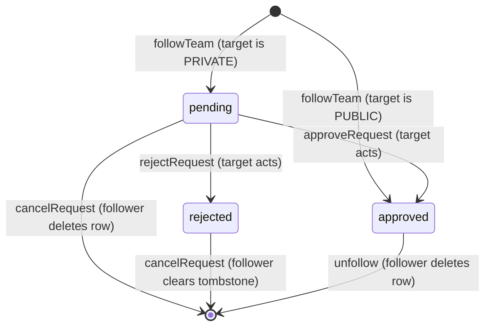

# 05 — Follow / Follow-Request System

> Scope: team → team following with a public/private approval model.
> Owns: the `follows` table semantics, the five mutation Server Actions
> (`followTeam`, `unfollow`, `cancelRequest`, `approveRequest`, `rejectRequest`),
> their authorization (RLS + column-level `status` grant), self/duplicate
> prevention, retroactive public→private handling, and the incoming-requests
> inbox UI logic.
>
> Cross-references (do not duplicate):
> - `01-data-model.md` — canonical DDL for `follows`, the `follow_status` enum,
>   master index list, and `public.check_team_follows()`.
> - `02-rls-and-security.md` — the `public.current_user_team_id()` helper and the
>   global RLS philosophy. This file only states the **follows-specific** policies.
> - `03-auth-and-session.md` — `app_metadata.team_id` claim injected by the Custom
>   Access Token Auth Hook; `await createClient()` server-client convention.
> - `04-posting.md` — the trigger that keeps `posts.is_public` in sync with
>   `teams.is_public`. This file consumes that invariant, it does not define it.
> - `07-home-feed.md` — how an **approved** follow makes a private team's posts
>   visible (`check_team_follows` + `get_feed`), and the `public_feed` cache tag.

---

## 1. Semantics — one table, one source of truth

A follow is a **directional, team-to-team** edge with a lifecycle. We model it as a
**single `follows` table** carrying a `status` enum, not as two tables
(`follows` + `follow_requests`).

```
follows(
  follower_team_id  uuid  -> teams(id),   -- the team that wants to follow
  following_team_id uuid  -> teams(id),   -- the team being followed (the "target")
  status            follow_status,        -- 'pending' | 'approved' | 'rejected'
  created_at        timestamptz default now(),
  primary key (follower_team_id, following_team_id)
)
-- enum + full DDL live in 01-data-model.md
```

**Why a single table + status enum (not two tables):** a separate
`follow_requests` table makes it possible to hold a *pending request* and an
*active follow* for the same `(A → B)` pair simultaneously — a data anomaly that
needs reconciliation logic. One row per directed pair with a `status` column is a
single source of truth: the pair's relationship is whatever the one row says, full
stop. It also means every read path (feed visibility, follower counts, button
state) is a single-row lookup on the primary key — no `UNION` of two tables.

**Status lifecycle**



- `pending` — a follow request awaiting the target's decision (private targets only).
- `approved` — an active follow. **This is the only status that grants visibility**
  of the target's private posts (see `07-home-feed.md`).
- `rejected` — the target declined. The row is kept as a **tombstone** (see §7) so
  a declined team cannot silently re-spam requests; the follower must explicitly
  clear it.

**Constraints (declared in `01-data-model.md`, restated for context):**

```sql
primary key (follower_team_id, following_team_id)          -- prevents duplicates
check (follower_team_id <> following_team_id)              -- prevents self-follow
-- NO ordering invariant (unlike conversations): following is directional,
-- so (A→B) and (B→A) are two distinct, independent rows.
```

**Why no `team_a < team_b` ordering invariant (contrast with `conversations`):**
messaging is symmetric — a conversation between A and B is *one* thing, so we
canonicalize the pair. Following is asymmetric — "A follows B" and "B follows A"
are different facts that can each exist independently. Forcing an ordering here
would be wrong.

---

## 2. How initial status is decided — a `BEFORE INSERT` trigger (authoritative)

`followTeam` must resolve to `approved` for a **public** target and `pending` for a
**private** target. We do **not** trust the client to send the right status. A
`BEFORE INSERT` trigger reads the target team's *current* `is_public` and
**overwrites** `status`:

```sql
create or replace function public.set_follow_initial_status()
returns trigger
language plpgsql
security definer
set search_path = ''
as $$
declare
  _target_is_public boolean;
begin
  select is_public into _target_is_public
  from public.teams
  where id = new.following_team_id;

  if _target_is_public is null then
    raise exception 'target team % does not exist', new.following_team_id;
  end if;

  -- The trigger is the SOLE authority on initial status. Whatever the client
  -- sent is ignored: public => auto-approved, private => pending request.
  new.status := case when _target_is_public then 'approved'::public.follow_status
                                            else 'pending'::public.follow_status end;
  return new;
end;
$$;

create trigger trg_set_follow_initial_status
before insert on public.follows
for each row execute function public.set_follow_initial_status();
```

**Why a trigger instead of letting the Server Action pick the status:** this is a
**security control**, not a convenience. RLS on `INSERT` can only assert
`follower_team_id = my team` — it cannot stop a hand-crafted PostgREST call from
inserting `status = 'approved'` against a **private** target, self-approving into a
follower-only feed. A `BEFORE INSERT` trigger that *overwrites* `status` from the
live `teams.is_public` makes self-approval structurally impossible, and makes the
public/private decision **race-free** (it reads committed state inside the same
transaction as the insert).

**Why `security definer` + `set search_path = ''`:** the check must succeed even
for a private target the follower otherwise can't fully read, so we read
`teams` as definer; the empty `search_path` (with fully-qualified
`public.teams` / `public.follow_status`) closes the standard search-path
hijack vector for definer functions.

---

## 3. RLS policies (follows-specific) + the column-level `status` grant

Global RLS philosophy and the `public.current_user_team_id()` helper are defined in
`02-rls-and-security.md`. `current_user_team_id()` returns the caller's active
`team_id` claim from the JWT (`03-auth-and-session.md`).

```sql
alter table public.follows enable row level security;

-- Base table privileges for the authenticated role.
grant select, insert, delete on public.follows to authenticated;

-- COLUMN-LEVEL UPDATE: strip the blanket UPDATE, re-grant ONLY the status column.
revoke update on public.follows from authenticated;
grant  update (status) on public.follows to authenticated;

-- Reproduced VERBATIM from `02-rls-and-security.md` §6.4 — the single source of
-- truth for the follows policies (names + bodies, incl. the INSERT privacy guard).
-- Do not edit divergently here.

-- A team sees edges it is on either side of: its outgoing follows/requests and
-- its incoming followers/requests.
create policy "follows_select_participant"
on public.follows for select to authenticated
using (
  follower_team_id  = (select public.current_user_team_id())
  or following_team_id = (select public.current_user_team_id())
);

-- A team may create only follows where IT is the follower. The WITH CHECK is the
-- security backstop preventing a client from self-approving a follow to a PRIVATE
-- team: an approved edge to a private team may only be created by a public target.
create policy "follows_insert_as_follower"
on public.follows for insert to authenticated
with check (
  follower_team_id = (select public.current_user_team_id())
  and follower_team_id <> following_team_id          -- redundant w/ CHECK constraint (01); explicit here
  and (
    status = 'pending'
    or (
      status = 'approved'
      and (select is_public from public.teams t where t.id = following_team_id) = true
    )
  )
);

-- Approve / reject: only the TARGET team (the followee) may act, and the
-- column-level GRANT (§4.3) already restricts the write to the status column.
create policy "follows_update_status_as_followee"
on public.follows for update to authenticated
using      ( following_team_id = (select public.current_user_team_id()) )
with check ( following_team_id = (select public.current_user_team_id()) );

-- Unfollow / cancel-request: the follower removes its own edge. (A followee
-- "rejecting" sets status='rejected' via UPDATE rather than DELETE, preserving an
-- auditable terminal state.)
create policy "follows_delete_as_follower"
on public.follows for delete to authenticated
using ( follower_team_id = (select public.current_user_team_id()) );
```

**Why the column-level `GRANT UPDATE (status)` (not RLS alone):** RLS filters
*rows*, never *columns*. With only the `follows_update_status_as_followee` row policy, an
approving team could send `UPDATE follows SET follower_team_id = '<someone-else>'`
and rewrite the edge — RLS would happily allow it because the row still belongs to
the target. Revoking table-wide `UPDATE` and granting `UPDATE (status)` means the
database rejects any statement that touches another column *before* RLS even runs.
The two layers compose: the **grant** says *which columns*, the **policy** says
*which rows / which actor*.

**Authorization matrix**

| Action          | SQL op | Who                      | Guard(s)                                                              |
|-----------------|--------|--------------------------|----------------------------------------------------------------------|
| `followTeam`    | INSERT | follower                 | `follows_insert_as_follower` (with-check) + CHECK constraint + status trigger |
| `unfollow`      | DELETE | follower                 | `follows_delete_as_follower`                                                  |
| `cancelRequest` | DELETE | follower                 | `follows_delete_as_follower`                                                  |
| `approveRequest`| UPDATE | target (`following_team`)| `follows_update_status_as_followee` + `GRANT UPDATE (status)`                 |
| `rejectRequest` | UPDATE | target (`following_team`)| `follows_update_status_as_followee` + `GRANT UPDATE (status)`                 |

> Optional hardening (documented, not required for MVP): a `BEFORE UPDATE` trigger
> that rejects illegal transitions (e.g. `approved → pending`). Impact today is
> negligible because only the target can update and only `status` is writable, so
> we leave it out to avoid over-abstraction.

**Indexes (follows-specific access patterns; defined in `01-data-model.md` §5, the
sole index owner — referenced here, never redefined):**

- `follows_follower_idx (follower_team_id, following_team_id, status)` — "who does my
  team follow, and is it approved?"; serves `check_team_follows()` point lookups
  alongside the PK (the PK already covers uniqueness / `ON CONFLICT` target).
- `follows_approved_idx (follower_team_id, following_team_id) WHERE status='approved'`
  — the partial index for the private-feed membership probe on every `get_feed` call.
- `follows_following_idx (following_team_id, status)` — the incoming-requests inbox
  query (`following_team_id = me AND status = 'pending'`) and follower-count/
  approved-list reads, which all filter by the *target* side that the PK's leading
  column (`follower_team_id`) cannot serve.

---

## 4. Server Actions

Conventions used everywhere (see `02`/`03`): `await createClient()` because Next 15
`cookies()` is async; input validated with **Zod**; standardized return
`{ success, message, errors? }`; the client uses React 19 `useActionState` (implicit
`startTransition`); success invalidates the keyed `TAGS.teamFollows(teamId)` tag via
`revalidateTag` (never `revalidatePath`).

```ts
// actions/follows.ts
'use server'

import { z } from 'zod'
import { revalidateTag } from 'next/cache'
import { createClient } from '@/utils/supabase/server'
import { getCurrentTeamId } from '@/lib/auth/claims'
import { TAGS } from '@/lib/constants'

export type ActionState = {
  success: boolean
  message: string
  errors?: Record<string, string[]>
}

const teamIdSchema = z.string().uuid()

/** Resolve the authenticated caller's active team from the JWT claim. */
async function requireTeam() {
  const supabase = await createClient() // AWAIT — cookies() is async in Next 15
  const teamId = await getCurrentTeamId() // reads app_metadata.team_id claim (03 §6.1)
  if (!teamId) return { error: 'No active team' as const }
  return { supabase, teamId }
}
```

### 4.1 `followTeam` — idempotent, status decided by the DB

```ts
export async function followTeam(
  _prev: ActionState,
  formData: FormData,
): Promise<ActionState> {
  const parsed = teamIdSchema.safeParse(formData.get('targetTeamId'))
  if (!parsed.success) return { success: false, message: 'Invalid team id' }

  const ctx = await requireTeam()
  if ('error' in ctx) return { success: false, message: ctx.error }
  const { supabase, teamId } = ctx
  const targetTeamId = parsed.data

  // Self-follow guard (also enforced by CHECK constraint + RLS with-check).
  if (teamId === targetTeamId) {
    return { success: false, message: 'A team cannot follow itself.' }
  }

  // supabase-js upsert with ignoreDuplicates === SQL "INSERT ... ON CONFLICT DO NOTHING".
  // We intentionally do NOT send `status`: the BEFORE INSERT trigger sets it
  // (approved for public targets, pending for private).
  const { error } = await supabase
    .from('follows')
    .upsert(
      { follower_team_id: teamId, following_team_id: targetTeamId },
      { onConflict: 'follower_team_id,following_team_id', ignoreDuplicates: true },
    )

  if (error) return { success: false, message: error.message }

  revalidateTag(TAGS.teamFollows(teamId))
  return { success: true, message: 'Request sent.' }
}
```

> Equivalent raw SQL that `upsert(..., { ignoreDuplicates: true })` compiles to:
> ```sql
> insert into public.follows (follower_team_id, following_team_id)
> values ($1, $2)
> on conflict (follower_team_id, following_team_id) do nothing;
> ```

**Why `ON CONFLICT DO NOTHING` (idempotency):** the same `(follower, target)` pair
can arrive twice — a double-click, a retried Server Action, two members of the same
team clicking "Follow" on the same target. A plain `.insert()` throws Postgres
`23505` (unique violation) on the second attempt, which surfaces as an error to a
user who did nothing wrong, and burns a transaction id per failed attempt. `DO
NOTHING` makes a duplicate a clean no-op: the first row wins, later identical
requests succeed silently. (Note the deliberate consequence: if a `rejected`
tombstone already exists, the new follow is also a no-op — see §7.)

> **Why not auto-resync the feed cache here?** Private-team posts are served on a
> *dynamic* feed path (it calls `cookies()`), so the next render re-runs RLS /
> `get_feed` and naturally reflects a freshly-approved follow — no tag to bust.
> The `TAGS.teamFollows(teamId)` tag only covers the follow-list / button-state reads. Feed
> caching is owned by `07-home-feed.md`.

### 4.2 `unfollow` — follower deletes an approved edge

```ts
export async function unfollow(
  _prev: ActionState,
  formData: FormData,
): Promise<ActionState> {
  const parsed = teamIdSchema.safeParse(formData.get('targetTeamId'))
  if (!parsed.success) return { success: false, message: 'Invalid team id' }

  const ctx = await requireTeam()
  if ('error' in ctx) return { success: false, message: ctx.error }
  const { supabase, teamId } = ctx

  const { data, error } = await supabase
    .from('follows')
    .delete()
    .eq('follower_team_id', teamId)            // RLS also enforces this
    .eq('following_team_id', parsed.data)
    .eq('status', 'approved')
    .select('following_team_id')               // return affected rows to detect no-op

  if (error) return { success: false, message: error.message }
  if (!data?.length) return { success: false, message: 'You are not following this team.' }

  revalidateTag(TAGS.teamFollows(teamId))
  return { success: true, message: 'Unfollowed.' }
}
```

### 4.3 `cancelRequest` — follower withdraws a pending request / clears a tombstone

```ts
export async function cancelRequest(
  _prev: ActionState,
  formData: FormData,
): Promise<ActionState> {
  const parsed = teamIdSchema.safeParse(formData.get('targetTeamId'))
  if (!parsed.success) return { success: false, message: 'Invalid team id' }

  const ctx = await requireTeam()
  if ('error' in ctx) return { success: false, message: ctx.error }
  const { supabase, teamId } = ctx

  // Deletes a pending request OR clears a 'rejected' tombstone so the team
  // can request again later. Approved follows are removed via unfollow().
  const { data, error } = await supabase
    .from('follows')
    .delete()
    .eq('follower_team_id', teamId)
    .eq('following_team_id', parsed.data)
    .in('status', ['pending', 'rejected'])
    .select('following_team_id')

  if (error) return { success: false, message: error.message }
  if (!data?.length) return { success: false, message: 'No request to cancel.' }

  revalidateTag(TAGS.teamFollows(teamId))
  return { success: true, message: 'Request canceled.' }
}
```

### 4.4 `approveRequest` / `rejectRequest` — target decides

Both are the same shape; only the target `status` differs. They UPDATE `status`
only (the column-level grant guarantees nothing else can change) and **must check
the affected-row count** — an RLS-blocked or already-resolved request returns
success with **zero rows**, the classic "silent RLS failure".

```ts
async function resolveRequest(
  formData: FormData,
  next: 'approved' | 'rejected',
): Promise<ActionState> {
  const parsed = teamIdSchema.safeParse(formData.get('followerTeamId'))
  if (!parsed.success) return { success: false, message: 'Invalid team id' }

  const ctx = await requireTeam()
  if ('error' in ctx) return { success: false, message: ctx.error }
  const { supabase, teamId } = ctx

  const { data, error } = await supabase
    .from('follows')
    .update({ status: next })                  // only column we are allowed to write
    .eq('follower_team_id', parsed.data)
    .eq('following_team_id', teamId)            // RLS also enforces: I am the target
    .eq('status', 'pending')                    // only act on a live request
    .select('follower_team_id')                 // <- detect 0-row no-op

  if (error) return { success: false, message: error.message }
  if (!data?.length) {
    return { success: false, message: 'No pending request found.' } // silent-RLS guard
  }

  revalidateTag(TAGS.teamFollows(teamId))
  return {
    success: true,
    message: next === 'approved' ? 'Request approved.' : 'Request rejected.',
  }
}

export const approveRequest = (_p: ActionState, fd: FormData) => resolveRequest(fd, 'approved')
export const rejectRequest  = (_p: ActionState, fd: FormData) => resolveRequest(fd, 'rejected')
```

**Why always re-select and check `data.length`:** under RLS, an `UPDATE`/`DELETE`
that matches no permitted rows is **not an error** — it reports success with 0 rows
affected. Without the `.select()` + length check, a forged or stale request would
look like it "worked". This guard is exactly what the pgTAP RLS tests assert (see
`09-ai-blueprint-and-quality.md`).

---

## 5. Sequence — request to follow a private team → approve → posts visible

```mermaid
sequenceDiagram
    autonumber
    participant A as Member of Team A (browser)
    participant SA as Server Action (followTeam)
    participant DB as Postgres (follows + trigger + RLS)
    participant B as Member of Team B (inbox)
    participant FA as approveRequest
    participant Feed as Home feed (get_feed)

    A->>SA: followTeam(targetTeamId = B)
    SA->>SA: getCurrentTeamId() -> team_id = A (from JWT claim)
    SA->>DB: upsert {follower:A, following:B} ON CONFLICT DO NOTHING
    DB->>DB: BEFORE INSERT trigger reads teams.is_public(B)=false
    DB-->>DB: status := 'pending'
    DB-->>SA: ok
    SA-->>A: { success:true, "Request sent." } (button -> "Requested")

    Note over B: Team B opens /requests inbox
    B->>DB: SELECT follows WHERE following=B AND status='pending'
    DB-->>B: [ { follower: A, name:"Team A" } ]  (RLS: B is the target)
    B->>FA: approveRequest(followerTeamId = A)
    FA->>DB: UPDATE follows SET status='approved'<br/>WHERE follower=A AND following=B AND status='pending'
    DB->>DB: follows_update_status_as_followee RLS + GRANT UPDATE(status) pass; 1 row
    DB-->>FA: 1 row affected
    FA-->>B: { success:true, "Request approved." }

    Note over A,Feed: Later, Team A loads the home feed
    A->>Feed: render feed (dynamic; cookies() -> team_id = A)
    Feed->>DB: get_feed(viewer_team_id = A, cursor, limit)
    DB->>DB: check_team_follows(A, B) = true (approved) -> include B's private posts
    DB-->>Feed: public posts + B's private posts, newest-first
    Feed-->>A: Team B's posts now visible
```

The visibility step (5's last block) is owned by `07-home-feed.md`; it is shown here
only to close the loop. The follow system's job ends at writing `status='approved'`;
visibility is a *consequence* read by `check_team_follows` / `get_feed`.

---

## 6. Self / duplicate prevention (defense-in-depth summary)

| Threat                         | Layer 1 (DB constraint)              | Layer 2 (RLS / trigger)                       | Layer 3 (Server Action)        |
|--------------------------------|--------------------------------------|-----------------------------------------------|--------------------------------|
| Team follows itself            | `CHECK (follower <> following)`      | `follows_insert_as_follower` with-check `<>`  | explicit `teamId === target`   |
| Duplicate follow / double-click| `PRIMARY KEY` (unique pair)          | —                                             | `ON CONFLICT DO NOTHING`       |
| Self-approve into private team | —                                    | `BEFORE INSERT` trigger overwrites `status`   | never sends `status`           |
| Approve someone else's request | —                                    | `follows_update_status_as_followee` (the target)  | `.eq(following_team_id, me)`   |
| Tamper with follower/target id | `GRANT UPDATE (status)` only         | column-level grant blocks other columns       | only sends `{ status }`        |

Each row holds even if the layers above it were bypassed (e.g. a raw PostgREST
call that skips the Server Action still hits the trigger, the grant, and RLS).

---

## 7. Retroactive public → private (and private → public) handling

Because the initial-status trigger reads **live** `teams.is_public` on every insert,
privacy toggles "just work" with **zero follow-system code changes**:

- **Public → Private.** Existing `approved` follows are **kept** — already-trusted
  followers stay trusted (matches the research finding). Every *new* follow attempt
  now hits the trigger, sees `is_public = false`, and is created `pending`. The
  owning team starts curating requests from that point on. (Post visibility flips
  via the `posts.is_public` sync trigger in `04-posting.md`; a now-private team's
  posts remain visible only to its existing approved followers.)

  **Why keep existing approved follows:** revoking trust retroactively would be a
  surprising, destructive side effect of a settings toggle and would mass-break feeds.
  Going private should gate *future* access, not purge history.

- **Private → Public.** New follows are auto-`approved` by the trigger (nothing to
  do). Existing `pending` requests are **left as-is** for MVP — the target can still
  approve them in the inbox, and they're harmless. *Optional enhancement
  (documented, not built):* the team-privacy toggle handler could bulk
  `UPDATE follows SET status='approved' WHERE following_team_id = me AND status='pending'`
  so pending requesters aren't stuck behind a now-open door.

**The `rejected` tombstone choice.** A `rejected` row is retained rather than
deleted. Combined with `followTeam`'s `ON CONFLICT DO NOTHING`, this means a
declined team **cannot silently re-request** — the no-op leaves the row `rejected`.
To retry, the follower must explicitly `cancelRequest` (which is allowed to delete a
`rejected` row), an intentional friction step against request spam.
**Trade-off / alternative:** `rejectRequest` could instead `DELETE` the row, making
"rejected" ephemeral and re-requests immediate. We chose the tombstone for the
anti-spam property and because the shared `follow_status` enum explicitly models
`rejected` as a first-class state. Either is defensible; this is the documented MVP
decision.

---

## 8. Incoming-requests inbox — UI logic

### 8.1 Inbox Server Component (read path)

The requester may be a **private** team, whose name the strict `teams` SELECT RLS
hides from the target. So we do **not** embed `teams`; instead we call the
`SECURITY DEFINER` RPC `get_incoming_follow_requests(_viewer_team_id)` (00 §6.4),
which returns `follower_team_id`, `follower_team_name`, and `created_at` for the
caller's pending incoming requests — bypassing RLS in a controlled, audited way so
the name is always present (no `'Unknown team'` fallback):

```tsx
// app/(app)/requests/page.tsx  — Server Component
import { createClient } from '@/utils/supabase/server'
import { getCurrentTeamId } from '@/lib/auth/claims'
import { RequestRow } from './request-row'

export default async function RequestsPage() {
  const supabase = await createClient()    // AWAIT (Next 15)
  const myTeamId = await getCurrentTeamId() // app_metadata.team_id claim (03 §6.1)
  if (!myTeamId) return <p>No active team.</p>

  // SECURITY DEFINER RPC: surfaces the requester team NAME even for a PRIVATE
  // requester (strict teams SELECT RLS would otherwise hide it) and self-guards on
  // _viewer_team_id = current_user_team_id(). Tagged so a successful approve/reject
  // (revalidateTag(TAGS.teamFollows(myTeamId))) refreshes this list.
  const { data: requests } = await supabase
    .rpc('get_incoming_follow_requests', { _viewer_team_id: myTeamId })

  if (!requests?.length) return <p>No pending follow requests.</p>

  return (
    <ul>
      {requests.map((r) => (
        <RequestRow
          key={r.follower_team_id}
          followerTeamId={r.follower_team_id}
          name={r.follower_team_name}
          requestedAt={r.created_at}
        />
      ))}
    </ul>
  )
}
```

### 8.2 Approve / Reject row (Client Component, `useActionState`)

```tsx
// app/(app)/requests/request-row.tsx
'use client'
import { useActionState } from 'react'
import { approveRequest, rejectRequest, type ActionState } from '@/actions/follows'

const initial: ActionState = { success: false, message: '' }

export function RequestRow({ followerTeamId, name }: { followerTeamId: string; name: string }) {
  const [approveState, approve, approving] = useActionState(approveRequest, initial)
  const [rejectState,  reject,  rejecting] = useActionState(rejectRequest,  initial)

  return (
    <li>
      <span>{name}</span>
      <form action={approve}>
        <input type="hidden" name="followerTeamId" value={followerTeamId} />
        <button disabled={approving || rejecting}>Approve</button>
      </form>
      <form action={reject}>
        <input type="hidden" name="followerTeamId" value={followerTeamId} />
        <button disabled={approving || rejecting}>Reject</button>
      </form>
      <p aria-live="polite">{approveState.message || rejectState.message}</p>
    </li>
  )
}
```

**Why `useActionState` (React 19) over `useFormState`:** it's the current API and it
wraps the action in an implicit `startTransition`, so the pending UI never blocks
the main thread while the Server Action round-trips. We expose its `pending` flag to
disable both buttons during a decision, preventing a double-submit race.

### 8.3 Follow button — derived state machine (target profile / discovery)

The follow control derives its label/action from the **single** `follows` row (if
any) for `(me → target)`, plus the target's `is_public`:

| Existing row status | Target `is_public` | Button label          | Action on click   |
|---------------------|--------------------|-----------------------|-------------------|
| _none_              | `true`             | **Follow**            | `followTeam`      |
| _none_              | `false`            | **Request to follow** | `followTeam`      |
| `pending`           | any                | **Requested** (cancel)| `cancelRequest`   |
| `approved`          | any                | **Following** (unfollow) | `unfollow`     |
| `rejected`          | any                | **Request declined**  | `cancelRequest` → then user may Follow again |

The single-row read makes this O(1): `SELECT status FROM follows WHERE follower = me
AND following = target` (primary-key lookup). The page also needs the target's
`is_public` to distinguish the two `_none_` rows — both already available where the
team is rendered.

---

## 9. Testing hooks (detail in `09-ai-blueprint-and-quality.md`)

Highest-ROI assertions for this module, via pgTAP +
`basejump-supabase_test_helpers` (`tests.authenticate_as(user_id)`, wrapped in
`BEGIN/ROLLBACK`):

- Team A **cannot** `SELECT` Team B's incoming `pending` requests (RLS `select` isolation).
- `followTeam` against a **private** target yields `status='pending'`; against a
  **public** target yields `status='approved'` (trigger correctness).
- A client setting `status='approved'` on insert to a **private** target is
  **overwritten** to `pending` (trigger as security control).
- Team A (the follower) **cannot** `UPDATE status` — only the target can
  (`follows_update_status_as_followee`); and even the target cannot change `follower_team_id`
  (column-level grant) — the statement is rejected.
- `approveRequest` on a non-existent / already-resolved request affects **0 rows**
  and the action returns `success:false` (silent-RLS guard).
- Duplicate `followTeam` is a clean no-op (`ON CONFLICT DO NOTHING`), not a `23505`.
- Self-follow is rejected by both the `CHECK` constraint and the action guard.
