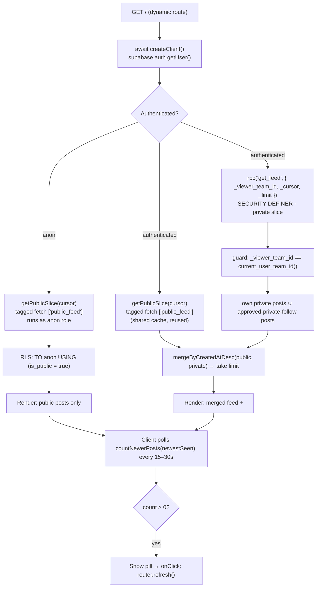
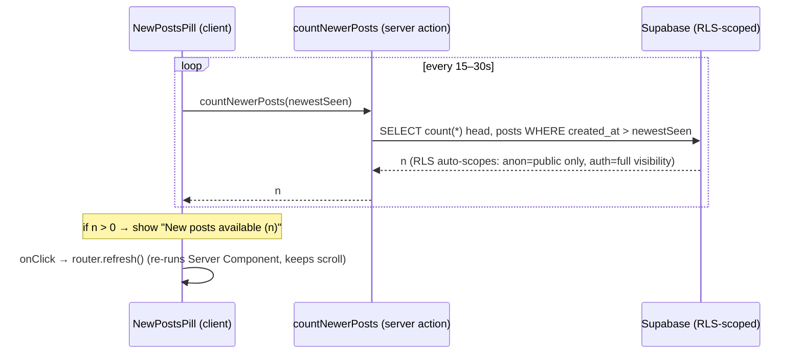

# 07 — Home Feed (revalidation, not realtime)

> **Owner of this file:** the public/private home feed read path, its caching and
> pagination model, and the "new posts available" pill.
>
> **Cross-references (do not duplicate here):**
> - `01-data-model.md` — canonical DDL for `posts`, `follows`, `teams`; the
>   `is_public` denormalization + sync trigger; index definitions; the
>   `public.current_user_team_id()` helper.
> - `02-rls-and-security.md` — canonical `posts` SELECT RLS policies (`TO anon`,
>   `TO authenticated`) and the GRANTs that make the anon feed work.
> - `03-auth-and-session.md` — how `team_id`/`onboarded` land in the JWT (Custom
>   Access Token Auth Hook), middleware `getUser()` gating, the awaited server client.
> - `04-posting.md` — the `create-post` Server Action; this file only fixes the
>   **revalidation contract** it must honor.
>
> This file owns the `public.get_feed()` RPC because it is the feed hot read path.

---

## 1. Scope & the one-sentence design

A **single dynamic route** (`app/page.tsx`) serves both audiences:

| Audience            | Sees                                                        | Source                                            |
| ------------------- | ---------------------------------------------------------- | ------------------------------------------------- |
| Logged-out (`anon`) | Public-team posts only                                     | Tagged fetch cache `["public_feed"]`              |
| Logged-in           | Public posts **+** own-team posts **+** approved-private-follow posts | `["public_feed"]` cache **+** `get_feed()` RPC, merged |

The feed is split into two **disjoint slices** that are merged and sorted
newest-first on the server:

1. **Public slice** — every `posts.is_public = true` row. Identical for *every*
   viewer (and for `anon`), so it is fetched once through Next.js's tagged Data
   Cache (`["public_feed"]`) and reused across requests.
2. **Private slice** — the per-viewer rows: the viewer's own private posts plus
   private posts of teams they have an `approved` follow on. Always dynamic,
   served by the `get_feed()` `SECURITY DEFINER` RPC.

Because the partition key is `is_public`, the two slices **never overlap**, so the
merge needs no de-duplication.

> **Why split public vs. private instead of one query?** The public slice is the
> same bytes for all 100% of viewers including anonymous traffic; caching it once
> and reusing it is strictly cheaper than recomputing it inside a per-viewer RPC on
> every request. The private slice is the only part that actually depends on *who is
> asking*, so it is the only part that must run dynamically. This is the cleanest
> reconciliation of "cache the shared data" and "RLS-filter the private data."

---

## 2. Why revalidation, not realtime, for the feed

The feed is **pull + revalidate**, not a realtime subscription. Realtime is used
**only** for messaging (see `06-messaging.md`).

> **Why revalidation over a realtime feed (the trade-off):**
> - **Cost & complexity:** A realtime feed means a Postgres Changes / Broadcast
>   subscription per viewer fanning out every public post to potentially every
>   connected client — a large, all-to-all fan-out — plus client-side list
>   reconciliation, ordering, and scroll-anchoring. For an MVP that is a lot of
>   moving parts for a feed where "a few seconds stale" is completely acceptable.
> - **Correctness for free:** Next.js 15 renders this route dynamically (we call
>   `cookies()` via `getUser()`), so every request re-evaluates auth and re-runs
>   the private slice live against the DB. New private posts appear on the next
>   render with zero extra infrastructure.
> - **Cheap perceived freshness:** A lightweight **polling pill** (Section 8) gives
>   the "new posts available (3)" UX of realtime at a tiny fraction of the cost — a
>   single indexed `COUNT(*)` every 15–30s, not a persistent socket.
> - **Documented scale path:** If the product later needs live feeds, the upgrade
>   is to add Broadcast-from-DB on `posts` and swap the pill for a subscription.
>   Nothing in this design blocks that.

---

## 3. Request flow (both audiences)



Two cache layers are in play and must not be conflated:

- The **route** is *dynamically rendered* (per request) because `getUser()` reads
  cookies — this guarantees auth is always fresh and private data is never cached
  into a static page.
- The **`fetch()` to the public slice** still hits Next's persistent **Data Cache**
  (keyed by URL, tagged `public_feed`). Dynamic rendering does not disable the
  fetch cache. This is what lets us "blend high performance with strict
  correctness": private data is live, shared public data is cached.

---

## 4. The `get_feed()` RPC — authenticated private slice (hot path)

`get_feed` is a `SECURITY DEFINER` function so it can run the `follows` EXISTS-join
at full speed, bypassing the cost of evaluating multi-table RLS policies on every
intermediate lookup. It returns **only the private slice** (public posts come from
the cache), keyset-paginated.

```sql
create or replace function public.get_feed(
  _viewer_team_id uuid,
  _cursor timestamptz default null,
  _limit  int default 20
)
returns table (id uuid, team_id uuid, team_name text, content text, is_public boolean, created_at timestamptz)
language plpgsql stable security definer set search_path = '' as $$
begin
  if _viewer_team_id is null or _viewer_team_id <> public.current_user_team_id() then
    raise exception 'forbidden' using errcode = '42501';   -- privilege guard
  end if;
  return query
    select p.id, p.team_id, t.name, p.content, p.is_public, p.created_at
    from public.posts p
    join public.teams t on t.id = p.team_id
    where p.is_public = false
      and (p.team_id = _viewer_team_id
           or public.check_team_follows(_viewer_team_id, p.team_id))
      and (_cursor is null or p.created_at < _cursor)
    order by p.created_at desc, p.id desc
    limit least(_limit, 50);
end;
$$;
grant execute on function public.get_feed(uuid, timestamptz, int) to authenticated;  -- NOT anon
```

> **Why a hybrid RPC read path (RPC + table RLS):** Inline RLS on `posts` that joins
> `follows` is the right *security* model (defense-in-depth, scopes every mutation),
> but executing that multi-table policy on the hot feed read can balloon into
> hundreds of ms. A `SECURITY DEFINER` RPC runs the same visibility logic once,
> with planner freedom and no per-row RLS re-check on the lookup tables, hitting the
> `<5ms` target. We keep **both**: the simple single-table RLS policy stays on
> `posts` as the universal safety net, and `get_feed` is the fast lane for reads.
> The in-body `auth.uid()/team` check is what stops the DEFINER function from
> becoming a privilege-escalation hole.

> **Note on cursor tiebreak:** `created_at` is `timestamptz` (µs precision), so
> collisions are rare but possible during bulk inserts. Ordering by
> `(created_at desc, id desc)` and (optionally) extending the cursor to the
> `(created_at, id)` tuple guarantees no row is skipped or duplicated across pages.
> For the MVP a `created_at`-only cursor is acceptable; the `id` secondary sort
> already makes ordering deterministic.

---

## 5. Public slice via tagged fetch cache `["public_feed"]`

The public slice is fetched straight from PostgREST **as the `anon` role**, so RLS
itself guarantees only `is_public = true` rows can ever come back — even though the
result is cached and shared, it is provably leak-free.

```ts
// lib/feed/public-slice.ts
import 'server-only';

const REST = `${process.env.NEXT_PUBLIC_SUPABASE_URL}/rest/v1`;
const ANON = process.env.NEXT_PUBLIC_SUPABASE_ANON_KEY!;

export interface Post {
  id: string;
  team_id: string;
  team_name: string;
  content: string;
  is_public: boolean;
  created_at: string; // ISO timestamptz
}

export async function getPublicSlice(cursor?: string, limit = 20): Promise<Post[]> {
  const params = new URLSearchParams({
    // Embed teams(name) so the public slice also carries team_name — same shape as
    // get_feed's private slice → PostCard (04 §6) renders both uniformly.
    select: 'id,team_id,content,is_public,created_at,teams(name)',
    is_public: 'eq.true',
    order: 'created_at.desc,id.desc',
    limit: String(limit),
  });
  if (cursor) params.set('created_at', `lt.${cursor}`); // keyset bound

  const res = await fetch(`${REST}/posts?${params.toString()}`, {
    headers: { apikey: ANON, Authorization: `Bearer ${ANON}` },
    // Shared, non-private data → safe to cache. Tag enables surgical purge;
    // revalidate is a time-based safety net if a tag purge is ever missed.
    next: { tags: ['public_feed'], revalidate: 60 },
  });
  if (!res.ok) throw new Error(`public slice failed: ${res.status}`);
  // Flatten the PostgREST embed (teams(name)) into a flat team_name field.
  const rows = (await res.json()) as Array<
    Omit<Post, 'team_name'> & { teams: { name: string } | null }
  >;
  return rows.map(({ teams, ...p }) => ({ ...p, team_name: teams?.name ?? '' }));
}
```

Each distinct `cursor` is a distinct URL → a distinct Data Cache entry, but **all of
them share the `public_feed` tag**, so a single `revalidateTag('public_feed')`
purges every cached page at once.

> **Why `team_id`-keyed caching matters (and why this slice is *un*-keyed):** A
> generic cache key on private data is catastrophic — the first team to load would
> cache *its* private posts for every later visitor. The rule: **anything
> per-viewer must be keyed by `team_id`** (e.g. `unstable_cache([... , teamId])`).
> The public slice is deliberately the exception: it contains *only* `is_public`
> rows, identical for everyone, so a global key `["public_feed"]` is correct *and*
> the whole point. We never put the private slice in a shared cache at all — it
> flows through the dynamic `get_feed` path, so the keying hazard cannot arise here.

---

## 6. Anonymous path correctness

For a logged-out visitor the feed **is** the public slice — no `get_feed` call, no
JWT, no team join. Correctness rests on three things owned by `01`/`02` that this
file depends on:

```sql
-- (Canonical home: 02-rls-and-security.md — shown here for the feed contract.)

-- Dedicated anon policy: never blended with team logic. Because it is TO anon,
-- the authenticated branch's current_user_team_id() is never even evaluated for
-- logged-out users (no brittle "NULL silently false" reliance).
create policy "posts: public read (anon)"
  on public.posts for select
  to anon
  using (is_public = true);

-- Baseline privileges the anon role needs BEFORE RLS is evaluated.
grant usage  on schema public      to anon;
grant select on public.posts       to anon;
```

> **Why a dedicated `TO anon` policy + denormalized `is_public` on `posts`:** Mixing
> anonymous and authenticated logic in one policy is a classic leak vector — it
> leans on `auth.uid()` returning `NULL` and `NULL` comparisons collapsing to
> `false`, which is brittle and hard to audit. Splitting by the `TO` clause means
> the anon path evaluates exactly one trivial predicate (`is_public = true`).
> Denormalizing `is_public` onto `posts` (kept in sync by the trigger defined in
> `01`) means the anon read **never joins `teams`** — a single-table, index-backed
> scan. If a view were ever used for the public feed it MUST be
> `WITH (security_invoker = true)`; we avoid views entirely and read the table
> directly, which is the most robust pattern for a simple `is_public = true` filter.

`get_feed` is **not** granted to `anon`, so there is no surface by which an
unauthenticated request could reach the private branch.

---

## 7. Server Component composition + merge

```tsx
// app/page.tsx  — ONE dynamic route for both audiences
import { createClient } from '@/utils/supabase/server';
import { getPublicSlice, type Post } from '@/lib/feed/public-slice';
import { mergeByCreatedAtDesc } from '@/lib/feed/merge';
import Feed from '@/components/feed/Feed';
import { getCurrentTeamId } from '@/lib/auth/claims';

const PAGE = 20;

export default async function HomePage(
  { searchParams }: { searchParams: Promise<{ cursor?: string }> },
) {
  const { cursor } = await searchParams;            // Next 15: searchParams is async
  const supabase = await createClient();            // Next 15: cookies() is async → await
  const { data: { user } } = await supabase.auth.getUser(); // fresh auth, gates audience
  const teamId = await getCurrentTeamId();          // acting team from verified JWT claims (03)

  // Public slice: cached + shared for everyone (anon and authenticated alike).
  const publicSlice = await getPublicSlice(cursor, PAGE);

  // Private slice: per-viewer, dynamic, only for authenticated users.
  let privateSlice: Post[] = [];
  if (teamId) {
    const { data, error } = await supabase.rpc('get_feed', {
      _viewer_team_id: teamId,
      _cursor: cursor ?? null,
      _limit: PAGE,
    });
    if (error) throw error;                       // surfaced by error.tsx boundary
    privateSlice = (data ?? []) as Post[];
  }

  // Disjoint by construction (public vs private) → no de-dup needed.
  const page = mergeByCreatedAtDesc(publicSlice, privateSlice, PAGE);
  const newestSeen = page[0]?.created_at ?? null;
  const nextCursor = page.length === PAGE ? page[page.length - 1].created_at : null;

  return (
    <Feed
      initialPosts={page}
      initialCursor={nextCursor}
      newestSeen={newestSeen}
      isAuthenticated={Boolean(user)}
    />
  );
}
```

```ts
// lib/feed/merge.ts
import type { Post } from './public-slice';

// Both inputs are individually sorted (created_at DESC, id DESC).
// Standard 2-way merge; stops at `limit`. No de-dup (slices are disjoint).
export function mergeByCreatedAtDesc(a: Post[], b: Post[], limit: number): Post[] {
  const out: Post[] = [];
  let i = 0, j = 0;
  const aFirst = (x: Post, y: Post) =>
    x.created_at > y.created_at ||
    (x.created_at === y.created_at && x.id >= y.id);

  while (out.length < limit && (i < a.length || j < b.length)) {
    if (j >= b.length || (i < a.length && aFirst(a[i], b[j]))) out.push(a[i++]);
    else out.push(b[j++]);
  }
  return out;
}
```

---

## 8. Keyset / cursor pagination

We paginate by **keyset on `created_at desc`**, never `OFFSET`.

> **Why keyset over OFFSET:** With `OFFSET`, a single new post inserted at the top
> shifts every later row down by one, so "page 2" re-shows the last item of "page
> 1" (a visible duplicate). Keyset anchors each page to a concrete row
> (`WHERE created_at < :cursor`); inserting newer rows above the cursor does not
> move anything below it, so pages stay stable across revalidation and across the
> "load more" lifecycle. This is exactly the property that makes keyset compose
> cleanly with Next.js caching.

**Two-slice cursor correctness.** Because the feed is two sorted streams, "load
more" over-fetches `PAGE` rows from **each** slice at the same cursor, merges, and
keeps the top `PAGE`. This is correct: any post that belongs in the global next
`PAGE` cannot rank beyond position `PAGE` *within its own slice* (intra-slice order
is preserved), so fetching `PAGE` from each slice captures every candidate. The next
cursor is the `created_at` of the last item of the merged page.

```ts
// actions/feed.ts  ('use server')
'use server';
import { createClient } from '@/utils/supabase/server';
import { getPublicSlice, type Post } from '@/lib/feed/public-slice';
import { mergeByCreatedAtDesc } from '@/lib/feed/merge';
import { getCurrentTeamId } from '@/lib/auth/claims';

const PAGE = 20;

export async function loadMoreFeed(
  cursor: string,
): Promise<{ posts: Post[]; nextCursor: string | null }> {
  const supabase = await createClient();
  const teamId = await getCurrentTeamId();

  const publicSlice = await getPublicSlice(cursor, PAGE); // tagged cache, same as initial render

  let privateSlice: Post[] = [];
  if (teamId) {
    const { data } = await supabase.rpc('get_feed', {
      _viewer_team_id: teamId,
      _cursor: cursor,
      _limit: PAGE,
    });
    privateSlice = (data ?? []) as Post[];
  }

  const posts = mergeByCreatedAtDesc(publicSlice, privateSlice, PAGE);
  const nextCursor = posts.length === PAGE ? posts[posts.length - 1].created_at : null;
  return { posts, nextCursor };
}
```

The client appends `posts` to its list and stores `nextCursor`; a `null` cursor
means the end of the feed.

---

## 9. "New posts available" pill

Perceived freshness without realtime: a tiny client poller asks an RLS-scoped count
Server Action whether anything newer than the top-of-feed timestamp exists.



```ts
// actions/feed.ts  (continued, 'use server')
export async function countNewerPosts(newestSeen: string): Promise<number> {
  const supabase = await createClient();
  // head:true → no rows shipped, just the count. RLS on `posts` automatically
  // scopes this to the caller's audience (anon → public only; authenticated →
  // public + own + approved-private), so the count always matches the viewer's feed.
  const { count, error } = await supabase
    .from('posts')
    .select('id', { count: 'exact', head: true })
    .gt('created_at', newestSeen);
  if (error) return 0; // fail closed: no nag pill on a transient error
  return count ?? 0;
}
```

```tsx
// components/feed/NewPostsPill.tsx
'use client';
import { useEffect, useState, useTransition } from 'react';
import { useRouter } from 'next/navigation';
import { countNewerPosts } from '@/actions/feed';

const POLL_MS = 20_000; // within the 15–30s window

export default function NewPostsPill({ newestSeen }: { newestSeen: string | null }) {
  const [count, setCount] = useState(0);
  const [isPending, startTransition] = useTransition();
  const router = useRouter();

  useEffect(() => {
    if (!newestSeen) return;            // empty feed → nothing to compare against
    let alive = true;
    const tick = async () => {
      const n = await countNewerPosts(newestSeen);
      if (alive) setCount(n);
    };
    const id = setInterval(tick, POLL_MS);
    return () => { alive = false; clearInterval(id); };
  }, [newestSeen]);

  if (count <= 0) return null;
  return (
    <button
      type="button"
      disabled={isPending}
      onClick={() => startTransition(() => { setCount(0); router.refresh(); })}
      className="sticky top-2 mx-auto rounded-full px-4 py-1 shadow"
    >
      {isPending ? 'Refreshing…' : `New posts available (${count})`}
    </button>
  );
}
```

`router.refresh()` re-runs the Server Component on the existing page, patching a
fresh RSC payload into the tree **without losing scroll position**. New *private*
posts are picked up because `get_feed` always runs live; new *public* posts are
picked up because `create-post` already purged the `public_feed` cache (Section 10),
so the refetch returns them.

> **Why the polling-pill pattern (vs. a realtime subscription):** It buys ~95% of
> the realtime UX for ~1% of the cost. One indexed `COUNT(*)` head query per client
> every 20s — no socket, no per-client fan-out, no client-side list reconciliation.
> Crucially the count is **RLS-scoped automatically**: the same action returns the
> right number for an anon visitor (public only) and a logged-in user (their full
> visible set) with zero branching, because it queries the `posts` table directly
> under the caller's role. The user stays in control of *when* the list jumps, which
> is better feed UX than content shifting under their cursor.

---

## 10. Revalidation contract with `create-post`

The `create-post` Server Action lives in `04-posting.md`; this file only pins down
what it must do so the feed cache stays correct:

| On creating a post where… | `create-post` MUST call            | Why                                                                 |
| ------------------------- | ---------------------------------- | ------------------------------------------------------------------- |
| `is_public = true`        | `revalidateTag('public_feed')`     | Purges every cached public-slice page so the new post is visible (to anon and authenticated alike) on the next render / `router.refresh()`. |
| `is_public = false`       | *(nothing required for the feed)*  | Private posts are never cached — they flow through the dynamic `get_feed` path, so the next dynamic render shows them automatically. |

> **Why `revalidateTag('public_feed')` over `revalidatePath('/')`:** `revalidateTag`
> surgically purges only the shared public fetch entries, across *every* route that
> reuses them. `revalidatePath('/')` is a blunt hammer that also nukes the
> client-side router cache and forces a full re-render of unrelated data. Tag-based
> purge is what keeps the public slice fast while staying correct.

The pill's correctness depends on this contract: a `count > 0` for a *public* post
implies its author's `create-post` already fired `revalidateTag('public_feed')`, so
`router.refresh()` is guaranteed to observe it (and `revalidate: 60` is the
belt-and-braces fallback if a purge is ever missed).

---

## 11. Performance assumptions & indexes

Indexes are declared canonically in `01-data-model.md`; the feed read path relies on
these specifically:

```sql
-- These are DEFINED canonically in 01-data-model.md §5 (sole owner). This file only
-- references them — it never redefines its own variants. The feed read path relies on:

--   posts_public_feed_idx  on public.posts (created_at desc, id desc) where is_public = true
--     → anon public slice + keyset ordering (the `id desc` tiebreaker the cursor needs).

--   follows_approved_idx   on public.follows (follower_team_id, following_team_id)
--                                                              where status = 'approved'
--     → get_feed's approved-follow EXISTS probe stays lean.

-- get_feed's own-team private scan is served by 01's team-scoped posts index, and the
-- pill's COUNT(*) WHERE created_at > newestSeen is served by posts_public_feed_idx's
-- leading `created_at desc` key.
```

**Assumptions (MVP scale):** hundreds of teams, low-thousands of posts, small follow
graphs (a team follows tens, not millions). Under these:

- Public slice: index-only-ish scan of `posts_public_feed_idx`, then served warm
  from the Data Cache for the vast majority of requests.
- `get_feed`: bounded by `LIMIT ≤ 50` after an indexed keyset bound; the `follows`
  EXISTS is a small index probe. `<5ms` is realistic.
- Pill count: a `head` `COUNT(*)` over an index range — cheap even at 20s intervals
  for the expected concurrent-user count.

These are *assumptions*, surfaced in the README's "known limitations": the feed is
single-Postgres, read-mostly, and tuned for the MVP's order of magnitude, with the
realtime/Broadcast and `last_message_at`-style denormalizations documented as the
explicit scale paths rather than built now (no over-abstraction).

---

## 12. Edge cases & failure handling

- **Empty feed:** merge returns `[]`, `newestSeen = null`, pill renders nothing
  (poller is disabled until the first post exists).
- **Authenticated but no `team_id` claim:** treated as public-only for the render
  (private slice skipped). This should be impossible in practice — the Custom Access
  Token Auth Hook guarantees `team_id` in the *first* token (see `03`) — so it is a
  defensive fallback, not a supported state.
- **`get_feed` error:** thrown and caught by the route's `error.tsx` boundary; the
  public slice still renders for resilience if you choose to degrade gracefully
  (optional — wrap the RPC call in try/catch and render public-only).
- **Private→public team toggle:** the `is_public`-on-`posts` sync trigger (`01`)
  flips affected rows; they enter the public slice on the next
  `revalidateTag('public_feed')` or within the 60s time-based window. A brief
  staleness window here is acceptable and documented.
- **Clock/tie on `created_at`:** the `(created_at desc, id desc)` ordering and tuple
  cursor make paging deterministic; no skipped or duplicated rows.

---

## 13. Testing hooks (see `09` / `02` for the harness)

Highest-ROI checks for this file, expressed as pgTAP assertions run under
`supabase db test` with the basejump test helpers:

- As `anon`: `select * from posts` returns **only** `is_public = true` rows;
  `get_feed(...)` is **not executable** (no grant).
- As Team A: `get_feed(A)` returns A's own private posts; returns Team B's private
  posts **iff** an `approved` follow A→B exists; never returns `pending`/`rejected`.
- Privilege-escalation guard: `get_feed(B)` called while authenticated as a member
  of Team A **raises `42501`**.
- Keyset: two successive `get_feed` calls with the returned cursor produce disjoint,
  correctly-ordered pages (no overlap, no gap) even after inserting a newer post
  between calls.

A Playwright smoke test (logged-out sees public feed; logged-in sees own private
post; pill appears after a second team posts publicly) is secondary.

---

## 14. Decision summary

| Decision                                            | Why (1-liner)                                                                 |
| --------------------------------------------------- | ----------------------------------------------------------------------------- |
| One dynamic route for both audiences                | `cookies()`/`getUser()` forces dynamic anyway; one route = correct + simple.  |
| Revalidation + polling pill, not realtime feed      | ~95% of the UX for ~1% of the cost; realtime reserved for messaging.          |
| Public slice cached `["public_feed"]`, shared       | Same bytes for everyone incl. anon → cache once, reuse everywhere.            |
| Private slice via `get_feed` `SECURITY DEFINER` RPC | Fast follow-join hot path (`<5ms`) without the multi-table RLS cost.          |
| Table RLS kept **and** RPC (hybrid)                 | RLS = universal safety net + mutation scope; RPC = fast lane for reads.       |
| Dedicated `TO anon` policy + denormalized `is_public` | Zero-leak anon path, single-table scan, no `teams` join.                     |
| Keyset (`created_at desc, id desc`) pagination      | Stable pages across inserts & revalidation; no OFFSET duplicate-row bug.      |
| `revalidateTag('public_feed')` from `create-post`   | Surgical purge of shared public data; far cheaper than `revalidatePath`.      |
| Per-viewer caches keyed by `team_id` (public slice un-keyed by design) | Prevents the catastrophic cross-tenant cache-leak.          |
| `await createClient()`                              | Next 15 `cookies()` is async; the server client must be awaited.              |

### Alternative considered (and rejected): `get_feed` returns the *unified* feed

Having `get_feed` return public + private in one call is simpler to paginate (one
sorted stream, one cursor). It was rejected because it **recomputes the shared public
data per viewer on every request**, throws away the `public_feed` cache reuse, and
**cannot serve anonymous traffic** (anon can't call the authenticated RPC). The
two-slice design pays a small server-side merge in exchange for cache reuse across
100% of viewers and a free anon path — the right trade for this workload.
