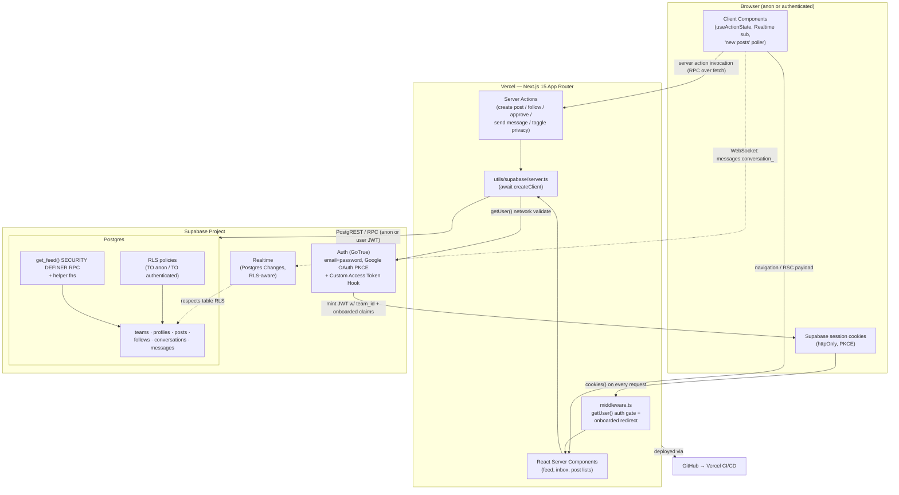
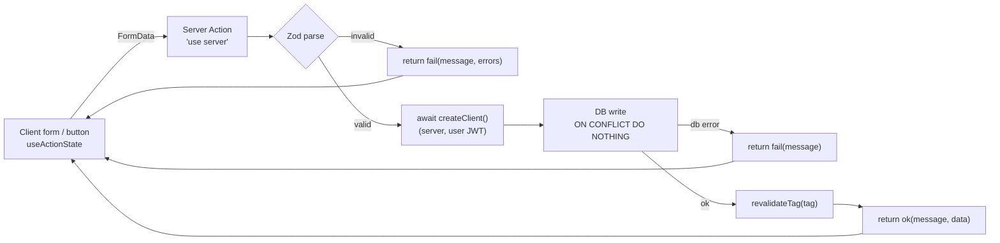
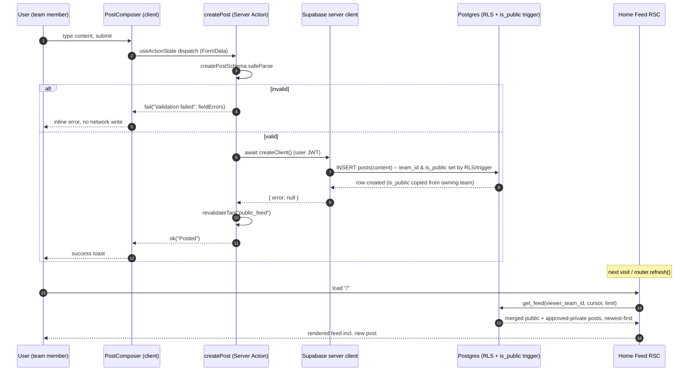
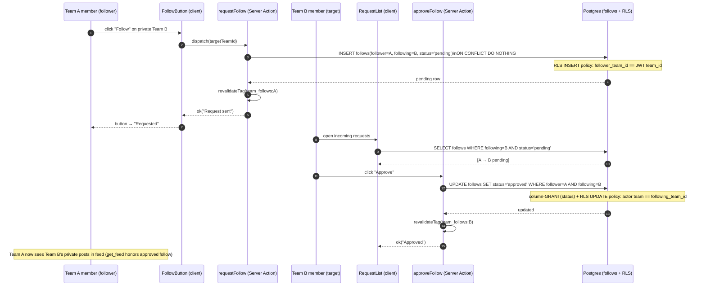
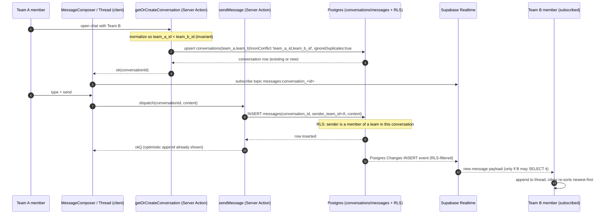
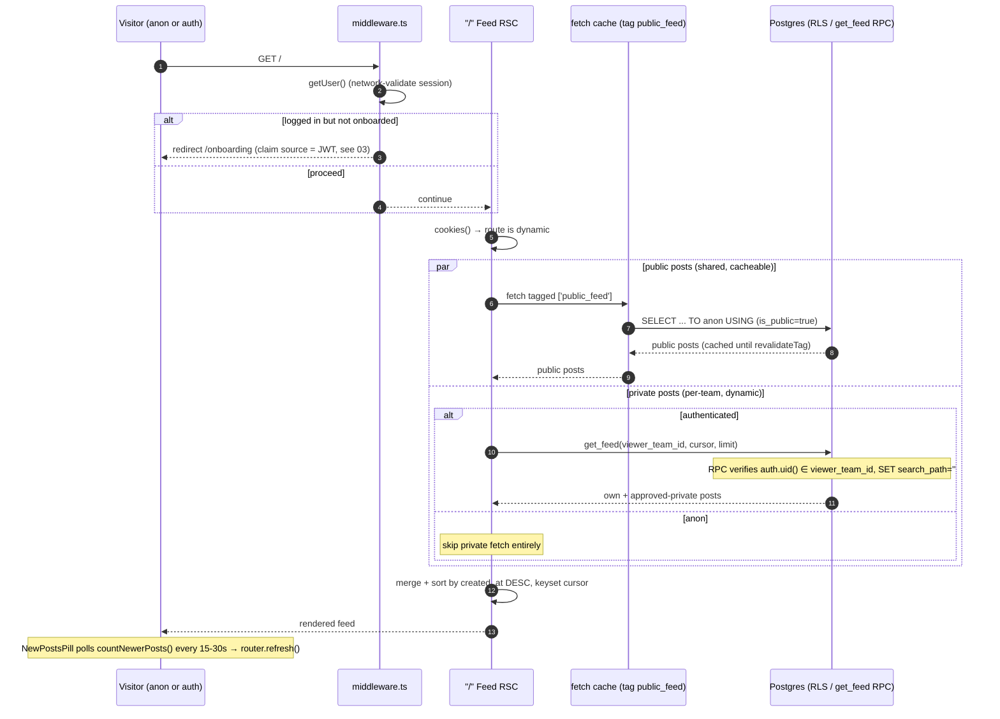
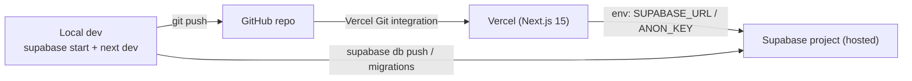
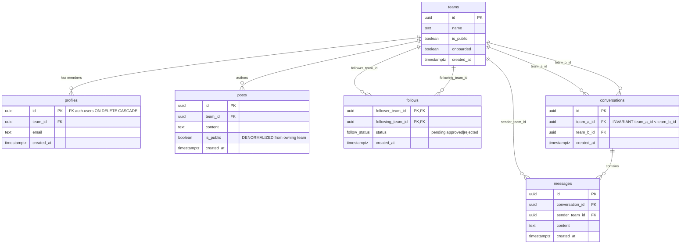

# 08 — System Architecture, Folder Structure & README Spine

> **Owns:** the system-level "shape" of the project — the high-level architecture diagram, the
> physical folder structure, the cross-cutting mutation/error conventions, the critical-flow
> sequence diagrams, and the README outline + trade-off/risk tables that tie every other plan
> file together.
>
> **Does NOT own (cross-references instead):**
> - Concrete table DDL, enums, triggers, the `is_public` denormalization mechanism → **`01-data-model.md`**
> - RLS policy bodies, `GRANT`s, `SECURITY DEFINER` helpers, pgTAP → **`02-rls-and-security.md`**
> - Auth Hook, middleware gating, signup/OAuth provisioning, session refresh → **`03-auth-and-session.md`**
> - Post creation action + post rendering → **`04-posting.md`**
> - Follow/approve/reject action logic → **`05-follow-system.md`**
> - Conversation upsert, realtime subscription, inbox ordering → **`06-messaging.md`**
> - `get_feed` RPC, keyset pagination, anon policy, "new posts" pill → **`07-home-feed.md`**
> - AI Engineering Blueprint, testing strategy, code quality conventions → **`09-ai-blueprint-and-quality.md`**

---

## 1. Architectural Overview

### 1.1 One-paragraph thesis

A **single Next.js 15 App Router application** deployed on **Vercel** talks to a **single Supabase
project** (Postgres + Auth + Realtime). The browser never holds privileged credentials: every
read is gated by **Row-Level Security**, and every write goes through a **Server Action** that runs
on Vercel's Node runtime with the user's cookie-bound session. The **active `team_id` lives in the
JWT** (injected by a Custom Access Token Auth Hook — see `03-auth-and-session.md`), so RLS and the
feed RPC can resolve tenant scope without an extra round-trip. There is **no bespoke API layer** —
RSC for reads, Server Actions for writes, and Supabase Realtime for the *one* live surface
(messaging). This keeps the moving-part count low, which is the whole point of "Tenant = Team, no
profiles, no roles, no over-abstraction."

> **Why this shape:** The case explicitly rewards "how & why > feature completeness" and penalizes
> over-abstraction. A monolithic Next.js app with DB-enforced security is the smallest design that
> still satisfies *publicly-viewable feed*, *strict tenant isolation*, and *realtime messaging*. Every
> additional tier (separate API service, GraphQL gateway, a state-management library) would add
> surface area without buying correctness.

### 1.2 High-level architecture diagram



> **Why Realtime is a dotted side-channel:** Messaging is the only feature that needs push. Everything
> else is request/response with cache revalidation, so Realtime stays a narrow, RLS-protected edge —
> not the backbone. See `06-messaging.md` for the channel topic + subscription details and
> `07-home-feed.md` for why the feed deliberately uses revalidation instead.

### 1.3 Request taxonomy (which path serves which need)

| Concern | Mechanism | Runtime | Auth context |
|---|---|---|---|
| Public feed (logged-out) | RSC + tagged `fetch` cache `['public_feed']` | Vercel Node (dynamic route) | `anon` role |
| Private feed (logged-in) | RSC → `get_feed()` RPC after `cookies()` | Vercel Node (dynamic) | user JWT (`team_id` claim) |
| All writes | Server Actions | Vercel Node | user JWT |
| Auth gate / onboarding redirect | `middleware.ts` `getUser()` | Vercel Edge/Node | fresh server-validated user |
| Live messages | Supabase Realtime (Postgres Changes) | Browser WebSocket | user JWT, RLS-filtered |

> **Why one dynamic route for both feed audiences:** Per field research, the moment you call
> `cookies()` or validate a JWT, Next.js opts the route into dynamic rendering anyway — so splitting
> into a static logged-out route + dynamic logged-in route only buys complexity (middleware routing,
> double cache surfaces) and a stale-page risk for freshly-logged-in users. Full rationale in
> `07-home-feed.md`.

---

## 2. Project Folder Structure

```text
vizio-case/
├── README.md                         # the spine — see §6 for the required section list
├── .env.local.example                # NEXT_PUBLIC_SUPABASE_URL / ANON_KEY + service-role (server-only)
├── .env.local                        # gitignored
├── middleware.ts                     # getUser() auth gate + onboarded redirect (logic: 03)
├── next.config.ts
├── package.json
├── tsconfig.json
│
├── app/
│   ├── layout.tsx                    # root layout, fonts, <Toaster/>, html lang
│   ├── globals.css
│   ├── page.tsx                      # "/" HOME FEED — single dynamic route, anon + auth (07)
│   ├── onboarding/page.tsx           # team naming/seed; OUTSIDE (app) group so MW can land here (03)
│   │
│   ├── (auth)/                       # route group: logged-OUT surfaces, no chrome
│   │   ├── login/page.tsx            # email+password + "Continue with Google" (03)
│   │   ├── signup/page.tsx
│   │   └── auth/
│   │       ├── callback/route.ts     # PKCE exchangeCodeForSession (03)
│   │       └── confirm/route.ts      # email OTP/magiclink confirm (03)
│   │
│   ├── (app)/                        # route group: logged-IN surfaces, shared app shell
│   │   ├── layout.tsx                # nav + current-team badge; assumes onboarded (gated by MW)
│   │   ├── teams/
│   │   │   ├── page.tsx              # discover/browse teams to follow (05)
│   │   │   └── [teamId]/page.tsx     # a team's public posts + follow button (04/05)
│   │   ├── messages/
│   │   │   ├── page.tsx              # inbox: conversations newest-message-first (06)
│   │   │   └── [conversationId]/page.tsx  # thread + realtime subscription (06)
│   │   └── settings/
│   │       └── page.tsx              # toggle team public/private (01/05)
│   │
│   └── api/                          # ONLY if a webhook/health endpoint is unavoidable; prefer none
│
├── actions/                          # all Server Actions ("use server"), one file per domain
│   ├── auth.ts                       # signIn / signUp / signInWithOAuth / signOut (03)
│   ├── onboarding.ts                 # completeOnboarding / toggleTeamPrivacy (03/05)
│   ├── posts.ts                      # createPost (04)
│   ├── follows.ts                    # requestFollow / approveFollow / rejectFollow / unfollow (05)
│   ├── messages.ts                   # getOrCreateConversation (upsert) / sendMessage (06)
│   └── feed.ts                       # countNewerPosts (lightweight count poller) (07)
│
├── components/
│   ├── ui/                           # primitives (button, textarea, dialog, toast)
│   ├── feed/
│   │   ├── FeedList.tsx              # server: renders merged+sorted posts (07)
│   │   ├── PostComposer.tsx          # client: useActionState(createPost) (04)
│   │   ├── PostCard.tsx              # server: one post row
│   │   └── NewPostsPill.tsx          # client: polls countNewerPosts, router.refresh() (07)
│   ├── follow/
│   │   ├── FollowButton.tsx          # client: useActionState; pending/approved/none states (05)
│   │   └── RequestList.tsx           # client: approve/reject incoming requests (05)
│   ├── messages/
│   │   ├── ConversationList.tsx      # server: inbox ordering (06)
│   │   ├── MessageThread.tsx         # client: realtime subscribe + optimistic append (06)
│   │   └── MessageComposer.tsx       # client: useActionState(sendMessage) (06)
│   └── shell/
│       ├── TopNav.tsx
│       └── CurrentTeamBadge.tsx      # reads team_id claim → team name
│
├── lib/
│   ├── auth/
│   │   └── claims.ts                 # getCurrentTeamId() — reads team_id from JWT app_metadata (03/00 §6.1)
│   ├── validation/                   # Zod schemas — the single source of input truth (§3.2)
│   │   ├── post.ts
│   │   ├── follow.ts
│   │   ├── message.ts
│   │   └── team.ts
│   ├── types.ts                      # ActionResult<T>, DB row types (generated or hand-written)
│   ├── constants.ts                  # cache tags, page sizes, channel-topic builders
│   └── result.ts                     # ok()/fail() helpers for ActionResult (§3.3)
│
├── utils/
│   └── supabase/
│       ├── server.ts                 # createClient() — async, awaits cookies() (§3.5, 03)
│       ├── client.ts                 # createBrowserClient() for Realtime + client reads
│       └── middleware.ts             # updateSession() cookie plumbing (03)
│
└── supabase/
    ├── config.toml                   # local stack config; enables the auth hook
    ├── migrations/                   # ordered, idempotent SQL — the canonical schema (01/02)
    │   ├── 0001_extensions.sql
    │   ├── 0002_tables.sql           # teams/profiles/posts/follows/conversations/messages (01)
    │   ├── 0003_enums_and_constraints.sql
    │   ├── 0004_helpers.sql          # current_user_team_id / check_team_follows / get_feed (02/07)
    │   ├── 0005_rls_policies.sql     # TO anon / TO authenticated policies + GRANTs (02)
    │   ├── 0006_triggers.sql         # signup provisioning + is_public sync + (optional) inbox (01/03)
    │   └── 0007_auth_hook.sql        # custom_access_token_hook registration (03)
    ├── tests/                        # pgTAP via `supabase db test` (09/02)
    │   ├── 010_rls_posts.test.sql
    │   ├── 020_rls_follows.test.sql
    │   └── 030_rls_messages.test.sql
    └── seed.sql                      # demo teams/posts for review + Playwright smoke (09)
```

> **Why route groups `(auth)` / `(app)`:** They let logged-out and logged-in surfaces have different
> layouts (no app chrome on the login page) **without** adding URL segments. The home feed `/` lives
> at the root — outside both groups — precisely because it must serve *both* audiences from one route.
>
> **Why `actions/` is a top-level domain folder, not colocated:** Server Actions are the app's
> entire write API. Centralizing them by domain makes the "what can mutate state" surface auditable in
> one place (a reviewer can read `actions/follows.ts` and see every follow mutation + its Zod gate),
> which is the readable/maintainable signal the rubric asks for.
>
> **Why `lib/validation` is separate from `actions`:** Zod schemas are imported by *both* the Server
> Action (server validation) and, where useful, the client form (cheap pre-submit UX). Keeping them
> framework-agnostic avoids pulling `"use server"` modules into client bundles.
>
> **Why `supabase/migrations` is the source of truth (not the dashboard):** A reproducible,
> version-controlled schema is what makes the README's "run these migrations and you have the app"
> claim true. It also lets pgTAP run against the exact same DDL the reviewer would deploy.

---

## 3. Cross-Cutting Conventions

These conventions are **mandatory for every mutation** in `actions/*`. Each feature file (04–07)
implements its specific logic but MUST conform to this contract so the codebase reads uniformly.

### 3.1 The mutation pipeline (Server Action contract)



> **Why Server Actions over Route Handlers:** Per field research and Next 15 guidance — colocation,
> end-to-end type safety, no hand-written `fetch` client, and built-in CSRF/origin checks. We treat
> them as untrusted public POST endpoints anyway (hence Zod + RLS as the real enforcement, never the
> client).

### 3.2 Input validation — Zod, always, server-side

```ts
// lib/validation/post.ts
import { z } from "zod";

export const createPostSchema = z.object({
  content: z.string().trim().min(1, "Post cannot be empty").max(2000, "Max 2000 characters"),
});
export type CreatePostInput = z.infer<typeof createPostSchema>;
```

> **Why Zod inside the action (not just on the client):** Server Actions are reachable as raw HTTP
> POSTs, so client validation is UX-only. The Zod `safeParse` in the action is the trust boundary; its
> `error.flatten().fieldErrors` feeds the standardized `errors` field below. Tenant authorization is
> *not* done here — that is RLS's job (`02-rls-and-security.md`); Zod only validates *shape*.

### 3.3 Standardized response object

```ts
// lib/types.ts
export type ActionResult<T = undefined> = {
  success: boolean;
  message: string;
  errors?: Record<string, string[]>; // Zod fieldErrors shape
  data?: T;
};

// lib/result.ts
import type { ActionResult } from "./types";
export const ok =  <T>(message: string, data?: T): ActionResult<T> => ({ success: true,  message, data });
export const fail = (message: string, errors?: Record<string, string[]>): ActionResult =>
  ({ success: false, message, errors });
```

```ts
// actions/posts.ts  (skeleton — full logic in 04-posting.md)
"use server";
import { revalidateTag } from "next/cache";
import { createClient } from "@/utils/supabase/server";
import { createPostSchema } from "@/lib/validation/post";
import { ok, fail } from "@/lib/result";
import type { ActionResult } from "@/lib/types";

export async function createPost(_prev: ActionResult, formData: FormData): Promise<ActionResult> {
  const parsed = createPostSchema.safeParse({ content: formData.get("content") });
  if (!parsed.success) return fail("Validation failed", parsed.error.flatten().fieldErrors);

  const supabase = await createClient();                  // NOTE: awaited — cookies() is async (Next 15)
  // team_id is NOT taken from the client — RLS derives it from the JWT (see 02/04).
  const { error } = await supabase.from("posts").insert({ content: parsed.data.content });
  if (error) return fail("Could not publish post. Please try again.");

  revalidateTag("public_feed");                           // granular cache bust (07)
  return ok("Posted");
}
```

> **Why a single `{ success, message, errors? }` shape everywhere:** `useActionState`'s reducer
> signature `(prev, formData) => next` wants one predictable return type. A uniform object lets every
> form render success toasts, inline field errors, and disabled states with the *same* component
> logic — no per-action special-casing.

### 3.4 Client wiring — `useActionState` + implicit `startTransition`

```tsx
// components/feed/PostComposer.tsx (client)
"use client";
import { useActionState } from "react";
import { createPost } from "@/actions/posts";

const initial = { success: false, message: "" };

export function PostComposer() {
  const [state, action, isPending] = useActionState(createPost, initial);
  return (
    <form action={action}>
      <textarea name="content" aria-invalid={!!state.errors?.content} disabled={isPending} />
      {state.errors?.content && <p role="alert">{state.errors.content[0]}</p>}
      <button type="submit" disabled={isPending}>{isPending ? "Posting…" : "Post"}</button>
      {state.success && <span aria-live="polite">{state.message}</span>}
    </form>
  );
}
```

> **Why `useActionState` (not `useFormState`) and no manual `startTransition`:** React 19 renamed the
> hook and wraps the dispatch in a transition internally, so the form submit never blocks the main
> thread and `isPending` is free. We get optimistic-friendly, non-suspending UX with zero extra state
> libraries — directly satisfying "clean async handling."

### 3.5 The Supabase server client — **always awaited**

```ts
// utils/supabase/server.ts (shape; full cookie logic in 03-auth-and-session.md)
import { cookies } from "next/headers";
import { createServerClient } from "@supabase/ssr";

export async function createClient() {
  const cookieStore = await cookies();          // Next 15: cookies() is async
  return createServerClient(URL, ANON_KEY, { cookies: { /* getAll/setAll from cookieStore */ } });
}
```

> **Why awaited:** In Next.js 15 `cookies()` returns a Promise. The corrected prior-plan note #5:
> every `createClient()` call site in `actions/*` and RSC must `await createClient()` or the cookie
> store is a pending Promise and auth silently breaks.

### 3.6 Cache & revalidation tags (central registry)

```ts
// lib/constants.ts
export const TAGS = {
  publicFeed: 'public_feed',
  teamFollows: (teamId: string) => `team_follows:${teamId}`,
  teamInbox:   (teamId: string) => `inbox:${teamId}`,
} as const;

export const PAGE_SIZE = 20;
export const channelForConversation = (id: string) => `messages:conversation_${id}`;
```

> **Why a central tag registry:** `revalidateTag` is only correct if the producer (RSC `fetch`) and
> the consumer (Server Action) use the *exact same string*. Centralizing the tags makes that
> impossible to typo and documents every cache surface in one file. **No raw tag strings anywhere** —
> every producer and consumer references a `TAGS` member. Concretely: `07`/`04` post →
> `revalidateTag(TAGS.publicFeed)`; `05` approve/reject → `revalidateTag(TAGS.teamFollows(teamId))`;
> `06` send → `revalidateTag(TAGS.teamInbox(teamId))`; the private feed slice is dynamic (no tag
> needed). We always prefer `revalidateTag` over `revalidatePath` (granular vs. blunt — see 07).

### 3.7 Async & error-handling rules (apply everywhere)

1. **No floating promises.** Every `await` that can reject is either inside the action's
   try-less `{ error }` destructure (Supabase returns errors, doesn't throw) or wrapped where a
   throw is possible. Supabase client calls return `{ data, error }` — branch on `error`, never
   assume success.
2. **Actions never throw to the client.** They catch/branch and return `fail(...)`. Throwing would
   surface Next's generic error overlay and lose the field-level `errors`.
3. **RSC reads may throw → `error.tsx` boundary.** Each route group gets an `error.tsx` so a failed
   feed/inbox load renders a retry UI, not a white screen.
4. **`not-found.tsx`** for `[teamId]`/`[conversationId]` that RLS hides or that don't exist (RLS
   returning zero rows is treated as 404, never "leak that it exists").
5. **User-safe messages.** `fail()` messages are human-readable and non-leaky ("Could not publish
   post"), never raw Postgres error text.
6. **Idempotency by default.** Inserts that a user can retry (follow, conversation create, onboarding)
   use `ON CONFLICT DO NOTHING` / upsert — see 05/06 — so retries are harmless.

> **Why "branch, don't throw" in actions but "throw, catch at boundary" in RSC:** Actions feed a form
> state machine that needs structured errors; RSC feeds the React render tree where `error.tsx` is the
> idiomatic recovery. Matching each layer to its native error channel keeps handling clean without a
> custom error framework.

---

## 4. Critical-Flow Sequence Diagrams

> Auth/provisioning/OAuth callback sequences live in **`03-auth-and-session.md`**. The four flows
> below are the hottest *application* paths.

### 4.1 Create + view a post



> **Why `team_id`/`is_public` are server-derived, not posted by the client:** The client only sends
> `content`. The owning team comes from the JWT via RLS, and `is_public` is denormalized from the team
> by an insert/trigger mechanism (`01-data-model.md`). A malicious client therefore cannot post as
> another team or forge visibility.

### 4.2 Private follow request → approval



> **Why approval is locked to one column by GRANT, not RLS alone:** RLS gates *rows*, not *columns*.
> Without `REVOKE UPDATE; GRANT UPDATE(status)`, an approver could rewrite `follower_team_id`. The
> column-level privilege + an RLS predicate `actor team == following_team_id` together make
> approve/reject the *only* legal mutation by the *only* legal actor. Full policy text in
> `05-follow-system.md` / `02-rls-and-security.md`.

### 4.3 Team-to-team messaging (get-or-create + realtime)



> **Why upsert with `ignoreDuplicates` instead of `.insert()`:** Corrected prior-plan note #2 — a
> plain insert throws `23505` when the conversation already exists, forcing fragile error parsing.
> `upsert(..., { onConflict: 'team_a_id,team_b_id', ignoreDuplicates: true })` makes "get or create"
> a single race-free statement. The `team_a_id < team_b_id` invariant guarantees one canonical row per
> pair. Details in `06-messaging.md`.
>
> **Why Postgres Changes (not Broadcast) for the MVP:** It automatically respects table RLS (zero
> extra auth wiring) and the per-conversation fan-out is tiny (2 teams). Broadcast-from-DB is noted as
> the scale path only — see `06-messaging.md`.

### 4.4 Home feed load (anon + authenticated, one route)



> **Why hybrid (anon path via direct RLS, auth path via SECURITY DEFINER RPC):** The anon `is_public`
> check is a trivial single-table predicate — direct RLS is simplest and safest. The authenticated
> feed must union own-posts + public + approved-private (a multi-table visibility resolution); doing
> that through row-by-row RLS joins is slow, so the hot path goes through `get_feed()` which resolves
> visibility once and targets <5ms. RLS stays enabled on `posts` as defense-in-depth. Full query +
> indexes in `07-home-feed.md`.

---

## 5. Deployment & Environments



| Env var | Where | Notes |
|---|---|---|
| `NEXT_PUBLIC_SUPABASE_URL` | client + server | safe to expose |
| `NEXT_PUBLIC_SUPABASE_ANON_KEY` | client + server | RLS makes this safe to ship |
| `SUPABASE_SERVICE_ROLE_KEY` | **server only** | never imported into a client component; used only if a privileged admin task is unavoidable |

> **Why Vercel + hosted Supabase with migrations as the bridge:** Push-to-deploy on Vercel plus a
> migration-driven Supabase schema means "clone, set two env vars, run migrations, deploy" reproduces
> the whole system — the exact setup story the README promises (§6). The service-role key is
> quarantined server-side because it bypasses RLS; the public path relies entirely on the anon key +
> policies. Auth Hook registration / redirect URLs config in `03-auth-and-session.md`.

---

## 6. README Outline (the deliverable spine)

The root `README.md` MUST contain these sections, in this order. (Content is authored at submission
time, pulling specifics from the referenced plan files.)

1. **Project Overview** — one-paragraph pitch: team-based social MVP, Tenant=Team, no profiles/roles.
2. **Live Demo & Video** — Vercel URL + optional walkthrough video link (optional deliverables).
3. **Feature Checklist** — table mapping each required feature (auth, team model, posting, follow,
   messaging, feed, security) to where it lives in the code. *Why: lets evaluators confirm 100% scope
   coverage at a glance.*
4. **Tech Stack & Why** — Next.js 15 App Router, Supabase (Auth/Postgres/RLS/Realtime), Vercel, Zod,
   pgTAP — each with a one-line rationale.
5. **Local Setup** — prereqs, `pnpm install`, `.env.local.example` → `.env.local`, `supabase start`,
   `supabase db reset` (runs migrations + seed), `pnpm dev`. Copy-paste runnable.
6. **Environment Variables** — the table from §5.
7. **Database Schema** — prose + the ERD (below) + link to `supabase/migrations`. Summarizes
   `01-data-model.md`.
8. **Entity-Relationship Diagram** — the Mermaid ERD in §6.1.
9. **RLS & Security Summary** — the tenant-isolation model, JWT `team_id` claim, anon vs authenticated
   policies, column-level follow GRANT, the hybrid RLS+RPC feed. Summarizes `02-rls-and-security.md`.
10. **High-Level Architecture** — the diagram from §1.2 + the request taxonomy.
11. **Key Flows** — the four sequence diagrams from §4 (or links to them).
12. **Project Structure** — the tree from §2, abbreviated.
13. **Conventions** — Server Actions + Zod + `useActionState` + `ActionResult` + `revalidateTag`
    (§3), so a contributor knows how to add a feature.
14. **Testing** — pgTAP RLS proof via `supabase db test`, Playwright smoke. Summarizes `09`.
15. **Key Assumptions** — e.g. one user ↔ one team (no team switching in MVP), roles out of scope,
    a team is seeded at signup.
16. **Trade-offs & Alternatives Considered** — the table in §7 (why-not MakerKit, why-not realtime
    feed, why hybrid RLS+RPC, lateral-join vs trigger).
17. **Risks & Mitigations** — the table in §8.
18. **Known Limitations** — no team switching, no message read receipts, feed liveness is
    poll-not-push, no media uploads.
19. **What I'd Improve With More Time** — realtime feed (Broadcast-from-DB), denormalized
    `last_message_at`, role management, full E2E coverage, keyset infinite scroll polish.
20. **AI Engineering Blueprint** — link/section pointing to `09-ai-blueprint-and-quality.md` content:
    tools used, agentic ruleset/instruction files, prompting/context strategy, how AI output was
    reviewed/validated, candidate-vs-AI decision split. *Why: the case flags this as a strong positive
    signal.*

### 6.1 ERD (README + here for reference; canonical column definitions in `01-data-model.md`)



> **Why two `teams ||--o{ follows` edges:** `follows` is a self-referential join on `teams` (follower
> and following are both teams). The ERD shows both FKs explicitly so the directional, non-symmetric
> nature of following is visible. The composite PK `(follower_team_id, following_team_id)` enforces
> one relationship row per ordered pair.

---

## 7. Key Trade-offs & Alternatives

| Decision | Chosen | Alternative(s) rejected | Why (trade-off) |
|---|---|---|---|
| Starter | **Own minimal Next.js 15 setup** | MakerKit SaaS starter | MakerKit ships accounts/billing/**roles** and a personal-vs-team account model that directly conflicts with *one-user-one-team / no-profiles*. Stripping it costs more than building lean; it also violates the rubric's "no over-abstraction." |
| Feed liveness | **Server Action revalidation + poll-for-count pill** | Realtime feed (Postgres Changes/Broadcast on `posts`) | A realtime global feed means every public post fans out to every connected client — large blast radius for marginal MVP value. Revalidation + a 15–30s count poll gives perceived liveness at near-zero cost; realtime feed is documented as a deferred stretch goal. |
| Feed query | **Hybrid: RLS on `posts` (defense-in-depth) + `get_feed()` SECURITY DEFINER RPC (hot path)** | (a) pure row-by-row RLS joins; (b) pure RPC with RLS off | Pure RLS multi-table joins can hit hundreds of ms; pure RPC with RLS off loses the universal safety net. Hybrid keeps RLS as a non-bypassable backstop while the RPC resolves visibility once (<5ms). RPC re-checks `auth.uid() ∈ viewer_team_id` to prevent privilege escalation. |
| Anon feed access | **Dedicated `TO anon` policy on denormalized `posts.is_public`** | One blended policy using `current_user_team_id()` for all roles | `current_user_team_id()` is null for anon, and null-comparisons silently evaluate false — safe but brittle. Isolating `TO anon` vs `TO authenticated` guarantees the private-team logic is *never even evaluated* for anonymous users. Denormalizing `is_public` avoids a `teams` join on the anon path. |
| Custom claims | **Custom Access Token Auth Hook** | `updateUserById` + client `refreshSession()`; trigger writing `raw_app_meta_data` | The hook injects `team_id` + `onboarded` into the **first** token, race-free, no awkward initial refresh. The other two have freshness windows / metadata-naming pitfalls. (Detail in `03`.) |
| `onboarded` source of truth | **JWT claim (via hook), read by the same middleware that gates** | Write `onboarded` only to `teams`, read `app_metadata.onboarded` in middleware | Corrected prior-plan bug #1: mismatched source → infinite onboarding redirect. Middleware must read the *same* claim the hook writes. |
| Inbox ordering | **LEFT JOIN LATERAL `max(created_at)` at read time** | Denormalized `last_message_at` via AFTER INSERT trigger; materialized view | Lateral join is always-correct with zero write-amplification; with a `(conversation_id, created_at DESC)` index it's fine for MVP volume. Trigger denormalization causes dead-tuple bloat under chat throughput — documented as scale path. |
| Follow storage | **Single `follows` table + `status` enum** | Separate `follows` + `follow_requests` tables | One table = single source of truth, no "pending request AND active follow simultaneously" anomaly. Constraints: `UNIQUE(follower,following)`, `CHECK(follower<>following)`, no sort invariant (directional). |
| Mutations | **Server Actions + Zod + `ActionResult`** | Route Handlers + client `fetch` wrapper | Server Actions give colocation, type safety, and built-in origin checks; Route Handlers would re-introduce a hand-rolled API client the rubric warns against. |
| Cache invalidation | **`revalidateTag`** | `revalidatePath` | Tag is granular (purge just `public_feed`) vs path which nukes the whole route + client router cache. |

---

## 8. Risks & Mitigations

| # | Risk | Likelihood | Impact | Mitigation | Owner file |
|---|---|---|---|---|---|
| R1 | Private posts leak into a shared cache (Data Cache / Full Route Cache keyed without team) | Med | **Critical** | Serve feed from one **dynamic** route; private posts fetched only after `cookies()`; if `unstable_cache` is ever used it MUST be keyed `['feed', team_id]`; public posts cached under a non-private `public_feed` tag only | 07 |
| R2 | Infinite onboarding redirect (claim source mismatch) | Med | High | `onboarded` injected into JWT by the Auth Hook AND read from that same claim in middleware | 03 (this file flags it) |
| R3 | `get_feed()` SECURITY DEFINER privilege escalation | Low | **Critical** | Inside RPC verify `auth.uid()` belongs to `viewer_team_id`; `SET search_path=''`; keep RLS on `posts` as backstop | 02 / 07 |
| R4 | Anon role can reach private data (missing/over-broad policy) | Low | **Critical** | Dedicated `TO anon USING (is_public=true)`; explicit `GRANT USAGE ON SCHEMA public` + `GRANT SELECT ON public.posts TO anon`; any view created `WITH (security_invoker = true)` | 02 |
| R5 | Approver rewrites `follower/following` instead of just `status` | Low | High | `REVOKE UPDATE; GRANT UPDATE(status)` + RLS UPDATE predicate `actor team == following_team_id` | 02 / 05 |
| R6 | `get-or-create conversation` 23505 race | Med | Med | `upsert(onConflict:'team_a_id,team_b_id', ignoreDuplicates:true)` + `team_a_id < team_b_id` invariant | 06 |
| R7 | `createClient()` not awaited → silent auth failure (Next 15 async `cookies()`) | Med | High | Lint/convention: every call site `await createClient()`; documented in §3.5 | 03 (this file flags it) |
| R8 | Signup provisioning race (callback runs before team exists) | Low | High | SECURITY DEFINER trigger on `auth.users` creates team+profile synchronously in-txn before PKCE code returns; app-layer onboarding idempotent via `ON CONFLICT DO NOTHING` | 03 |
| R9 | Realtime over-subscription / leakage across conversations | Low | Med | Scope channel to `messages:conversation_<id>`; Postgres Changes inherits table RLS so non-members receive nothing | 06 |
| R10 | Feed pagination duplicates/skips when new posts arrive | Med | Low | Keyset/cursor on `created_at DESC` (cursor stays valid across inserts) instead of OFFSET | 07 |
| R11 | Server Action treated as trusted (CSRF/forged payload) | Med | High | Treat as public POST: Zod `safeParse` every input; authorization always via RLS, never client-sent `team_id` | this file (§3) / 02 |
| R12 | Schema drift between dashboard and repo | Med | Med | Migrations are the single source of truth; `supabase db reset` reproduces; pgTAP runs against migrated schema | 01 / 09 |

---

## 9. How this file constrains the others (contract summary)

- Every action in `actions/*` returns `ActionResult` and validates with a `lib/validation` Zod schema
  (04, 05, 06, 07 must conform).
- Every server-side Supabase usage `await createClient()` (03 owns the client; all callers obey).
- Every successful mutation invalidates via a tag from `lib/constants.ts` `TAGS` (no raw strings).
- The home feed is **one dynamic route** `app/page.tsx`; no static/dynamic split (07).
- Realtime appears in exactly one place: the message thread (06). No other feature opens a channel.
- The folder structure in §2 is the agreed physical layout; new files land in the domain folder that
  already owns that concern (cross-reference, don't duplicate).

> **Why end with a contract:** This file is the integration seam between nine independently-authored
> plans. Stating the invariants the others must honor is what prevents drift when the code is actually
> written under a 3-day clock.
