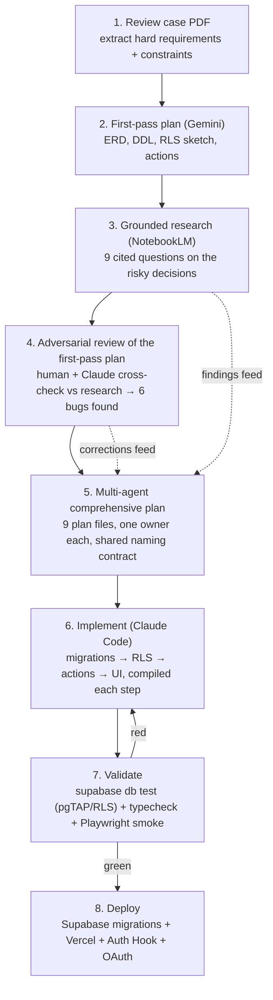
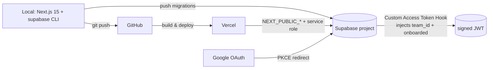

# 09 — AI Engineering Blueprint, Testing & Deployment

> **Scope of this file.** This is the meta-engineering deliverable: *how the project was built with AI*, *how we prove it is correct (testing)*, and *how it ships (deployment)*. It also pins the cross-cutting code-quality conventions.
>
> **Boundaries / cross-references (no duplication):**
> - Schema/DDL & the `is_public` denormalization trigger → `01-data-model.md`
> - RLS policy definitions, helper functions, column-level GRANTs → `02-rls-and-security.md`
> - Auth Hook definition, middleware, session model → `03-auth-and-session.md`
> - Posting / follow / messaging / feed server-actions → `04-posting.md`, `05-follow-system.md`, `06-messaging.md`, `07-home-feed.md`
> - Folder structure & runtime architecture → `08-architecture.md`
>
> This file *tests* and *deploys* those artifacts and *references* their canonical names; it does not redefine them.

---

## Part A — AI Engineering Blueprint

> The case explicitly weights **"how & why > feature completeness"** and calls the AI Engineering story a **strong positive signal**. This section is written to be read on its own as the answer to *"How did you actually use AI to build this, and how did you keep it honest?"*

### A.1 AI tool stack — who does what, and why

| Tool | Role in this project | Why this tool (not another) |
|------|----------------------|------------------------------|
| **Claude Code** (Opus) | **Primary agentic driver.** Owns the repo: writes migrations, RLS, Server Actions, components; runs `supabase db test`, `pnpm typecheck`, Playwright; does the adversarial self-review pass. | Terminal-native agent that edits files *and* runs the toolchain in one loop, so generated SQL/TS is immediately compiled and tested rather than pasted blind. Reads a project ruleset (`CLAUDE.md`) on every turn, which lets us encode the *locked decisions* once and have them enforced continuously. |
| **Gemini** | **First-pass architecture.** Produced the initial `implementation_plan.md`: ERD, DDL draft, RLS sketch, trigger, middleware, action skeletons. | Fast, long-context brainstorming partner for the *shape* of the system. Cheap to iterate on a whiteboard-level design before committing engineering time. Its draft is treated as a **proposal to be audited**, not ground truth — see A.5. |
| **NotebookLM** | **Grounded field research.** Fed the case PDF + curated Supabase/Next.js docs as sources; answered 9 targeted questions (RLS recursion, JWT claim propagation, feed caching, anon RLS, realtime, inbox ordering, follow modeling, mutation patterns, RLS testing). | Answers are **citation-bound to uploaded sources**, which sharply lowers hallucination risk versus open-web chat. Used specifically to *de-risk the decisions an LLM is most likely to get subtly wrong* (e.g. "comparing NULL silently evaluates to false" in anon policies). |
| **Supabase CLI + local stack** (AI-operated) | Migration apply, `db reset`, `db test`, type generation. | Gives the agent a real Postgres to execute against; turns "the model thinks this SQL is valid" into "the SQL ran and the RLS test passed." This is the single biggest hallucination-killer in the loop. |

> **Why a multi-model split instead of one model end-to-end:** each model is used where its failure mode is cheapest. Gemini diverges fast (good for breadth, bad for correctness) → used for the throwaway first draft. NotebookLM is conservative and cited (good for correctness, narrow) → used to *grade* the risky decisions. Claude Code closes the loop by making the code compile and the tests pass. The handoffs are deliberate, not incidental.

### A.2 Development workflow

The project ran as a **plan-first, research-grounded, multi-agent fan-out** rather than "prompt → paste → hope."



**Stage notes**
- **Stage 4 is the value-add.** The first-pass plan is never trusted; it is *diffed against the grounded research* and against a running database. That diff is where the 6 bugs (A.5) were caught.
- **Stage 5 (this plan set)** splits the design into 9 owned files with a **shared naming contract** (table/column/function names fixed up front) so independently generated sections compose without rework.
- **Stage 6/7 form a tight red/green loop** — nothing is "done" until `supabase db test` and `pnpm typecheck` are green.

> **Why plan-then-implement instead of letting the agent free-run:** the 3-day budget rewards *not redoing work*. A pinned plan + naming contract means the agent's edits converge instead of drifting, and reviewers can read intent (`docs/plan/*`) separately from code.

### A.3 Agentic rulesets & memory files

The agent's behavior is constrained by checked-in instruction files. These are real artifacts in the repo, not prose.

#### `CLAUDE.md` (repo root) — the operating ruleset

```markdown
# CLAUDE.md — Vizio Case Operating Rules

## Product invariants (NEVER violate)
- Tenant = Team. Each auth user belongs to EXACTLY ONE team. There are NO
  individual profiles; every post/follow/message acts under the team identity.
- Role management is OUT OF SCOPE. Do not add roles/permissions tables.
- Teams are Public or Private. Public => followable instantly (status 'approved').
  Private => follow is a 'pending' REQUEST the target approves/rejects.
- Messaging & follow are TEAM<->TEAM. A team can never follow/message itself.

## Locked technical decisions (do not relitigate)
- Stack: Next.js 15 App Router + Supabase. Our OWN minimal setup (NOT MakerKit).
- Security lives in the DATABASE via RLS. The app layer never substitutes for RLS.
- Active team_id + onboarded are injected into the JWT via a Custom Access Token
  Auth Hook (canonical, race-free). The auth.users trigger ONLY creates
  team+profile transactionally; it MUST NOT write raw_app_meta_data.
- Realtime is messaging-ONLY (Supabase Postgres Changes). The home feed uses
  Server Action revalidation (revalidateTag), never realtime.
- Mutations are Server Actions (not Route Handlers). Validate input with Zod.

## Hard coding rules
- Next.js 15: the server Supabase client is async — ALWAYS `await createClient()`
  because cookies() is async. Never call it synchronously.
- In middleware use `supabase.auth.getUser()` (network round-trip = fresh
  app_metadata). Do NOT gate auth on getSession()/getClaims() (locally decoded =
  stale).
- get-or-create conversation: `upsert(..., { onConflict: 'team_a_id,team_b_id',
  ignoreDuplicates: true })`. NEVER a bare .insert() (it throws 23505 on conflict).
- conversations invariant: store with team_a_id < team_b_id (sort the pair before
  upsert).
- follows: ONE table with status enum ('pending'|'approved'|'rejected'). Approve/
  reject updates the `status` column ONLY (column-level GRANT + RLS), never the FK
  columns.
- Idempotent writes: `INSERT ... ON CONFLICT DO NOTHING` (no try/catch on 23505).
- Every Server Action returns `{ success: boolean, message: string, errors?: ... }`.
- After a successful mutation call `revalidateTag(<tag>)`, not revalidatePath.
- Client forms use React 19 `useActionState` (NOT the deprecated useFormState).
- `is_public` is DENORMALIZED onto posts and kept in sync with teams.is_public
  (set at insert; updated by trigger on team privacy toggle). Assume it exists.

## Shared naming (authoritative — copy exactly)
teams(id,name,is_public,onboarded,created_at)
profiles(id->auth.users,team_id->teams,email,created_at)
posts(id,team_id->teams,content,is_public,created_at)
follows(follower_team_id,following_team_id,status follow_status,created_at,
        pk(follower_team_id,following_team_id))
conversations(id,team_a_id,team_b_id,created_at,unique(team_a_id,team_b_id))
messages(id,conversation_id,sender_team_id,content,created_at)
helpers: public.current_user_team_id(),
         public.check_team_follows(_follower_team_id,_following_team_id),
         public.get_feed(_viewer_team_id,_cursor,_limit)

## Definition of done for any change
1. `supabase db test` (pgTAP/RLS) is GREEN.
2. `pnpm typecheck` is clean (no `any` on Supabase rows — use generated types).
3. New tables/policies ship with a matching pgTAP RLS assertion.
4. SECURITY DEFINER functions set `search_path = ''` and verify the caller's team.

## Self-review pass (run before declaring done)
Re-read the diff as an adversary. For every new RLS policy, ask: "what does the
anon role see? what does Team B see?" For every SECURITY DEFINER function, ask:
"can a caller pass someone else's team_id?" Write a failing test FIRST, then fix.
```

> **Why a `CLAUDE.md` ruleset:** the locked decisions and the 6 prior bugs are encoded as *rules the agent re-reads every turn*. This is the cheapest possible guardrail — it prevents the model from "helpfully" reintroducing MakerKit-style abstractions, forgetting `await createClient()`, or writing a bare `.insert()` for conversations, which are exactly the regressions an unconstrained agent drifts toward.

#### Cursor rules equivalent (`.cursor/rules/*.mdc`)

For contributors using Cursor, the same constraints are mirrored as path-scoped MDC rules so they auto-attach to the right files:

```
.cursor/rules/
  00-product-invariants.mdc   # alwaysApply: true   — the product invariants block
  10-supabase-server.mdc      # globs: utils/supabase/**,app/**/page.tsx,actions/**
                              #   -> "await createClient()"; getUser() in middleware
  20-mutations.mdc            # globs: actions/**    — Zod, ON CONFLICT, useActionState,
                              #   standardized return object, revalidateTag
  30-sql-migrations.mdc       # globs: supabase/migrations/**  — RLS-on by default,
                              #   search_path='', shared naming, column-level GRANT
```

> **Why mirror to Cursor MDC:** rules in Cursor are *glob-scoped* (`globs:` frontmatter), so the SQL rules only fire on migrations and the React-19 rules only fire in `actions/**`. This keeps each rule short and high-signal instead of one giant always-on prompt that the model skims.

#### Memory / context files

- `docs/plan/*.md` (this set) — the durable plan; the agent reads the relevant file before touching an area.
- `docs/decisions/` (lightweight ADRs) — one short note per locked decision (e.g. *"Auth Hook over DB-trigger claim write — race-free, see research finding #6"*), so the *why* survives even when the diff doesn't show it.
- `supabase/types/database.ts` (generated) — the type contract; regenerated after every migration so the agent codes against real row shapes, not guessed ones.

### A.4 Prompting & context strategy

1. **Constraint-first prompts.** Every task prompt leads with the relevant invariant ("Tenant=Team, no profiles, RLS is the security boundary") so the model optimizes inside the real box. Generic "build a social feed" prompts were deliberately avoided — they produce user-centric schemas that violate the core model.
2. **Grounded > generative for risky decisions.** Anything with a subtle correctness cliff (RLS recursion, anon NULL-comparison, JWT claim freshness, OFFSET-vs-keyset pagination) was first answered by **NotebookLM against cited sources**, then handed to the coding agent as a settled decision. Brainstorming was reserved for low-risk surface area.
3. **Shared naming contract injected into context.** The exact table/column/function names live in `CLAUDE.md` and in every plan file header, so independently-generated sections (feed RPC, RLS tests, actions) refer to identical identifiers and compile together.
4. **Compile-in-the-loop.** The agent is required to run `supabase db test` and `pnpm typecheck` after edits. Tool output (a failing assertion, a TS error) is fed straight back as the next turn's context — the toolchain, not the human, catches most mistakes.
5. **Adversarial self-review prompt.** A standing instruction (the "Self-review pass" block in `CLAUDE.md`) forces the model to re-read its own diff as an attacker and write a failing test *before* fixing — institutionalizing the exact discipline that found the 6 bugs.

### A.5 How AI-generated code was reviewed & validated — the concrete proof

> **Headline:** A human + grounded-research review of the AI-authored **Gemini first-pass plan** caught **6 real, shipping-blocking bugs** before any of it reached the repo. This is the evidence that AI output here was *audited*, not trusted.

| # | Bug in the Gemini plan | Where (Gemini `implementation_plan.md`) | Why it breaks | Fix (owned by) |
|---|------------------------|------------------------------------------|---------------|----------------|
| 1 | **Infinite onboarding redirect.** `onboarded` is written only to the `teams` table, but middleware reads `user.app_metadata.onboarded`. | Trigger `insert into public.teams (... onboarded) values (..., false)`; middleware `const onboarded = user.app_metadata.onboarded ?? false`. | `app_metadata.onboarded` is always `undefined` → `?? false` → user is redirected to `/onboarding` forever, even after completing it. The flag is read from a different source than it's written to. | Inject `onboarded` (and `team_id`) into the JWT via the **Custom Access Token Auth Hook**, and have middleware read from that **same** source. → `03-auth-and-session.md` |
| 2 | **`getOrCreateConversation` uses a bare `.insert()`.** | `await supabase.from('conversations').insert({...}).select().maybeSingle()` then "fetch existing on failure." | On an existing conversation this throws Postgres `23505` (unique violation) instead of returning the row; the "fetch existing" branch never runs cleanly and the action errors under the normal repeat case. | `upsert({...}, { onConflict: 'team_a_id,team_b_id', ignoreDuplicates: true })`, then select the canonical row. → `06-messaging.md` |
| 3 | **Claim injection via a DB trigger writing `raw_app_meta_data`.** | Trigger does `update auth.users set raw_app_meta_data = raw_app_meta_data || jsonb_build_object('team_id', _team_id)`. | Not race-free: the trigger writing the column does **not** guarantee the concurrently-minted JWT captures it (research finding #6), and `raw_app_meta_data` vs `app_metadata` naming is finicky. First token can ship without `team_id`. | Use the **Custom Access Token Auth Hook** to read team_id at mint time. The `auth.users` trigger ONLY creates team+profile transactionally — it must NOT touch `raw_app_meta_data`. → `03-auth-and-session.md` |
| 4 | **Inbox ordering by latest message not implemented.** | A composite index `(conversation_id, created_at desc)` is created, but no query orders the conversation list by newest message; the messaging section never sorts the inbox. | Inbox would render in arbitrary/`conversations.created_at` order, not "newest message first" — failing requirement #5 (history ordered newest-first). | `LEFT JOIN LATERAL` fetching `max(created_at)` per conversation at read time, using that composite index. → `06-messaging.md` |
| 5 | **`createClient()` not awaited (Next.js 15).** | Server action: `const supabase = createClient();` (synchronous). | In Next.js 15 `cookies()` is async, so the server Supabase client factory is async. Calling it synchronously yields a client with no cookie context → `auth.getUser()` returns null → the action 401s for a logged-in user. | `const supabase = await createClient();` everywhere on the server. Encoded as a hard rule in `CLAUDE.md`. → `03-auth-and-session.md` |
| 6 | **`follows` UPDATE not restricted to the `status` column.** | Policy `create policy "Update follows" ... for update using (following_team_id = current_user_team_id())` with no column-level GRANT. | RLS gates *rows*, not *columns*. The target team could `UPDATE` and rewrite `follower_team_id`/`following_team_id` — hijacking the relationship — while still passing the row check. | `REVOKE UPDATE ON follows; GRANT UPDATE(status) ON public.follows TO authenticated;` plus the RLS UPDATE policy requiring actor team = `following_team_id`. → `02-rls-and-security.md`, `05-follow-system.md` |

**Bonus findings from the same review** (folded into the corrected plan, not counted among the 6): the Gemini `follows` CHECK allowed only `('pending','approved')` — missing `'rejected'` and not using the shared `follow_status` enum; the posts SELECT policy joined `teams` for visibility instead of using the **denormalized `posts.is_public`**, and shipped **no `TO anon` policy / no `GRANT SELECT ... TO anon`**, so the public logged-out feed (requirement #6) wouldn't return any rows; and the follow action used `revalidatePath` instead of granular `revalidateTag`.

> **Validation methods, ranked by what actually caught things:** (1) **grounded research diff** — comparing the plan against NotebookLM's cited answers surfaced bugs #1, #3, #6; (2) **running it against a real local Postgres** via `supabase db reset` + `db test` — would have surfaced #2 and #6 as red assertions; (3) **`pnpm typecheck`/Next.js build** — surfaces #5 immediately; (4) **requirement traceback** — re-reading each requirement against the plan surfaced #4. The lesson encoded into the workflow: *AI breadth is excellent, AI correctness must be mechanically verified.*

**Second adversarial pass — review of the *Claude-authored* plan (this `docs/plan/*` set).** The same untrusted-draft discipline was then applied to the comprehensive plan itself: **three independent critics** (coverage / consistency / correctness) reviewed all nine files and surfaced **4 high / 8 medium / 9 low** integration defects — including a **JWT claim-path mismatch** (readers split between `app_metadata.team_id` and other paths), the **Auth Hook reading 0 rows under RLS** (the `supabase_auth_admin` role lacked an explicit read policy on `profiles`/`teams`), a **missing `posts.team_id` default** (so `insert({ content })` would fail `NOT NULL`), a **`get_feed` contract divergence** (its return shape/columns differed across `01`/`02`/`07`), and **private-team name visibility** (counterpart team names were unrenderable under strict `teams` RLS). **All five are resolved canonically in `00-overview.md` §6** (with corrected SQL/TS inline, surfaced via `SECURITY DEFINER` RPCs that return `team_name`). This is the decisive proof that AI artifacts here — *including the ones Claude itself authored* — were treated as untrusted drafts and mechanically verified, not shipped blind: the 6 first-pass (Gemini) bugs catalogued above, then this 4-high/8-med/9-low cross-file pass over the Claude plan.

### A.6 Candidate vs. AI — decision split

| Decision / artifact | Driver | Notes |
|---------------------|--------|-------|
| Core domain model (Tenant=Team, no profiles, public/private, follow-as-request) | **Candidate** | Read directly from the case; non-negotiable framing the AI works inside. |
| "Don't use MakerKit; build minimal" | **Candidate** | Judgment call that the starter's account/billing/role model fights the one-user-one-team + no-over-abstraction criteria. |
| First-pass ERD / DDL / RLS sketch / action skeletons | **AI (Gemini)** | Speed draft; explicitly treated as a proposal to audit. |
| Risky-decision research (RLS recursion, JWT claims, anon RLS, caching, inbox sort) | **AI (NotebookLM), candidate-framed** | Candidate wrote the 9 questions; NotebookLM answered against cited sources. |
| Catching the 6 bugs + the bonus findings | **Candidate-led, AI-assisted** | Human review + research cross-check; the decisive step. |
| Locked corrections (Auth Hook over trigger-write, upsert conversations, await client, column-GRANT on follows, lateral-join inbox, denormalized is_public) | **Candidate** | Final architecture calls. |
| Implementation (migrations, RLS, actions, components, tests) | **AI (Claude Code), candidate-reviewed** | Generated under `CLAUDE.md` constraints; every change gated by tests + typecheck + diff review. |
| Test assertions & deployment runbook | **AI-drafted, candidate-verified** | Candidate owns the "is this actually proving the right thing" judgment. |

> **One-line summary for the README:** *The candidate owns the model, the constraints, and the corrections; AI owns breadth, drafting, and mechanical execution; and every AI artifact is gated by grounded research + a running database before it counts.*

---

## Part B — Testing strategy

> **Highest-ROI test plan for a 3-day build.** The security story *is* the product here (RLS is the whole authorization model), so testing budget goes where a bug is catastrophic and invisible: **database RLS**. UI E2E is secondary.

### B.1 Why pgTAP-first (not Playwright-first)

> **Why:** RLS failures are *silent* — a missing policy doesn't throw, it just returns the wrong rows (or an `UPDATE` that affects 0 rows looks like success). pgTAP runs **in the database, in milliseconds, deterministically**, and can assert "Team B literally cannot see Team A's private post" — the exact property the case grades. Playwright is slow, flaky, and only exercises the UI happy path, so it can't economically prove a cross-tenant leak. We spend the scarce 3-day testing budget on pgTAP RLS proofs and keep Playwright to a thin smoke layer.

### B.2 Setup — `supabase db test` + basejump test helpers

```
supabase/
  migrations/                # canonical schema (01) + RLS (02) + hooks (03)
  tests/
    00_helpers.sql           # installs basejump-supabase_test_helpers
    01_rls_posts.sql         # feed visibility / anon
    02_rls_follows.sql       # request approval / column lockdown
    03_rls_messaging.sql     # conversation isolation
```

Install the helper extension once (gives `tests.create_supabase_user`, `tests.authenticate_as`, `tests.rls_enabled`, and `BEGIN/ROLLBACK` isolation):

```sql
-- supabase/tests/00_helpers.sql
create extension if not exists basejump_supabase_test_helpers cascade;
```

Run the whole suite locally and in CI:

```bash
supabase db reset            # apply all migrations to a clean local db
supabase db test             # run every supabase/tests/*.sql via pg_prove
```

> **Why basejump-supabase_test_helpers:** `tests.authenticate_as('<user>')` swaps the session into a given user's JWT context so policies evaluate exactly as they would for that user, and every test runs inside a `BEGIN ... ROLLBACK` so fixtures never pollute the database. This is what makes per-role RLS assertions cheap to write.

### B.3 Example RLS assertions (real, runnable)

**Assertion 1 — anonymous role cannot read a private team's post (requirement #6).**

```sql
-- supabase/tests/01_rls_posts.sql
begin;
select plan(2);

-- fixtures: one private team with one post
insert into public.teams (id, name, is_public, onboarded)
values ('11111111-1111-1111-1111-111111111111', 'Private Co', false, true);

insert into public.posts (id, team_id, content, is_public)
values ('aaaaaaaa-aaaa-aaaa-aaaa-aaaaaaaaaaaa',
        '11111111-1111-1111-1111-111111111111', 'secret', false);

-- act as the anon role (logged-out visitor)
set local role anon;

-- anon must see ZERO rows of that private post
select is(
  (select count(*) from public.posts
     where id = 'aaaaaaaa-aaaa-aaaa-aaaa-aaaaaaaaaaaa')::int,
  0,
  'anon cannot read a private team post'
);

-- control: a public post IS visible to anon
set local role postgres;  -- bypass to seed
insert into public.teams (id, name, is_public, onboarded)
values ('22222222-2222-2222-2222-222222222222', 'Public Co', true, true);
insert into public.posts (id, team_id, content, is_public)
values ('bbbbbbbb-bbbb-bbbb-bbbb-bbbbbbbbbbbb',
        '22222222-2222-2222-2222-222222222222', 'hello world', true);
set local role anon;

select is(
  (select count(*) from public.posts
     where id = 'bbbbbbbb-bbbb-bbbb-bbbb-bbbbbbbbbbbb')::int,
  1,
  'anon CAN read a public team post'
);

select * from finish();
rollback;
```

**Assertion 2 — Team B cannot approve Team A's incoming follow request (bug #6 regression guard).**

```sql
-- supabase/tests/02_rls_follows.sql
begin;
select plan(2);

-- Team A (follower) and Team B (target, private)
insert into public.teams (id, name, is_public, onboarded) values
  ('aaaa1111-0000-0000-0000-000000000000', 'Team A', true,  true),
  ('bbbb2222-0000-0000-0000-000000000000', 'Team B', false, true);

-- a user in Team A, and the pending request A -> B
select tests.create_supabase_user('user_a', 'a@x.com');
update public.profiles set team_id = 'aaaa1111-0000-0000-0000-000000000000'
  where id = tests.get_supabase_uid('user_a');

insert into public.follows (follower_team_id, following_team_id, status)
values ('aaaa1111-0000-0000-0000-000000000000',
        'bbbb2222-0000-0000-0000-000000000000', 'pending');

-- Team A (the FOLLOWER) tries to self-approve -> must NOT change the row.
select tests.authenticate_as('user_a');
update public.follows set status = 'approved'
  where follower_team_id = 'aaaa1111-0000-0000-0000-000000000000'
    and following_team_id = 'bbbb2222-0000-0000-0000-000000000000';

select is(
  (select status::text from public.follows
     where follower_team_id = 'aaaa1111-0000-0000-0000-000000000000'
       and following_team_id = 'bbbb2222-0000-0000-0000-000000000000'),
  'pending',
  'follower team cannot approve its own outgoing request (RLS UPDATE blocked)'
);

-- And the follower cannot tamper with the FK columns even on status update path.
-- (column-level GRANT only exposes status; attempting to move following_team_id
--  is rejected at the privilege layer.)
select throws_ok(
  $$ update public.follows
       set following_team_id = 'aaaa1111-0000-0000-0000-000000000000'
     where follower_team_id = 'aaaa1111-0000-0000-0000-000000000000' $$,
  '42501',  -- insufficient_privilege
  null,
  'follower cannot rewrite follow FK columns (column-level GRANT enforces status-only)'
);

select * from finish();
rollback;
```

**Assertion 3 — Team C cannot read Team A↔Team B messages (requirement #5/#7 isolation).**

```sql
-- supabase/tests/03_rls_messaging.sql
begin;
select plan(1);

insert into public.teams (id, name, is_public, onboarded) values
  ('a0000000-0000-0000-0000-000000000000', 'A', true, true),
  ('b0000000-0000-0000-0000-000000000000', 'B', true, true),
  ('c0000000-0000-0000-0000-000000000000', 'C', true, true);

-- canonical conversation A<B with one message
insert into public.conversations (id, team_a_id, team_b_id)
values ('c0c0c0c0-0000-0000-0000-000000000000',
        'a0000000-0000-0000-0000-000000000000',
        'b0000000-0000-0000-0000-000000000000');

insert into public.messages (conversation_id, sender_team_id, content)
values ('c0c0c0c0-0000-0000-0000-000000000000',
        'a0000000-0000-0000-0000-000000000000', 'private to A and B');

-- a user in the unrelated Team C
select tests.create_supabase_user('user_c', 'c@x.com');
update public.profiles set team_id = 'c0000000-0000-0000-0000-000000000000'
  where id = tests.get_supabase_uid('user_c');
select tests.authenticate_as('user_c');

select is(
  (select count(*) from public.messages
     where conversation_id = 'c0c0c0c0-0000-0000-0000-000000000000')::int,
  0,
  'an outside team cannot read another conversation''s messages'
);

select * from finish();
rollback;
```

> **Why these three:** they cover the three RLS surfaces a reviewer will probe — **anon vs private (feed)**, **column-level approval lockdown (follow)**, and **conversation isolation (messaging)** — and the second one is a *direct regression test for caught-bug #6*. Each is a positive+negative pair so a too-permissive policy fails loudly.

### B.4 `rlsautotest` — generated coverage net

> **Why:** `rlsautotest` parses the schema and auto-generates pgTAP boilerplate for every table × role × CRUD op, catching *silent* RLS gaps — most importantly an `UPDATE`/`DELETE` that the policy reduces to **0 affected rows** (which looks like success to the app). We use it to generate a baseline matrix, then keep the three hand-written assertions above for the high-value, scenario-specific cases. It is a net, not a replacement.

```bash
npx rlsautotest generate --schema public --out supabase/tests/_generated
supabase db test
```

### B.5 Playwright smoke (secondary)

Two flows only — proving the wiring, not exhaustive UI coverage.

```ts
// e2e/smoke.spec.ts
import { test, expect } from '@playwright/test';

test('email+password login lands on the feed', async ({ page }) => {
  await page.goto('/login');                         // route groups add no path segment
  await page.getByLabel('Email').fill(process.env.E2E_EMAIL!);
  await page.getByLabel('Password').fill(process.env.E2E_PASSWORD!);
  await page.getByRole('button', { name: /sign in/i }).click();
  await expect(page).toHaveURL('/');                 // not bounced to /onboarding (bug #1 guard)
  await expect(page.getByTestId('feed')).toBeVisible();
});

test('a team member can post and see it appear', async ({ page }) => {
  // ...login (reuse storageState) ...
  const body = `smoke ${Date.now()}`;
  await page.getByTestId('composer').fill(body);
  await page.getByRole('button', { name: /post/i }).click();
  await expect(page.getByText(body)).toBeVisible();  // revalidateTag refresh worked
});
```

> **Why keep Playwright thin:** the first test doubles as a guard against caught-bug #1 (the infinite `/onboarding` redirect) and the second proves the Server-Action → `revalidateTag` → re-render path end to end. Beyond these two, additional E2E gives diminishing returns versus pgTAP in a 3-day window.

### B.6 CI wiring (GitHub Actions, sketch)

```yaml
# .github/workflows/ci.yml (essentials)
jobs:
  db-and-types:
    steps:
      - uses: supabase/setup-cli@v1
      - run: supabase start
      - run: supabase db reset          # apply migrations
      - run: supabase db test           # pgTAP + RLS (the load-bearing gate)
      - run: supabase gen types typescript --local > supabase/types/database.ts
      - run: pnpm typecheck
  e2e:
    needs: db-and-types
    steps:
      - run: pnpm build && pnpm playwright test e2e/smoke.spec.ts
```

| Requirement | Primary test |
|-------------|--------------|
| Public feed readable logged-out (#6) | pgTAP Assertion 1 (anon) |
| Private post hidden from non-followers (#6/#7) | pgTAP Assertion 1 + a follower-approved positive case |
| Follow request approve/reject scoping (#4/#6) | pgTAP Assertion 2 |
| Message isolation team↔team (#5/#7) | pgTAP Assertion 3 |
| Auth + session + onboarding (#1) | Playwright login smoke |
| Posting under team identity (#3) | Playwright post smoke |

---

## Part C — Deployment runbook



### C.1 Environment variables

| Variable | Where | Exposure | Purpose |
|----------|-------|----------|---------|
| `NEXT_PUBLIC_SUPABASE_URL` | Vercel (all envs) | **Public** (browser) | Supabase project URL for the browser + server clients. |
| `NEXT_PUBLIC_SUPABASE_ANON_KEY` | Vercel (all envs) | **Public** (browser) | Anon key; **safe to expose because RLS is the real boundary.** |
| `SUPABASE_SERVICE_ROLE_KEY` | Vercel (server only) | **Secret — never `NEXT_PUBLIC_`** | Admin key for the auth-callback / privileged server paths only. Must never reach a Client Component or the browser bundle. |
| `SUPABASE_DB_URL` | CI only | Secret | For `supabase db test` in CI if running against a remote db. |
| `E2E_EMAIL` / `E2E_PASSWORD` | CI only | Secret | Seeded smoke-test account for Playwright. |

> **Why the anon key is public but the service role is locked to the server:** the security model puts *all* authorization in RLS, so the anon key only ever gets what `TO anon` policies allow. The service-role key bypasses RLS entirely, so it is a server-only secret — leaking it would defeat the entire model. Naming it without the `NEXT_PUBLIC_` prefix guarantees Next.js never inlines it into client JS.

### C.2 Supabase project setup

```bash
# 1. Link the local repo to the hosted project
supabase link --project-ref <project-ref>

# 2. Push the canonical schema + RLS + hooks (from supabase/migrations)
supabase db push

# 3. Sanity-check policies are live (RLS enabled on every table)
supabase db test           # should be green against the linked project's schema

# 4. Regenerate types for the deployed schema
supabase gen types typescript --linked > supabase/types/database.ts
```

> **Required README setup step — email confirmation:** In **Authentication → Providers → Email**, **disable "Confirm email"** so email+password sign-up logs the user straight in for the demo — *or* keep it enabled and click the emailed confirm link. This is an explicit setup step in the README (and `supabase/config.toml` `[auth.email] enable_confirmations = false` for local), **not merely a known limitation**.

### C.3 Enable the Custom Access Token Auth Hook

The hook is what makes `team_id` + `onboarded` present in the **first** JWT (the fix for caught-bugs #1 and #3). It must be turned on explicitly — defining the function is not enough.

1. Migration ships the hook function (definition lives in `03-auth-and-session.md`), e.g. `public.custom_access_token_hook(event jsonb) returns jsonb`.
2. Grant the auth admin role execute + read access:
   ```sql
   grant execute on function public.custom_access_token_hook(jsonb) to supabase_auth_admin;
   grant usage on schema public to supabase_auth_admin;
   grant select on public.profiles, public.teams to supabase_auth_admin;
   ```
3. **Dashboard → Authentication → Hooks → Custom Access Token** → select `public.custom_access_token_hook` → **Enable**. (Or set it in `supabase/config.toml` `[auth.hook.custom_access_token]` for IaC.)
4. Verify: sign up a fresh user, decode the issued JWT, confirm `app_metadata.team_id` and `app_metadata.onboarded` are present **on the first token** with no client `refreshSession()`.

> **Why this is a runbook step, not a code step:** the hook only fires once an operator enables it for the project. Skipping it silently reverts behavior to "claims missing on first login," which is exactly the failure mode the prior plan shipped. The post-deploy smoke check below asserts it.

### C.4 Google OAuth (PKCE) redirect configuration

1. **Google Cloud Console → Credentials → OAuth 2.0 Client** → Authorized redirect URI:
   `https://<project-ref>.supabase.co/auth/v1/callback`
2. **Supabase Dashboard → Authentication → Providers → Google** → paste Client ID + Secret → enable.
3. **Supabase → Authentication → URL Configuration:**
   - **Site URL:** `https://<your-app>.vercel.app`
   - **Additional Redirect URLs:** `https://<your-app>.vercel.app/auth/callback`, `http://localhost:3000/auth/callback`, and the Vercel **preview** wildcard `https://*-<team>.vercel.app/auth/callback` so preview deploys can log in.
4. The app uses the **PKCE** flow — the callback route (`app/auth/callback/route.ts`, see `03-auth-and-session.md`) reads `?code=` from the **query string** (not the URL hash) and calls `exchangeCodeForSession`.

> **Why PKCE + explicit preview URLs:** PKCE puts the auth code in the query string where a server route handler can read it, avoiding the hash-fragment loop that breaks server-side exchange. Registering the Vercel preview wildcard prevents the classic "OAuth works in prod, redirect_uri_mismatch on every PR preview" failure.

### C.5 Vercel deploy

1. Import the GitHub repo into Vercel (framework auto-detected: Next.js).
2. Add the env vars from **C.1** for **Production**, **Preview**, and **Development** (service-role key Production/Preview only, never exposed to the browser).
3. Build command `pnpm build`, output handled by the Next.js adapter (default).
4. Deploy. Then run the **C.6** smoke checklist against the deployed URL.

### C.6 Post-deploy smoke checklist

- [ ] Logged-out visit to `/` renders **public** posts (anon RLS + `GRANT SELECT ... TO anon` working).
- [ ] Logged-out visitor sees **no** private posts.
- [ ] Email+password sign-up creates a team (trigger) and lands on `/onboarding` once, then `/` — **never loops** (Auth Hook `onboarded` working → bug #1 guard).
- [ ] Google OAuth login completes via `/auth/callback` and the **first** session already has `app_metadata.team_id` (Auth Hook → bug #3 guard).
- [ ] Post created by a team member appears in that team's feed after `revalidateTag`.
- [ ] Follow a private team → status `pending`; that team approves → follower now sees its posts.
- [ ] Open a conversation twice → no `23505`; same conversation row reused (upsert → bug #2 guard).
- [ ] Send a message → arrives in the other team's open thread via Postgres Changes; inbox re-sorts newest-first (bug #4 guard).

---

## Part D — Code-quality conventions (cross-cutting)

These are the readability/maintainability rules the case grades under "Quality." They are enforced by `CLAUDE.md` and reviewed in every diff.

- **Async & error handling.** Every Server Action: `await createClient()` → `await auth.getUser()` guard → Zod-validate input → DB call → return the **standardized object**:
  ```ts
  type ActionResult = { success: boolean; message: string; errors?: Record<string, string[]> };
  ```
  No throwing across the action boundary for expected failures; throw only for truly exceptional states. Client reads results via React 19 `useActionState`.
- **No silent catches on `23505`.** Idempotency via `ON CONFLICT DO NOTHING` / `upsert(..., { ignoreDuplicates: true })`, never `try/catch` on a unique violation (avoids transaction-id burn / dead tuples).
- **Typed DB access.** All Supabase calls use generated `Database` types (`supabase/types/database.ts`); no `any` on row shapes.
- **Folder structure** is defined in `08-architecture.md` (`app/`, `actions/`, `utils/supabase/{client,server,middleware}.ts`, `components/`). This file does not redefine it — it only enforces that mutations live in `actions/` (Server Actions) and never in ad-hoc Route Handlers.
- **SECURITY DEFINER discipline.** Every definer function `set search_path = ''` and verifies the caller's team (`get_feed` checks `auth.uid()` ∈ `_viewer_team_id`). See `02-rls-and-security.md` / `07-home-feed.md`.

> **Why a standardized `ActionResult` shape:** uniform success/error handling means every form binds to `useActionState` the same way, error rendering is one component, and the reviewer sees a consistent, predictable mutation contract instead of bespoke handling per feature.

---

## Part E — Known limitations & what we'd improve with more time

| Area | MVP shipped | Limitation | With more time (documented scale path) |
|------|-------------|------------|------------------------------------------|
| **Home feed realtime** | Server-Action revalidation + a 15–30s "new posts" poll pill | Not push-realtime; up to ~30s latency for new public posts | Postgres Changes / Broadcast-from-DB on `posts`, scoped to followed teams (see `07-home-feed.md`). |
| **Inbox ordering** | `LEFT JOIN LATERAL max(created_at)` at read time | Lateral join slows as `messages` grows very large | Denormalized `conversations.last_message_at` via `AFTER INSERT` trigger (trade write-amplification for O(1) read) — `06-messaging.md`. |
| **Feed read path** | `get_feed` SECURITY DEFINER RPC + keyset pagination | Single-region Postgres; no edge read cache for private data | Tagged-cache public posts at the edge; read replica / cached follow-graph for the hot path. |
| **Messaging realtime auth** | Postgres Changes (auto-respects table RLS) | Larger fan-out is less efficient than broadcast | Broadcast-from-DB with RLS on `realtime.messages` + `private: true` — documented scale path only. |
| **Teams membership** | One user ↔ one team, role-less (per case scope) | No invites, no multi-team, no roles | Membership join table + role enum; explicitly out of scope now to honor "no over-abstraction." |
| **Testing depth** | pgTAP RLS proofs + 2 Playwright smokes | No load test; limited E2E breadth | Broaden Playwright (follow/approve/message flows); add `pgbench` on `get_feed`; wire `rlsautotest` matrix into the required CI gate. |
| **Observability** | Vercel + Supabase dashboards | No structured app logging / tracing | Sentry on Server Actions, Supabase log drains, slow-query alerts on `get_feed`. |
| **Abuse / rate limiting** | RLS authz only | No rate limiting on posting/messaging/follows | Per-team rate limits (Postgres or Upstash) on mutation actions. |

---

### Why-notes index (this file's significant choices)

- **Claude Code as primary driver** — closes the generate→compile→test loop in one place, so SQL/TS is verified, not pasted.
- **Gemini for first-pass only** — fast breadth; treated as an auditable proposal, which is exactly how the 6 bugs were exposed.
- **NotebookLM for risky decisions** — citation-bound answers minimize hallucination on the parts an LLM gets subtly wrong.
- **`CLAUDE.md` + Cursor MDC rulesets** — encode locked decisions + the 6 prior bugs so the agent can't regress them.
- **pgTAP-first testing** — RLS bugs are silent and catastrophic; in-database assertions prove cross-tenant isolation in milliseconds, where the grading weight actually is.
- **Anon key public / service-role server-only** — consistent with RLS-as-the-boundary; service-role bypasses RLS so it never touches the browser.
- **Auth Hook as an explicit deploy step** — claims-on-first-token is an operator toggle, not just code; skipping it reproduces the prior plan's infinite-redirect bug.
