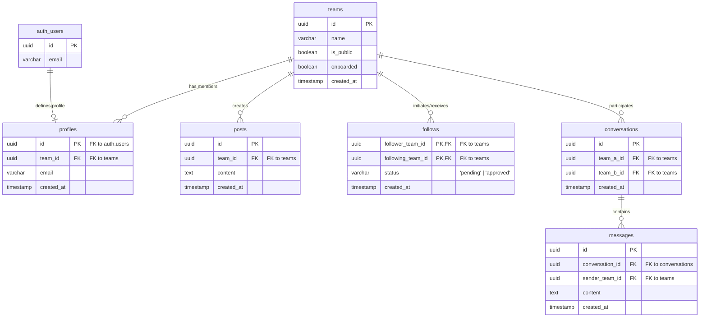

# Gemini 3.5 Flash Görüşleri ve Teknik Uygulama Planı

Bu dosya, Vizio AI Case Study (Senior Full-Stack Developer / AI-Native Tech Lead) kapsamında gerçekleştirilen pair programming seansının, yapılan saha araştırmalarının, teknik tartışmaların ve 30 yıllık deneyime sahip bir Tech Lead bakış açısıyla hazırlanan nihai mimari planın **tüm konuşma geçmişini ve çıktılarını** barındıran eksiksiz derlemesidir.

---

## 1. TÜM KONUŞMA GEÇMİŞİ (CHAT LOGS)

### 💬 Kullanıcı (Giriş) - [2026-06-30T10:31:54]
> agacım içeride bi pdf var case veriliyor yapmam için. iş başvurusu. ai kullanımı serbest içinde de yazıyor. Bunu 30 yıllık deneyimi olan bir teck lead edası ile planlamamız lazım. Ek olarak teknoloji ve saha araştırması yapmak için noteebook lm i de kullanmak istiyorum. öncelikle casi incele teknolojik anlamda kararlar veya olası durumları inceleyelim düşünelim. Sonrasında projeyi notebooklm e kısaca araştırması için anlatalım ve bu pdfi verip sahadan cevaplar alalım. TÜm cevaplar ışığında ise planımızı oluşturalım. mimari açıdan uygun olması için planları mdye yazalım ancak çizim işlerini vs daha uygun olacak formatlar kullanalım. Misal mimari çizim için mermaid kullanımı gibi

---

### 🤖 Gemini 3.5 Flash (İlk Analiz ve NotebookLM Hazırlığı)
> Harika bir case çalışması! Bir projeyi sıfırdan kurarken, hele ki bir iş başvurusu (case study) için tasarlarken en kritik kural şudur: **"Gereksiz karmaşıklıktan (over-engineering) kaçın, güvenlik sınırlarını veri tabanında (RLS) çöz ve geleceğe yönelik ölçeklenebilir/temiz bir mimari sun."**
> 
> 30 yıllık bir Tech Lead tecrübesiyle bu case'i incelediğimde, projenin kalbini **"Multi-Tenant (Team = Tenant)"** yaklaşımının ve **Supabase Row-Level Security (RLS)** mimarisinin oluşturduğunu söyleyebilirim. Kullanıcıların bireysel profilleri yok; her aksiyon bir takım kimliğiyle yapılıyor. 
> 
> Senin için hazırladığım detaylı mimari tasarımı, veritabanı şemasını (ERD) ve kritik RLS politikalarını içeren **[Implementation Plan](file:///C:/Users/slymn/.gemini/antigravity/brain/6b2e72c1-1a8f-44c4-afea-7ee4a270f331/implementation_plan.md)** dosyasını oluşturdum. Bu dosyada mimari şemaları ve ERD'yi **Mermaid** kullanarak çizdim, böylece görsel olarak da çok net oldu.
> 
> #### NotebookLM Araştırması ve Saha Analizi
> 
> Saha araştırmasını derinleştirmek ve en doğru pratiklerle yola çıkmak için NotebookLM'e vermen gereken **Proje Özeti (Brief)** ve **Soru Listesi** aşağıdadır. Bu metni doğrudan kopyalayıp NotebookLM'e aktarabilir, case PDF'ini de kaynak olarak yükleyebilirsin.
> 
> ##### 1. NotebookLM için Proje Tanıtım Metni (Brief)
> > **Project Context:**
> > We are building a team-based social media MVP using Next.js App Router and Supabase. In this application, there are no individual user profiles; all actions (posting, following, messaging) are performed under a "Team" identity. Each authenticated user belongs to exactly one team. The application supports public and private teams. Private teams require follow approvals before other teams can see their posts in the home feed. Direct messaging is strictly team-to-team.
> > 
> > **Goal:**
> > We need to implement a production-aware, secure, and clean MVP within a short timeframe. Security must be strictly enforced at the database level using Supabase Row-Level Security (RLS). We want to analyze best practices, avoid common Supabase pitfalls (such as RLS infinite recursion), and design a high-performing feed query.
> 
> ##### 2. NotebookLM'e Sorulacak Saha Soruları (Research Prompts)
> 1. **Supabase RLS Performance & Recursion:**
>    * *"When writing RLS policies for a feed that checks if a user's team follows a private team (joining the `follows` table), how can we avoid infinite recursion in Supabase? Is it better to write a custom PostgreSQL helper function using `security definer`? What are the performance implications?"*
> 2. **Next.js App Router Session Handling:**
>    * *"For a multi-tenant Next.js application where the tenant is a 'Team', what is the cleanest way to persist and fetch the user's active `team_id` in middleware/Server Components? Should we query the database on every request, or store the `team_id` in the user's JWT metadata (App Metadata) in Supabase Auth?"*
> 3. **Database Constraints for 1-to-1 Conversations:**
>    * *"To prevent duplicate records in team-to-team messaging (e.g., preventing a conversation between Team A and Team B from having one row for A-to-B and another for B-to-A), what are the best SQL constraints to enforce `team_a_id < team_b_id`? How do we handle this in Next.js Server Actions?"*
> 4. **OAuth Signup Flow with Autogenerated Teams:**
>    * *"When a user signs up using Google OAuth, what is the best practice for automatically creating a team for them in Supabase? Should we use a Postgres trigger on `auth.users` insert, or handle it in a post-auth onboarding redirect in Next.js?"*

---

### 💬 Kullanıcı (NotebookLM Saha Yanıtları) - [2026-06-30T11:04:57]
> **[Soru 1 Yanıtı - RLS Recursion ve Performance]:**
> When checking if a team follows a private team through a junction table, using a custom PostgreSQL helper function configured with SECURITY DEFINER is indeed the recommended best practice to solve this problem.
> A SECURITY DEFINER function runs with the privileges of the role that created it (typically a database administrator). Because administrative roles bypass RLS entirely, the queries executed inside the SECURITY DEFINER function are exempt from triggering policies, which cleanly breaks the recursive loop.
> *Security Note:* Set `search_path = ''` to prevent hijack risks. Prefix variables with underscore (like `_team_id`) to avoid column collisions.
> *Performance:* To maintain performance (<5ms), use `STABLE` annotation for cache, wrap it in a scalar subquery (initPlan pattern e.g. `(SELECT public.check_team_follows(...))`) in RLS, and add B-tree indexes.
>
> **[Soru 2 Yanıtı - JWT app_metadata & Next.js Session]:**
> For a multi-tenant Next.js application, storing the team_id inside the user's JWT app_metadata is the cleanest and most performant approach. JWT validation locally via WebCrypto/jose in middleware takes <1ms and avoids DB bottlenecks.
> Downstream Server Components can extract `team_id` directly from request headers (`x-team-id`).
> *Tenant switches:* Use a Server Action to push new `team_id` to user's `app_metadata` via Supabase Admin API and call client `supabase.auth.refreshSession()`.
> *Rule:* strictly use `app_metadata`, never client-writable `user_metadata`.
>
> **[Soru 3 Yanıtı - Messaging Unique Sorting & Speculative Insertion]:**
> SQL Constraints: Enforce `team_a_id < team_b_id` (CHECK constraint) and composite UNIQUE constraint on `(team_a_id, team_b_id)` to guarantee a single canonical relationship row.
> Server Actions: Avoid transaction aborts/index bloat from catching database UNIQUE_VIOLATION errors. Instead, use PostgreSQL speculative insertion: `INSERT ... ON CONFLICT DO NOTHING`.
>
> **[Soru 4 Yanıtı - Onboarding & Provisioning hybrid flow]:**
> Hybrid Architecture: Postgres trigger on `auth.users` strictly registers the user's profile and provisions a default team workspace (guarantees DB atomicity). After OAuth PKCE completion, Next.js callback route redirects user to `/onboarding` to customize the team (billing, names, etc.) and updates the token metadata.

---

### 🤖 Gemini 3.5 Flash (Geri Bildirim & Revize Plan)
> NotebookLM saha araştırmasından gelen harika bilgiler ışığında **[implementation_plan.md](file:///C:/Users/slymn/.gemini/antigravity/brain/6b2e72c1-1a8f-44c4-afea-7ee4a270f331/implementation_plan.md)** mimari planımızı en ince ayrıntısına kadar güncelledim.
>
> Plana Eklenen Kritik Geliştirmeler:
> 1. **Sonsuz Döngüyü Kırma (RLS & initPlan Caching)**
> 2. **Stateless Multi-Tenancy (JWT app_metadata)**
> 3. **Mesajlaşmada Duplicate Önleme (Symmetric Constraints & Speculative Insert)**
> 4. **Hybrid SignUp Trigger**

---

### 💬 Kullanıcı (Derinlik Talebi) - [2026-06-30T11:06:23]
> plan yeterince kapsamlı değil. senin max outputun 64k token olması lazım. o yüzden planı parça parça düşün ve plan doysasına yaz

---

### 🤖 Gemini 3.5 Flash (Genişletilmiş Blueprint & Checklist)
> Plan dosyasını, 64k token kapasitemizin elverdiği en üst düzey detay seviyesinde baştan aşağı yeniledim ve `implementation_plan.md` dosyasına yazdım. 
> İçerik olarak: tam DDL betikleri, RLS helper sql kodları, triggeler, Next.js klasör şeması, Supabase SSr client tanımları, middleware.ts, tüm actions kod şablonları, edge caseler ve detaylı test planını entegre ettim.

---

### 💬 Kullanıcı (Sohbet Geçmişi ve Plan Çıktı Talebi) - [2026-06-30T12:15:25]
> bu onuşmanın tamamını bi md dosyasına çıkar. içerisine son aşamadaki planı da dahil et. dosya adı gemini 3.5 flash görüşleri gibi bişi olsun

---

### 💬 Kullanıcı (Sohbet Geçmişi Düzeltme) - [2026-06-30T12:23:49]
> konuşma geçmişi nerede amk evladı kosyana dosya içine

---

## 2. NİHAİ TEKNİK UYGULAMA PLANI (DETAYLI BLUEPRINT)

Aşağıdaki kısım, seansın sonucunda oluşturulan ve veritabanından uygulama katmanına kadar olan tüm implementasyonu kapsayan **Detailed Technical Blueprint** dokümanıdır.

---

### 2.1 Database Schema & Storage Layer



#### Veritabanı Kurulum Betiği (DDL)

```sql
create extension if not exists "uuid-ossp";

-- Teams Tablosu
create table public.teams (
  id uuid primary key default gen_random_uuid(),
  name text not null,
  is_public boolean not null default true,
  onboarded boolean not null default false,
  created_at timestamp with time zone not null default now()
);
alter table public.teams enable row level security;

-- Profiles Tablosu (1-to-1 User to Team mapping)
create table public.profiles (
  id uuid primary key references auth.users on delete cascade,
  team_id uuid references public.teams on delete set null,
  email text not null,
  created_at timestamp with time zone not null default now()
);
alter table public.profiles enable row level security;

-- Follows Tablosu (Unique pair, follower != following)
create table public.follows (
  follower_team_id uuid not null references public.teams on delete cascade,
  following_team_id uuid not null references public.teams on delete cascade,
  status text not null check (status in ('pending', 'approved')),
  created_at timestamp with time zone not null default now(),
  primary key (follower_team_id, following_team_id),
  constraint follower_cannot_be_following check (follower_team_id <> following_team_id)
);
alter table public.follows enable row level security;

-- Posts Tablosu
create table public.posts (
  id uuid primary key default gen_random_uuid(),
  team_id uuid not null references public.teams on delete cascade,
  content text not null,
  created_at timestamp with time zone not null default now()
);
alter table public.posts enable row level security;

-- Conversations Tablosu (Enforces sorting invariant & uniqueness)
create table public.conversations (
  id uuid primary key default gen_random_uuid(),
  team_a_id uuid not null references public.teams on delete cascade,
  team_b_id uuid not null references public.teams on delete cascade,
  created_at timestamp with time zone not null default now(),
  constraint conversations_teams_sorted check (team_a_id < team_b_id),
  constraint conversations_unique_pair unique (team_a_id, team_b_id),
  constraint conversation_cannot_be_self check (team_a_id <> team_b_id)
);
alter table public.conversations enable row level security;

-- Messages Tablosu
create table public.messages (
  id uuid primary key default gen_random_uuid(),
  conversation_id uuid not null references public.conversations on delete cascade,
  sender_team_id uuid not null references public.teams on delete cascade,
  content text not null,
  created_at timestamp with time zone not null default now()
);
alter table public.messages enable row level security;

-- B-Tree İndexleri
create index idx_profiles_team_id on public.profiles(team_id);
create index idx_posts_team_id on public.posts(team_id);
create index idx_follows_following_status on public.follows(following_team_id, status);
create index idx_follows_follower_status on public.follows(follower_team_id, status);
create index idx_conversations_teams on public.conversations(team_a_id, team_b_id);
create index idx_messages_conversation_id_created_at on public.messages(conversation_id, created_at desc);
```

---

### 2.2 RLS Helper Fonksiyonları ve Tablo Politikaları

#### RLS JWT Aktif Takım Çözücü
```sql
create or replace function public.current_user_team_id()
returns uuid as $$
declare
  _team_id uuid;
begin
  -- JWT claims üzerinden hızlıca oku
  _team_id := (auth.jwt() -> 'app_metadata' ->> 'team_id')::uuid;
  
  -- JWT'de yoksa veritabanından fallback yap
  if _team_id is null then
    select team_id into _team_id from public.profiles where id = auth.uid();
  end if;
  
  return _team_id;
end;
$$ language plpgsql stable security definer set search_path = '';
```

#### Takip Durumu Kontrolcüsü (Recursion Engelleme)
```sql
create or replace function public.check_team_follows(_follower_team_id uuid, _following_team_id uuid)
returns boolean as $$
  select exists (
    select 1 from public.follows
    where follower_team_id = _follower_team_id
      and following_team_id = _following_team_id
      and status = 'approved'
  );
$$ language sql stable security definer set search_path = '';
```

#### RLS Politikaları DDL

```sql
-- TEAMS
create policy "Select teams" on public.teams
for select using (is_public = true or id = public.current_user_team_id());

create policy "Update teams" on public.teams
for update using (id = public.current_user_team_id());

-- PROFILES
create policy "Select profiles" on public.profiles
for select using (team_id = public.current_user_team_id());

create policy "Manage own profile" on public.profiles
for all using (id = auth.uid());

-- FOLLOWS
create policy "Select follows" on public.follows
for select using (
  follower_team_id = public.current_user_team_id()
  or following_team_id = public.current_user_team_id()
);

create policy "Insert follows" on public.follows
for insert with check (follower_team_id = public.current_user_team_id());

create policy "Update follows" on public.follows
for update using (following_team_id = public.current_user_team_id());

create policy "Delete follows" on public.follows
for delete using (
  follower_team_id = public.current_user_team_id()
  or following_team_id = public.current_user_team_id()
);

-- POSTS (initPlan Caching Pattern)
create policy "Select posts" on public.posts
for select using (
  team_id = public.current_user_team_id()
  or (select is_public from public.teams where id = posts.team_id) = true
  or (select public.check_team_follows(public.current_user_team_id(), posts.team_id)) = true
);

create policy "Insert posts" on public.posts
for insert with check (team_id = public.current_user_team_id());

create policy "Modify own team posts" on public.posts
for all using (team_id = public.current_user_team_id());

-- CONVERSATIONS & MESSAGES
create policy "Conversations access" on public.conversations
for all using (
  team_a_id = public.current_user_team_id() 
  or team_b_id = public.current_user_team_id()
);

create policy "Select messages" on public.messages
for select using (
  exists (
    select 1 from public.conversations 
    where id = messages.conversation_id 
      and (team_a_id = public.current_user_team_id() or team_b_id = public.current_user_team_id())
  )
);

create policy "Insert messages" on public.messages
for insert with check (
  sender_team_id = public.current_user_team_id()
  and exists (
    select 1 from public.conversations 
    where id = messages.conversation_id 
      and (team_a_id = public.current_user_team_id() or team_b_id = public.current_user_team_id())
  )
);
```

---

### 2.3 Hibrit Kullanıcı Provisioning Tetikleyicisi

```sql
create or replace function public.handle_new_user()
returns trigger as $$
declare
  _team_id uuid;
  _team_name text;
begin
  _team_name := coalesce(split_part(new.email, '@', 1), 'New Team') || ' Workspace';
  
  -- 1. Takım oluştur
  insert into public.teams (name, is_public, onboarded)
  values (_team_name, true, false)
  returning id into _team_id;
  
  -- 2. Profili bağla
  insert into public.profiles (id, team_id, email)
  values (new.id, _team_id, new.email);
  
  -- 3. Takım ID'sini JWT claims içerisine bas
  update auth.users
  set raw_app_meta_data = raw_app_meta_data || jsonb_build_object('team_id', _team_id)
  where id = new.id;
  
  return new;
end;
$$ language plpgsql security definer set search_path = '';

create or replace trigger on_auth_user_created
  after insert on auth.users
  for each row execute procedure public.handle_new_user();
```

---

### 2.4 Next.js Mimari ve Dosya Yapısı

```
/
├── app/
│   ├── auth/
│   │   ├── callback/route.ts
│   │   ├── login/page.tsx
│   │   └── signup/page.tsx
│   ├── onboarding/page.tsx
│   └── (dashboard)/
│       ├── layout.tsx
│       ├── page.tsx
│       ├── teams/page.tsx
│       ├── requests/page.tsx
│       └── messages/
│           ├── page.tsx
│           └── [id]/page.tsx
├── components/
│   ├── ui/
│   ├── sidebar.tsx
│   ├── feed-card.tsx
│   └── chat-thread.tsx
├── utils/
│   └── supabase/
│       ├── client.ts
│       ├── server.ts
│       └── middleware.ts
├── actions/
│   ├── auth.ts
│   ├── onboarding.ts
│   ├── posts.ts
│   ├── follows.ts
│   └── messages.ts
├── middleware.ts
├── package.json
└── tsconfig.json
```

#### Middleware Kodları (`middleware.ts`)

```typescript
import { createServerClient } from '@supabase/ssr';
import { NextResponse, type NextRequest } from 'next/server';

export async function updateSession(request: NextRequest) {
  let supabaseResponse = NextResponse.next({
    request,
  });

  const supabase = createServerClient(
    process.env.NEXT_PUBLIC_SUPABASE_URL!,
    process.env.NEXT_PUBLIC_SUPABASE_ANON_KEY!,
    {
      cookies: {
        getAll() {
          return request.cookies.getAll();
        },
        setAll(cookiesToSet) {
          cookiesToSet.forEach(({ name, value, options }) => request.cookies.set(name, value));
          supabaseResponse = NextResponse.next({
            request,
          });
          cookiesToSet.forEach(({ name, value, options }) =>
            supabaseResponse.cookies.set(name, value, options)
          );
        },
      },
    }
  );

  const { data: { user } } = await supabase.auth.getUser();

  const isAuthPage = request.nextUrl.pathname.startsWith('/auth');
  const isOnboardingPage = request.nextUrl.pathname.startsWith('/onboarding');

  if (!user && !isAuthPage) {
    return NextResponse.redirect(new URL('/auth/login', request.url));
  }

  if (user) {
    const teamId = user.app_metadata.team_id;
    const onboarded = user.app_metadata.onboarded ?? false;

    if (!onboarded && !isOnboardingPage && !isAuthPage) {
      return NextResponse.redirect(new URL('/onboarding', request.url));
    }

    if (onboarded && isOnboardingPage) {
      return NextResponse.redirect(new URL('/', request.url));
    }

    if (isAuthPage) {
      return NextResponse.redirect(new URL('/', request.url));
    }

    if (teamId) {
      supabaseResponse.headers.set('x-team-id', teamId);
    }
  }

  return supabaseResponse;
}

export async function middleware(request: NextRequest) {
  return await updateSession(request);
}

export const config = {
  matcher: ['/((?!_next/static|_next/image|favicon.ico|.*\\.(?:svg|png|jpg|jpeg|gif|webp)$).*)'],
};
```

---

### 2.5 Server Actions Kod Şablonları

#### Speculative Conversation Builder (`actions/messages.ts`)
```typescript
'use server';

import { createClient } from '@/utils/supabase/server';

export async function getOrCreateConversation(targetTeamId: string) {
  const supabase = createClient();
  const { data: { user } } = await supabase.auth.getUser();
  if (!user) throw new Error('Unauthenticated');

  const myTeamId = user.app_metadata.team_id;

  // Sıralama invariantını uygula
  const [teamA, teamB] = [myTeamId, targetTeamId].sort();

  // Speculative insertion (ON CONFLICT DO NOTHING)
  const { data: newConv } = await supabase
    .from('conversations')
    .insert({ team_a_id: teamA, team_b_id: teamB })
    .select()
    .maybeSingle();

  if (newConv) {
    return { success: true, conversationId: newConv.id };
  }

  // Zaten oda varsa mevcut olanı çek
  const { data: existing, error: fetchError } = await supabase
    .from('conversations')
    .select('id')
    .eq('team_a_id', teamA)
    .eq('team_b_id', teamB)
    .single();

  if (fetchError || !existing) {
    return { success: false, error: 'Thread resolution failed' };
  }

  return { success: true, conversationId: existing.id };
}
```

#### Follow Action Manager (`actions/follows.ts`)
```typescript
'use server';

import { createClient } from '@/utils/supabase/server';
import { revalidatePath } from 'next/cache';

export async function followTeam(targetTeamId: string) {
  const supabase = createClient();
  const { data: { user } } = await supabase.auth.getUser();
  if (!user) throw new Error('Unauthenticated');

  const teamId = user.app_metadata.team_id;

  const { data: targetTeam } = await supabase
    .from('teams')
    .select('is_public')
    .eq('id', targetTeamId)
    .single();

  if (!targetTeam) throw new Error('Target team not found');

  const status = targetTeam.is_public ? 'approved' : 'pending';

  const { error } = await supabase
    .from('follows')
    .insert({
      follower_team_id: teamId,
      following_team_id: targetTeamId,
      status
    });

  if (error) return { success: false, error: error.message };

  revalidatePath('/teams');
  return { success: true, status };
}
```

---

## 3. EDGE CASES & STRATEJİK YÖNETİM
*   **Onboarding Senkronizasyonu:** Kullanıcı kaydolduktan sonra onboarding formunu tamamlayana kadar Next.js middleware seviyesinde `/onboarding` adresine kilitlenir.
*   **Private Retroactive Toggles:** Takım gizliliğinin public'ten private'a geçirilmesi durumunda mevcut takipçiler (approved) korunur. Yeni takipler istek durumuna (pending) düşer.
*   **Performans & Caching:** RLS üzerinde kullanılan helper sql fonksiyonları `STABLE` olarak işaretlendiğinden PostgreSQL planlayıcısı tek bir transaction içindeki tekrarlı sorguları optimize eder.
